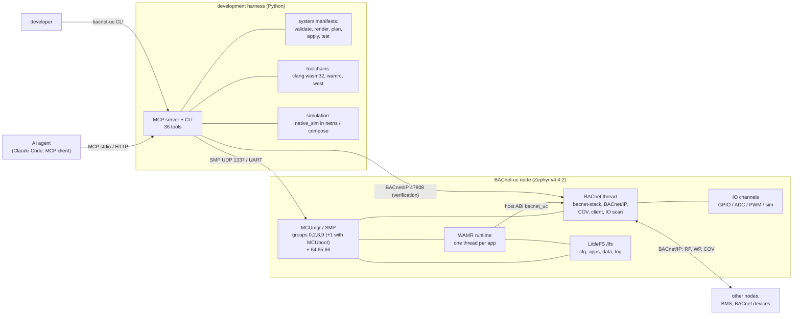

# BACnet-uc

BACnet-uc is a Zephyr RTOS firmware and tool set that turns the ST
NUCLEO-F767ZI and the NXP FRDM-MCXN947 boards (and a `native_sim` build that
runs as a Linux process) into programmable BACnet/IP controllers. Each node is
a BACnet device whose IO channels are bound to BACnet objects by
configuration, keeps its configuration, applications and logs on a LittleFS
file system, is managed over MCUmgr/SMP, and runs control logic as
WebAssembly applications (WAMR) that can be compiled and uploaded at run
time. A Python development harness exposes the nodes to AI agents as an MCP
server, so that an agent can commission nodes, configure IO, write and deploy
applications, and build distributed BACnet applications from a declarative
system manifest, first in simulation and then on hardware.

## Features

- **BACnet/IP device** (bacnet-stack): Device, Network Port, AI/AO/AV,
  BI/BO/BV, MSI/MSO/MSV objects; ReadProperty(Multiple), WriteProperty(Multiple),
  COV server and client, Who-Is/I-Am, static bindings, foreign device
  registration; DeviceCommunicationControl and ReinitializeDevice only with the
  configured password, CreateObject/DeleteObject off by default.
- **IO catalog in devicetree** (`uc,io-channels`): GPIO, ADC and PWM channels
  per board, bound to BACnet objects by `io.json` with scaling, debouncing,
  COV increments and forcing for tests.
- **File system and logs**: LittleFS at `/lfs` (external SPI NOR on the F767,
  on-board QSPI NOR on the MCXN947, a file on `native_sim`) holding JSON
  configuration documents (uploaded as staged `*.json.new` files and activated
  atomically on reload), application modules, per-app key/value data and
  rotating log files; optional syslog.
- **Management interface**: MCUmgr/SMP over UDP port 1337 and the console
  UART; standard groups (OS, file system, statistics, shell; image with
  MCUboot builds) plus custom groups for applications (64), IO (65) and node
  configuration and BACnet properties (66). Firmware updates with MCUboot
  (sysbuild).
- **WebAssembly applications**: WAMR 2.4.5 fast interpreter (AOT as a build
  option), a versioned host ABI (`bacnet_uc.h`) for local and remote BACnet
  objects, COV subscriptions, raw IO and persistent storage, a permission
  model, pointer validation, a per-callback watchdog; SDK with `uc-cc`
  (clang), `uc-aot` (wamrc), a host stub for unit tests and four example
  applications (`blinky`, `thermostat`, `alarm`, `uc-link`).
- **MCP development harness**: 36 tools, resources and prompts for AI agents
  (Claude Code or any MCP client), plus the `bacnet-uc` CLI with the same
  functions: inventory, configuration, IO, BACnet reads/writes, app build and
  deployment, logs, firmware build/flash/OTA, system manifests
  (validate/plan/apply/test) and `native_sim` simulation in network
  namespaces or containers.

## Architecture



Details: [docs/architecture.md](docs/architecture.md) (node) and
[docs/harness-mcp.md](docs/harness-mcp.md) (harness).

## Repository map

| Path | Content |
|------|---------|
| [`firmware/`](firmware/) | Zephyr application: `src/` (storage, config, net, bacnet, io, apps, mgmt, shell), `include/uc/` (module APIs), `boards/` (per-board `.conf`/`.overlay`, IO catalogs in `boards/io/`), `Kconfig` (`CONFIG_UC_*`), `prj.conf`, overlays for MCUboot and syslog, `sysbuild/`, `tests/unit/` |
| [`wasm/`](wasm/) | WebAssembly SDK (`sdk/`: `bacnet_uc.h`, `uc-cc`, `uc-aot`, `uc-wasm-info`, host stub, WAMR runner) and example applications (`examples/`) |
| [`harness/`](harness/) | Python package `bacnet_uc_harness`: MCP server, CLI, SMP and BACnet/IP clients, manifest planner, test runner, simulation; example manifests in `examples/systems/` |
| [`schemas/`](schemas/) | JSON schemas of `device.json`, `io.json`, `apps.json` and the system manifest, with examples |
| [`docs/`](docs/) | documentation (index: [docs/README.md](docs/README.md)) |
| [`dts/bindings/`](dts/bindings/) | devicetree binding `uc,io-channels` |
| [`modules/`](modules/), [`zephyr/module.yml`](zephyr/module.yml) | this repository as a Zephyr module; Zephyr glue for WAMR |
| [`snippets/uc-ramfs/`](snippets/uc-ramfs/) | snippet for a RAM-backed `/lfs` (boards without external flash) |
| [`west.yml`](west.yml) | west manifest (T2 topology): Zephyr v4.4.2, bacnet-stack-zephyr, bacnet-stack, WAMR 2.4.5 |
| [`.github/workflows/ci.yml`](.github/workflows/ci.yml) | CI: harness tests (Python 3.11/3.12), WebAssembly SDK checks, firmware builds for the three boards with warnings as errors, unit tests, harness end-to-end tests against `native_sim` |
| [`LICENSE`](LICENSE) | Apache License 2.0 |

## Quick start

Requirements: Linux x86-64, Python ≥ 3.12, CMake, Ninja, dtc, git, clang
with the `wasm32` target and `wasm-ld` (Ubuntu: `clang lld`), and for the MCU
builds the Zephyr SDK 1.0.1 with the `arm-zephyr-eabi` toolchain. Full
instructions, board flashing and plain-SMP alternatives:
[docs/getting-started.md](docs/getting-started.md).

**1. Workspace**

```sh
mkdir bacnet-uc-ws && cd bacnet-uc-ws
git clone https://github.com/IlijaVorontsov/BACNet-uc
python3.12 -m venv .venv && . .venv/bin/activate
pip install west
west init -l BACNet-uc
west update --narrow -o=--depth=1
pip install -r zephyr/scripts/requirements-base.txt
pip install -e 'BACNet-uc/harness[serial,sim]'
```

**2. Build the simulator target and run one node**

```sh
west build -b native_sim/native/64 BACNet-uc/firmware -d build-native
mkdir -p ~/uc-sim && cd ~/uc-sim
~/bacnet-uc-ws/build-native/zephyr/zephyr.exe --flash=node1.flash.bin > console.log &
```

The node listens for SMP on UDP 1337 and for BACnet/IP on UDP 47808 of the
host; `/lfs` is kept in `node1.flash.bin`.

**3. Talk to it with the harness CLI**

```sh
export BACNET_UC_HOME=~/uc-sim                 # inventory and build cache in ~/uc-sim/.bacnet-uc
bacnet-uc node add sim1 --udp 127.0.0.1 --bacnet 127.0.0.1:47808
bacnet-uc node info sim1
bacnet-uc io catalog sim1                      # di0 di1 do0 do1 ai0 ai1 ao0 ao1 (simulated)

cat > points.yaml <<'EOF'
- {channel: ai0, type: analog-input, instance: 1, name: Room Temperature, units: degrees-celsius, scale: 0.01}
- {channel: do0, type: binary-output, instance: 1, name: Lamp}
EOF
bacnet-uc io configure sim1 points.yaml        # validates, uploads io.json.new, reloads
bacnet-uc io force sim1 ai0 2150               # 2150 mV
bacnet-uc prop read sim1 analog-input:1        # 21.5
bacnet-uc prop write sim1 binary-output:1 1 --priority 8
bacnet-uc io read sim1 do0                     # 1.0

bacnet-uc app build blinky ~/bacnet-uc-ws/BACNet-uc/wasm/examples/blinky/blinky.c
bacnet-uc app deploy sim1 blinky .bacnet-uc/apps/blinky.wasm --param instance=5
bacnet-uc app status sim1 blinky               # state: running
bacnet-uc prop read sim1 binary-value:5        # toggles every second
bacnet-uc node logs sim1 -n 20
```

Two or more simulated nodes with links and acceptance tests (network
namespaces, needs root):

```sh
cd ~/bacnet-uc-ws/BACNet-uc && unset BACNET_UC_HOME   # state in BACNet-uc/.bacnet-uc (git-ignored)
SUDO="sudo -E env PATH=$PATH"      # sim up/down and apply (restarts nodes) need root
$SUDO bacnet-uc sim up harness/examples/systems/sim-demo.yaml --erase \
    --exe ~/bacnet-uc-ws/build-native/zephyr/zephyr.exe
$SUDO bacnet-uc system apply harness/examples/systems/sim-demo.yaml --no-dry-run
bacnet-uc system test harness/examples/systems/sim-demo.yaml
$SUDO bacnet-uc sim down sim-demo
```

See [docs/simulation.md](docs/simulation.md).

**4. Connect an AI agent (Claude Code)**

```sh
cd ~/uc-sim
claude mcp add bacnet-uc --scope project \
  --env BACNET_UC_HOME="$PWD" -- ~/bacnet-uc-ws/.venv/bin/bacnet-uc-mcp
```

This writes `.mcp.json` in the current directory; start `claude` there and
ask it, for example, to "commission node sim1 and map its simulated inputs to
BACnet objects" (prompt `commission_node`). `node_shell` stays disabled unless
the server runs with `--allow-shell`. Tool catalog, workflows and the safety
model: [docs/harness-mcp.md](docs/harness-mcp.md).

**5. Boards**

```sh
cd ~/bacnet-uc-ws
west build -b nucleo_f767zi             BACNet-uc/firmware -d build-f767
west build -b frdm_mcxn947/mcxn947/cpu0 BACNet-uc/firmware -d build-mcxn
west flash -d build-f767                # or build-mcxn
west build --sysbuild -b nucleo_f767zi BACNet-uc/firmware -d build-f767-mcuboot   # MCUboot + OTA
```

Both boards build and link in the default configuration (RAM about 91 %,
the WAMR pool in DTCM / SRAMX); the images have not run on the boards yet
(see [Status](#status)). Wiring, storage and flashing:
[docs/hardware.md](docs/hardware.md),
[docs/getting-started.md](docs/getting-started.md).

## Supported boards

| Board | Zephyr target | CPU | `/lfs` | Network | WAMR pool | Status |
|-------|---------------|-----|--------|---------|-----------|--------|
| ST NUCLEO-F767ZI | `nucleo_f767zi` | Cortex-M7, 216 MHz, DP FPU | external SPI NOR (W25Q128JV on SPI1) or RAM (`-S uc-ramfs`) | on-board Ethernet (LAN8742A) | 112 KiB (DTCM) | builds and links (RAM 91.5 %, DTCM 97.1 %); not yet run on hardware |
| NXP FRDM-MCXN947 | `frdm_mcxn947/mcxn947/cpu0` | Cortex-M33 core 0, 150 MHz, SP FPU | on-board 8 MiB QSPI NOR (FlexSPI) or RAM (`-S uc-ramfs`) | on-board Ethernet (ENET QoS) | 96 KiB (SRAMX) | builds and links (RAM 91.1 %, SRAMX 100 %); not yet run on hardware |
| native_sim (Linux x86-64) | `native_sim/native/64` | host | file (`--flash=<file>`) | host sockets (NSOS) | 256 KiB | builds and runs; used for the simulated system tests |

## Documentation

| Document | Content |
|----------|---------|
| [docs/README.md](docs/README.md) | index, reading order, normative sources, versions |
| [docs/getting-started.md](docs/getting-started.md) | workspace, builds, first node, configuration, apps, MCP server |
| [docs/architecture.md](docs/architecture.md) | firmware layers, threads, data flows, boot, memory, failure handling |
| [docs/hardware.md](docs/hardware.md) | boards, IO catalogs, storage options, RS-485 plan, bill of materials |
| [docs/bacnet.md](docs/bacnet.md) | device profile, BIBBs, object model, COV, BACnet/IP, PICS skeleton |
| [docs/io.md](docs/io.md) | channel catalog, `io.json`, scaling, scan timing, forcing, new boards |
| [docs/wasm-runtime.md](docs/wasm-runtime.md) | WAMR configuration, app lifecycle, host ABI, memory, sandboxing, toolchains |
| [docs/storage-and-logging.md](docs/storage-and-logging.md) | flash layouts, LittleFS, directory layout, logging, wear |
| [docs/configuration.md](docs/configuration.md) | `device.json`, `io.json`, `apps.json`, Kconfig options |
| [docs/management-protocol.md](docs/management-protocol.md) | **normative** SMP contract: transports, groups, commands |
| [docs/harness-mcp.md](docs/harness-mcp.md) | MCP harness concept: tools, workflows, safety, GitOps, CI |
| [docs/distributed-apps.md](docs/distributed-apps.md) | system manifests, links, placement, timing, failure modes, rollout |
| [docs/simulation.md](docs/simulation.md) | `native_sim`, host / netns / compose modes, limitations |
| [docs/security.md](docs/security.md) | threat model, current exposure, controls, production checklist |
| [docs/roadmap.md](docs/roadmap.md) | phased plan: MS/TP, BACnet/SC, signed apps, AOT, OTA, schedules, web UI |
| [wasm/README.md](wasm/README.md) | WebAssembly SDK and examples |
| [harness/README.md](harness/README.md) | harness package reference (installation, CLI, library use) |

## License

The code in this repository is licensed under the **Apache License 2.0**
([`LICENSE`](LICENSE); `SPDX-License-Identifier: Apache-2.0` in the source
files; the JSON schemas and examples cannot carry a header), the license of
Zephyr and of the bacnet-stack Zephyr glue.

Third-party components fetched by west keep their own licenses:

| Component | License |
|-----------|---------|
| Zephyr RTOS | Apache-2.0 |
| bacnet-stack-zephyr (Zephyr glue, `modules/lib/bacnet`) | Apache-2.0 |
| bacnet-stack (`modules/lib/bacnet/stack`) | per file. Core library files: **GPL-2.0-or-later WITH GCC-exception-2.0**; example, template and many object files: **MIT**; a few files Apache-2.0, BSD-3-Clause, BSD-2-Clause or CC-PDDC (see `stack/license/` and the `SPDX-License-Identifier` of each file). Of the 182 bacnet-stack files compiled into the `native_sim` firmware build, 78 are GPL-2.0-or-later WITH GCC-exception-2.0, 96 MIT, 4 Apache-2.0, 3 CC-PDDC and 1 BSD-3-Clause. The two GPL-2.0-or-later files without the exception (`basic/ucix/`) are not compiled |
| WAMR (WebAssembly Micro Runtime) | Apache-2.0 WITH LLVM-exception |
| MCUboot | Apache-2.0 |
| LittleFS | BSD-3-Clause |
| Mbed TLS | Apache-2.0 OR GPL-2.0-or-later |

What the bacnet-stack license means (from its `license/readme.txt`): the GCC
runtime library exception allows linking the BACnet library into firmware
under other licenses without that firmware becoming GPL; changes to the
GPL-licensed stack files themselves must be made available when distributed,
per section 3 of the GPL. This is a summary, not legal advice; check the
license texts for your distribution.

## Status

Version 0.1.0 (`CONFIG_UC_FW_VERSION`), host ABI 1.0, work in progress.

| Area | State |
|------|-------|
| `native_sim/native/64` firmware | builds and runs; end-to-end system tests of `harness/examples/systems/sim-demo.yaml` pass (two nodes, three tests) |
| NUCLEO-F767ZI, FRDM-MCXN947 firmware | the default configuration, the `uc-ramfs` variant and the MCUboot (sysbuild) builds of both boards link without warnings; default: FLASH about 24 %, RAM about 91 % (`uc-ramfs`: RAM about 96 %; numbers in [docs/architecture.md](docs/architecture.md#62-measured-usage)). Not yet run on hardware |
| Firmware unit tests | 32 ztest cases pass on `native_sim` |
| Harness | 596 unit and integration tests pass (in-process fake node); 10 end-to-end tests against `native_sim` firmware pass |
| CI | [`.github/workflows/ci.yml`](.github/workflows/ci.yml); has not run on GitHub yet |
| Security | development configuration: SMP without authentication (DTLS not wired up), MCUboot development key; BACnet DCC/ReinitializeDevice need `bacnet.password`, CreateObject/DeleteObject off by default; see [docs/security.md](docs/security.md) before connecting a node to a shared network |
| Planned | MS/TP, BACnet/SC, signed applications, AOT validated on the boards (a build option today), fleet OTA, schedules and trend logs: [docs/roadmap.md](docs/roadmap.md) |
