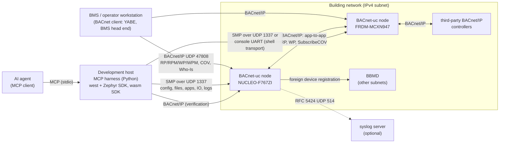
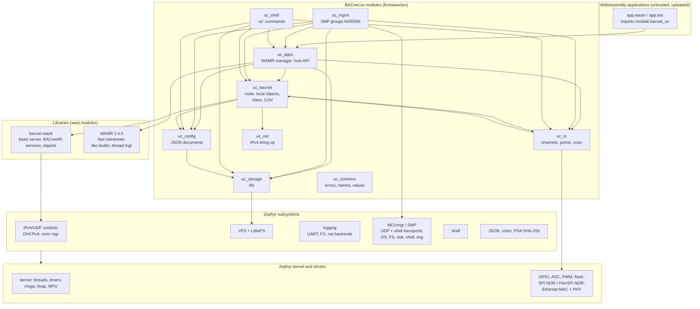
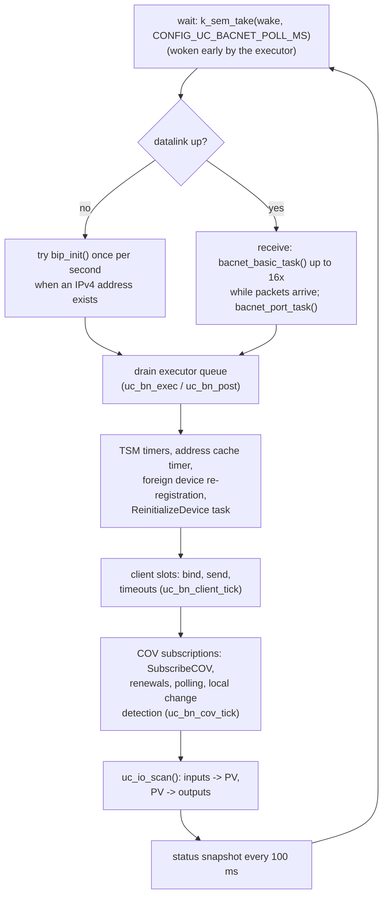
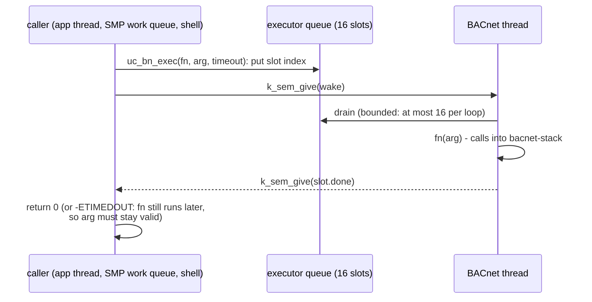
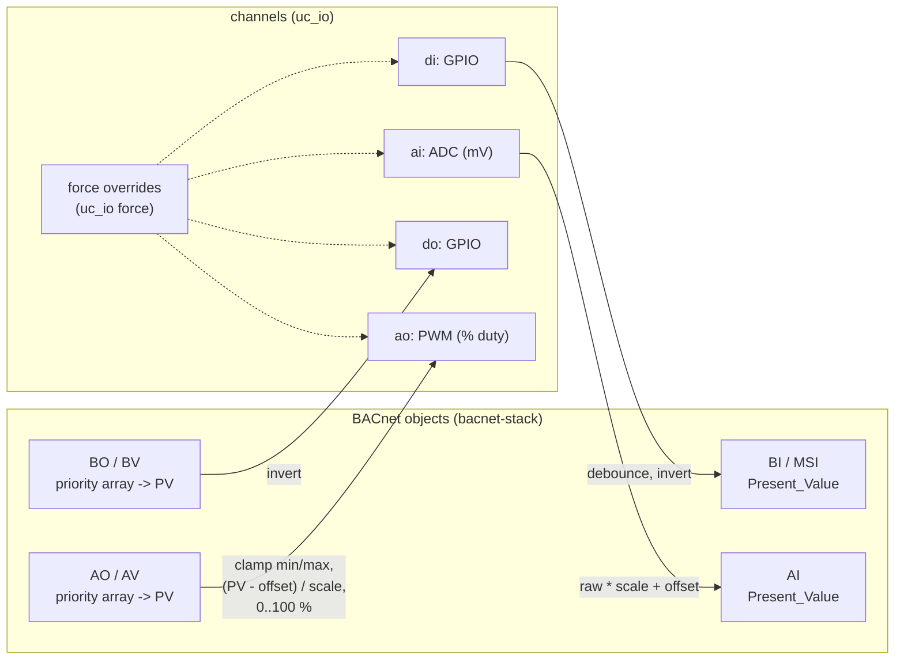
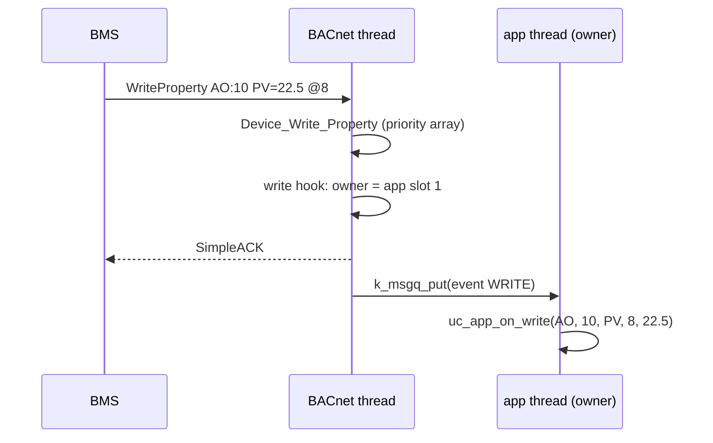
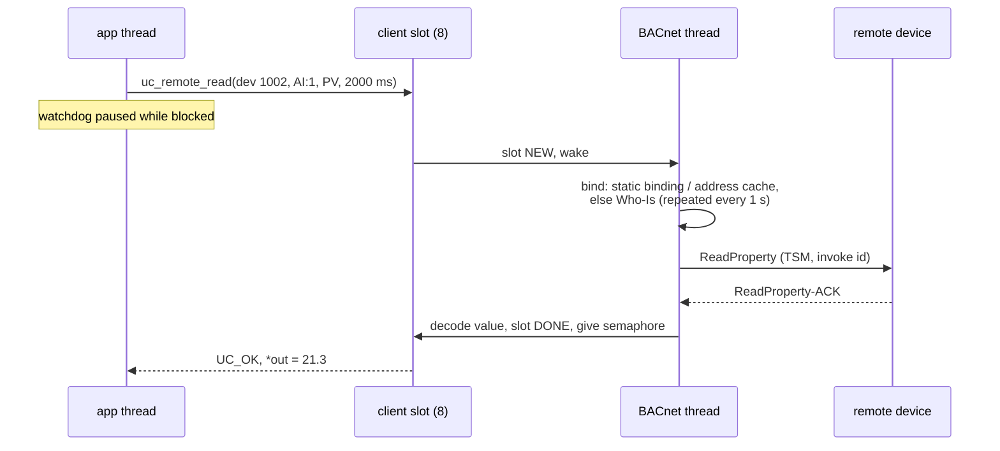
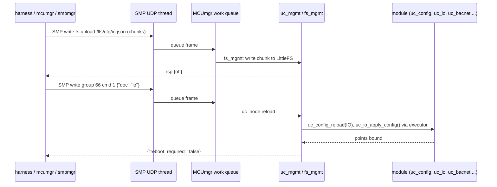
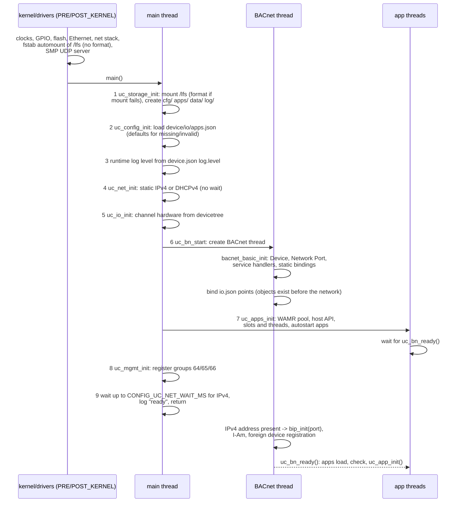

# Architecture

This document describes how a BACnet-uc node is built: its place in a
building automation network, the software layers of the firmware, the threads
and who owns what, the main data flows, the boot sequence, the memory budget
of each board and how failures are handled.

Source of truth: the module APIs in [`firmware/include/uc/`](../firmware/include/uc/)
and the implementation in [`firmware/src/`](../firmware/src/). Items marked
**Planned** are not implemented.

## 1. System context

| Actor | Talks to the node over | Purpose |
|-------|------------------------|---------|
| BMS / operator workstation | BACnet/IP, UDP 47808 (configurable) | Supervision: read/write points, COV, discovery |
| Other BACnet devices, other BACnet-uc nodes | BACnet/IP | Peer data exchange initiated by WebAssembly applications (client side) |
| Development harness (MCP server) | SMP over UDP 1337 or serial; BACnet/IP | Configuration, file transfer, application deployment, IO forcing, log retrieval, verification |
| AI agent | MCP to the harness only | Plans and applies changes through harness tools; never talks to nodes directly |
| Engineer at the bench | Console UART (115200 8N1): shell `uc ...`, log output | Diagnosis, recovery |
| syslog server | UDP 514 (build option `overlay-syslog.conf`) | Central log collection |
| Debug probe | SWD (ST-LINK/V2-1, MCU-Link) | Flashing, debugging |

The harness side is described in [harness-mcp.md](harness-mcp.md) and
[distributed-apps.md](distributed-apps.md); this document covers the node.

### Network interfaces of a node

| Port | Protocol | Direction | Configured by | Notes |
|------|----------|-----------|---------------|-------|
| UDP 47808 | BACnet/IP (Annex J) | in/out, unicast + local broadcast | `device.json` `bacnet.udp_port` | two sockets (unicast, broadcast) opened by bacnet-stack `bip_init()` |
| UDP 1337 | SMP v2 | in | `CONFIG_MCUMGR_TRANSPORT_UDP_PORT` | no authentication in the default build, see [security.md](security.md) |
| UDP 67/68 | DHCPv4 client | out | `device.json` `network.dhcp` | |
| UDP 514 | syslog | out | `overlay-syslog.conf` | optional |
| console UART | shell + SMP shell transport + log output | in/out | devicetree `zephyr,console` / `zephyr,shell-uart` | |

## 2. Software layers

### Firmware modules

| Module | Sources | Responsibility | Runs in |
|--------|---------|----------------|---------|
| `uc_common` | `src/common/uc_common.c` | errno ↔ `UC_ERR_*` ↔ management rc mapping, BACnet text names ↔ enums, value conversion, name validation, permissions | caller |
| `uc_storage` | `src/storage/uc_storage.c` | mount `/lfs` (format on failure), directory layout, atomic file replace, SHA-256 of files | main, callers |
| `uc_config` | `src/config/uc_config.c` | parse `device.json`, `io.json`, `apps.json` into a RAM cache, defaults, `apps.json` encoder | main, SMP work queue, shell |
| `uc_net` | `src/net/uc_net.c` | static IPv4 or DHCPv4 on the default interface; loopback/static address on `native_sim` | main |
| `uc_bacnet` | `src/bacnet/uc_bn_{node,local,client,cov}.c` | BACnet thread, stack initialisation, BACnet/IP datalink, executor, local objects with owner table, blocking client, COV subscriptions for applications | BACnet thread (+ thread-safe wrappers) |
| `uc_io` | `src/io/uc_io.c` | devicetree channel table, GPIO/ADC/PWM/simulated channels, forcing, `io.json` point binding, IO scan | BACnet thread (scan), any thread (channel API) |
| `uc_apps` | `src/apps/uc_app_mgr.c`, `uc_app_host_api.c` | WAMR runtime and pool, application slots and threads, events, watchdog, host functions of import module `bacnet_uc`, key/value store | app threads, manager callers |
| `uc_mgmt` | `src/mgmt/uc_mgmt_{app,io,node,util}.c` | SMP groups 64 `uc_app`, 65 `uc_io`, 66 `uc_node` ([management-protocol.md](management-protocol.md)) | MCUmgr work queue |
| `uc_shell` | `src/shell/uc_shell.c` | `uc info`, `uc app ...`, `uc io ...`, `uc obj list`, `uc cfg show/reload` | shell thread, SMP shell group |
| `main` | `src/main.c` | boot sequence, runtime log level | main thread |

The modules talk only through the headers in `firmware/include/uc/`. Two
rules keep them decoupled:

1. **The BACnet stack is single-threaded.** bacnet-stack keeps global state
   (object tables, TSM, address cache, COV lists) without locks. Only the
   BACnet thread calls into it. Other threads use `uc_bn_exec()` /
   `uc_bn_post()` (executor) or the thread-safe wrappers
   (`uc_bn_obj_create()`, `uc_bn_prop_read()`, `uc_bn_remote_read()`, ...)
   which marshal into the BACnet thread themselves. Functions with the
   `_locked` suffix run in the BACnet thread only.
2. **Errors are negative errno values inside the firmware** and are mapped
   only at the boundaries: to `UC_ERR_*` for WebAssembly applications and to
   the group rc of the management protocol (table in
   [`uc_common.h`](../firmware/include/uc/uc_common.h)).

## 3. Threads and priorities

Zephyr priorities: negative = cooperative (not preempted by other threads),
0..14 = preemptible, lower number = higher priority. The table lists the
threads of the default build (`nucleo_f767zi` values; the other boards differ
only in the Ethernet driver thread).

| Thread | Priority | Stack | Owner | Role |
|--------|---------:|------:|-------|------|
| `rx_q[0]` (net RX traffic class) | -16 (coop) | 2048 | Zephyr net | IP/UDP receive processing, delivery to sockets |
| `stm_eth` (F767) / `ENETQOS_RX` work queue (MCXN947) | -14 / -13 (coop) | 1500 / 1024 | Ethernet driver | receive DMA descriptor service (none on `native_sim`: host sockets) |
| `sysworkq` | -1 (coop) | 4096 | Zephyr | system work queue: application watchdog work items, driver work |
| net_mgmt events, conn mgr monitor | -1 (coop) | 800 / default | Zephyr net | interface and address events (DHCP lease, link) |
| `main` | 0 | 4096 | `main.c` | boot sequence, then returns |
| SMP UDP receive | 0 | 1024 | MCUmgr | receives SMP datagrams, queues them to the SMP work queue |
| `mcumgr smp` work queue | 3 | 4096 | MCUmgr | runs every SMP command handler, including the custom groups; file uploads, JSON parsing of reloads, SHA-256 of app modules |
| `bacnet` | 5 (`CONFIG_UC_BACNET_THREAD_PRIORITY`) | 8192 | `uc_bacnet` | owns bacnet-stack; loop every `CONFIG_UC_BACNET_POLL_MS` (5 ms) or when woken |
| `uc_app0` .. `uc_app3` | 10 (`CONFIG_UC_APP_THREAD_PRIORITY`) | 8192 each | `uc_apps` | one per application slot; the only thread that executes that slot's WebAssembly instance |
| shell (UART) | 14 | 4096 | Zephyr shell | console, `uc` commands |
| logging | 14 | 2048 | Zephyr logging | formats deferred log messages for UART, FS and net backends; `fs_sync()` after each batch |
| `idle` | 15 | 320 | kernel | |

Consequences of this assignment:

- Network reception and the BACnet thread preempt applications: a busy or
  looping application cannot delay BACnet responses or IO scanning.
- Management commands (prio 3) preempt the BACnet thread while a handler
  computes: JSON parsing on `reload`, SHA-256 of a module on `install`
  (256 KiB at most) delay the BACnet loop by their CPU time. Waiting for the
  flash (erase, program) blocks the handler and frees the CPU. Handlers that
  touch the BACnet stack go through the executor and wait for the BACnet
  thread.
- Logging and the shell run at the lowest application priority: under load,
  log output is delayed (deferred mode, 4 KiB buffer, the oldest messages are
  overwritten when it is full), never the control path.
- Applications may block in host calls (remote requests wait up to
  `timeout_ms`); the watchdog is paused while they block, so only execution
  time counts against `CONFIG_UC_APP_WATCHDOG_MS`.

### The BACnet thread loop

`bacnet_basic_task()` handles at most one received PDU per call; the loop
calls it up to 16 times per iteration while packets keep arriving (the
bacnet-stack-zephyr sample sleeps 100 ms per call, which is too slow for a
burst of requests).

### Executor

`uc_bn_exec()` runs `fn` inline when called from the BACnet thread. A full
queue returns `-EAGAIN` (mapped to `UC_ERR_BUSY` / rc `BUSY`).

## 4. Data flows

### 4.1 IO scan and objects

Every loop, `uc_io_scan()` services the points whose `sample_ms` has elapsed.
Inputs write Present_Value directly (bypassing the write protection of input
objects) unless the object is Out_Of_Service; outputs read the effective
Present_Value (after priority arbitration) and drive the channel when it
changed. Details: [io.md](io.md).

### 4.2 BACnet server requests and write events

A WriteProperty from the BMS is handled entirely in the BACnet thread:
decode, `Device_Write_Property()`, priority array update, then the store
callback, which `uc_bn_local.c` uses as a write hook. When the written object
belongs to an application, the hook queues a `uc_app_on_write` event into
that application's queue (non-blocking; dropped and counted when the queue of
`CONFIG_UC_APP_EVENT_QUEUE_LEN` = 16 events is full). The next IO scan drives
an output from the new Present_Value.

### 4.3 Client requests from applications

A caller that times out marks its slot abandoned; the BACnet thread frees it
later and never touches the caller's memory again. Error, Reject and Abort
PDUs return `UC_ERR_BACNET`, a device that cannot be bound
`UC_ERR_NO_ROUTE`, no free slot or TSM entry `UC_ERR_BUSY`.

### 4.4 COV

Applications subscribe through `uc_cov_subscribe()`:

| Target | Mechanism | Traffic |
|--------|-----------|---------|
| local object (`UC_DEVICE_LOCAL` or own instance) | Present_Value compared every BACnet loop; analog objects use their COV_Increment | none |
| remote device supporting COV | SubscribeCOV (unconfirmed notifications), renewed at lifetime/2 | notifications |
| remote device rejecting COV | ReadProperty every `CONFIG_UC_BACNET_COV_POLL_MS` (2 s) | polling |
| remote device not answering SubscribeCOV | polling, SubscribeCOV retried every 60 s | polling |

The current value is delivered once right after subscribing. Server-side COV
(BMS subscribes to the node) is bacnet-stack's `handler_cov_subscribe` with
`CONFIG_BACNET_BASIC_COV_SUBSCRIPTIONS_SIZE` = 16 subscriptions. See
[bacnet.md](bacnet.md#5-change-of-value).

### 4.5 Management

The same command set is reachable over the console UART (SMP shell
transport, frames multiplexed with the interactive shell). Group, command and
key definitions: [management-protocol.md](management-protocol.md).

### 4.6 Logging

All modules log with `LOG_MODULE_REGISTER(<name>, CONFIG_UC_LOG_LEVEL)`;
applications log through `uc_log()` into the source `uc_app` with the
application name as prefix (max 120 characters per line, 20 lines per second
per application). Deferred logging hands messages to the logging thread,
which writes to the UART backend, the file backend (`/lfs/log/log.NNNN`) and,
with `overlay-syslog.conf`, the network backend. See
[storage-and-logging.md](storage-and-logging.md).

## 5. Boot sequence

| Step | Failure | Effect |
|------|---------|--------|
| storage | no flash device, mount and format fail | logged; configuration falls back to Kconfig defaults; logs only on UART; apps cannot be installed |
| configuration | document missing | defaults for that document (`INF` log) |
| configuration | document invalid (syntax, schema, limits) | defaults for that document (`WRN` log with the offending field) |
| network | no link / no DHCP lease | BACnet thread keeps waiting; after `CONFIG_UC_NET_WAIT_MS` (30 s) it starts BACnet anyway and retries the datalink once per second |
| io | a channel's device not ready | channel marked not ready, reads/writes return `-EIO`; points on it log once |
| bacnet | UDP port cannot be bound | retried once per second |
| apps | WAMR init fails (pool) | logged; app starts fail with "failed" state |
| mgmt | group registration | logged; the standard groups still work |

No step aborts the boot: the node stays reachable over the shell and SMP so
that it can be repaired remotely. `main()` returns after step 9; everything
else runs in the threads above.

## 6. Memory budgets

### 6.1 Static allocation plan

| Consumer | Size | Where configured |
|----------|------|------------------|
| WAMR pool: module images, loaded modules (fast-interpreter code), instances, linear memories, app heaps, operand stacks | 128 KiB (F767), 96 KiB (MCXN947), 256 KiB (native_sim) | `CONFIG_UC_APP_POOL_SIZE` in `boards/<board>.conf` |
| kernel heap (`k_malloc`): configuration parse buffers, file reads, per-command scratch | 64 KiB (MCUs), 128 KiB (native_sim) | `CONFIG_HEAP_MEM_POOL_SIZE` |
| app thread stacks | 4 × 8 KiB | `CONFIG_UC_APPS_MAX` × `CONFIG_UC_APP_THREAD_STACK_SIZE` |
| BACnet thread stack | 8 KiB | `CONFIG_UC_BACNET_THREAD_STACK_SIZE` |
| main, system work queue, SMP work queue, shell | 4 KiB each | `prj.conf` |
| bacnet-stack TSM table (16 transactions with a 1476-byte APDU buffer each) | 24 KiB | `CONFIG_BACNET_MAX_TSM_TRANSACTIONS` |
| configuration cache (`device`, `io`, `apps`) and IO point table | ~20 KiB | `CONFIG_UC_IO_POINTS_MAX`, `CONFIG_UC_APPS_MAX`, `CONFIG_UC_APP_PARAMS_MAX` |
| application slots (event queues, watchdog state, subscriptions) | ~14 KiB | `CONFIG_UC_APPS_MAX`, `CONFIG_UC_APP_EVENT_QUEUE_LEN` |
| network packets and buffers (16/16 packets, 32/32 buffers of 128 bytes) | ~14 KiB | `CONFIG_NET_PKT_*`, `CONFIG_NET_BUF_*` |
| log buffer | 4 KiB | `CONFIG_LOG_BUFFER_SIZE` |
| LittleFS file caches (8 files × 256 bytes + read/prog/lookahead) | ~3 KiB | `CONFIG_FS_LITTLEFS_*`, fstab node |
| bacnet-stack Network Port object lists | 11 KiB | bacnet-stack |
| libc `malloc` arena: bacnet-stack object data (`calloc` per object created) | **all RAM left after linking** on the MCUs; host `malloc` on `native_sim` | `CONFIG_COMMON_LIBC_MALLOC_ARENA_SIZE=-1` (Zephyr default) |

The last row matters: static RAM that grows (a larger pool, more threads)
shrinks the arena from which IO points and applications create their BACnet
objects, and object creation then fails at run time with
`NO_SPACE_FOR_OBJECT` (`UC_ERR_NO_MEM`). Keep a few KiB of RAM unallocated
after linking (roughly 50..200 bytes per object plus list nodes; an AO
with its 16-entry priority array is about 140 bytes).

Sizes of the largest consumers are from the linker map (sections `bss`,
`noinit`, `datas`) of the `nucleo_f767zi` build.

### 6.2 Measured usage

Builds of the repository state at the time of writing (`west build -b <board>
BACNet-uc/firmware`, default configuration):

| Board | Result | Static RAM demand (sum of input sections in the linker map) | RAM region |
|-------|--------|-------------------------------:|-----------:|
| `nucleo_f767zi` | **does not link**: `region 'RAM' overflowed by 29564 bytes` | 421 190 B | 393 216 B (`sram0`, 384 KiB) |
| `frdm_mcxn947/mcxn947/cpu0` | **does not link**: `region 'RAM' overflowed by 60648 bytes` | 386 573 B | 327 680 B (320 KiB) |
| `native_sim/native/64` | links; `zephyr.exe`: text 699 322 B, data 78 076 B, bss 637 990 B | host process | - |

With the WAMR pool moved out of the main RAM through the chosen node
`uc,app-pool` (proposed fix; the overlay is not part of the repository yet,
and the resulting images were not run on hardware):

| Board | Change | FLASH | RAM | Second region |
|-------|--------|------:|----:|---------------|
| `nucleo_f767zi` | `/ { chosen { uc,app-pool = &dtcm; }; };` and `CONFIG_UC_APP_POOL_SIZE=98304` | 494 444 B of 2 MiB (23.6 %) | 291 708 B of 384 KiB (74.2 %) | DTCM 110 848 B of 128 KiB: pool 96 KiB + 12.25 KiB Ethernet DMA buffers (`CONFIG_ETH_STM32_HAL_USE_DTCM_FOR_DMA_BUFFER`) |
| `frdm_mcxn947/mcxn947/cpu0` | `/ { chosen { uc,app-pool = &sramx; }; };` | 503 628 B of 2 MiB (24.0 %) | 290 024 B of 320 KiB (88.5 %) | SRAMX 96 KiB of 96 KiB (pool) |

Reproduce with an overlay file passed as
`-- -DEXTRA_DTC_OVERLAY_FILE=<abs path>` (plus `-DCONFIG_UC_APP_POOL_SIZE=98304`
on the F767). RAM left after linking, which becomes the `malloc` arena for
BACnet objects: ~99 KiB on the F767, ~37 KiB on the MCXN947. Both images fit
the MCUboot slots (768 KiB and 984 KiB).

Code size by component (`nucleo_f767zi`, `.text` from the linker map;
`.rodata` adds 112 868 B, mostly strings and tables):

| Component | `.text` |
|-----------|--------:|
| bacnet-stack + Zephyr glue | 72 924 B |
| WAMR (fast interpreter, loader, libc-builtin, thread manager) | 62 962 B |
| BACnet-uc modules (`firmware/src`) | 53 142 B |
| network stack (IP, UDP, sockets, DHCPv4, Ethernet L2, conn mgr, net shell) | 58 804 B |
| Zephyr libraries (logging, shell, JSON, crypto glue, ...) | 33 986 B |
| LittleFS + VFS | 22 928 B |
| kernel | 11 610 B |
| C library | 9 912 B |
| MCUmgr (SMP transports and groups) + zcbor | 11 664 B |
| drivers and HAL (Ethernet, flash, SPI NOR, ADC, PWM, GPIO, UART) | 18 270 B |
| total `.text` | 367 828 B |

### 6.3 Tuning

| Goal | Change | Saves |
|------|--------|-------|
| more room for applications | raise `CONFIG_UC_APP_POOL_SIZE`; place the pool in another RAM region with the chosen node `uc,app-pool` (e.g. the MCXN947's 96 KiB SRAMX, or the F767's DTCM where the Ethernet DMA buffers leave room) | - |
| fewer applications | `CONFIG_UC_APPS_MAX=2` | 16 KiB stacks + ~7 KiB slots |
| fewer simultaneous client requests of the stack | `CONFIG_BACNET_MAX_TSM_TRANSACTIONS=8` | ~12 KiB |
| smaller app threads (C apps with shallow host calls) | `CONFIG_UC_APP_THREAD_STACK_SIZE=6144` | 2 KiB per slot |
| no shell | `CONFIG_SHELL=n` (also removes the SMP shell transport and group, and the `fs mv` used for power-safe uploads) | two 4 KiB shell stacks, buffers and the shell code |

## 7. Failure handling

| Failure | Detection | Handling | Visible as |
|---------|-----------|----------|------------|
| corrupt or blank file system | mount fails | format (`CONFIG_UC_STORAGE_FORMAT_ON_FAIL=y`) and continue with defaults | `WRN uc_storage: formatting /lfs` |
| invalid configuration document at boot | parser error | defaults for that document | `WRN uc_config: ... rejected (-22), using defaults` |
| invalid document on `reload` | parser error | the active configuration is kept | SMP rc `INVALID`, log |
| power loss during a configuration write | - | `uc_storage_write_file()` writes `<path>.tmp` and renames it (one LittleFS metadata commit): the old or the new file exists | - |
| no IPv4 address | `uc_net_wait_ready()` | BACnet waits, starts after 30 s anyway; SMP UDP starts when the address appears | `WRN no IPv4 address after 30000 ms` |
| remote device not reachable | no I-Am / TSM timeout | `UC_ERR_NO_ROUTE` / `UC_ERR_TIMEOUT` to the application; Who-Is repeated | app status `errors` |
| remote device rejects COV | Error/Reject/Abort to SubscribeCOV | polling fallback | transparent to the application |
| executor or client slots exhausted | queue full | `-EAGAIN`/`-EBUSY` → `UC_ERR_BUSY` / rc `BUSY`; caller retries | |
| IO hardware error | driver return code | point skipped, logged once per episode, retried every sample | `ERR uc_io: ai0 (analog-input 1): read failed` |
| application trap (out-of-bounds, unreachable, division by zero) | WAMR exception | instance destroyed, owned objects deleted, subscriptions cancelled, state `failed`, `last_error` set | `uc_app status` |
| application endless loop | watchdog `CONFIG_UC_APP_WATCHDOG_MS` (2 s) of execution time | `wasm_runtime_terminate()`, state `failed` | `last_error: "uc_app_tick: watchdog, callback exceeded 2000 ms"` |
| application floods events or logs | queue full / rate limit | events dropped and counted as errors; log lines above 20/s dropped and counted | `WRN <app>: N log lines dropped` |
| WAMR pool exhausted | load/instantiate fails | start fails, state `failed`, `last_error` names the WAMR message | `uc_app status`, `uc_node info` `wasm.pool_free` |
| thread stack overflow | MPU stack guard (Cortex-M7), stack limit registers (Cortex-M33) | kernel fatal error | fatal error dump on the console |
| kernel fatal error, hang | - | **Planned**: hardware watchdog (IWDG on the F767, WWDT0 on the MCXN947) fed by the BACnet thread, reset on fatal error | |

## 8. Design decisions

| Decision | Alternatives | Reason |
|----------|--------------|--------|
| One thread owns bacnet-stack, others use an executor | a global mutex around the stack | the stack's handlers call back into objects and the store callback; a mutex would be held across callbacks into application code and invite lock inversion with the application threads |
| One thread per application slot | one thread running all apps | a blocking remote read or a long callback of one app does not delay the others; the watchdog can terminate one instance |
| Static WAMR pool | `malloc` from the kernel heap | fragmentation of the system heap by module images is avoided; the pool is sized per board and reported by `uc_node info` |
| JSON documents on LittleFS | Zephyr settings (NVS/ZMS) | human- and agent-readable, schema-validated before upload, diffable by the harness; settings remain available for the BACnet stack |
| SMP (MCUmgr) for management | custom HTTP/REST, BACnet file objects | existing clients (mcumgr, smpmgr, AuTerm), firmware update and file transfer included, same protocol over UDP and UART |
| Fast interpreter by default, AOT optional | AOT only | AOT needs executable RAM (MPU configuration, see [wasm-runtime.md](wasm-runtime.md#21-aot-and-the-mpu)) and per-board compilation; the interpreter runs the same `.wasm` on all boards |
