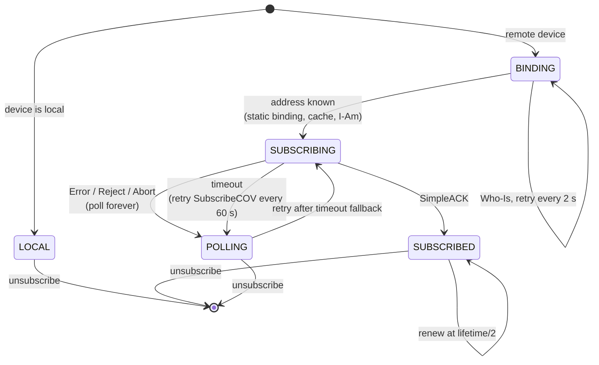

# BACnet

This document specifies what a BACnet-uc node offers on a BACnet network and
how it uses the network on behalf of its applications. The protocol engine is
the [BACnet Stack](https://github.com/bacnet-stack/bacnet-stack) (Steve Karg
et al.) with its Zephyr glue (`bacnet-stack-zephyr`), both pinned in
[`west.yml`](../west.yml). The BACnet-uc part is
[`firmware/src/bacnet/`](../firmware/src/bacnet/) (API:
[`uc_bacnet.h`](../firmware/include/uc/uc_bacnet.h)).

## 1. Device profile

| Item | Value | Source |
|------|-------|--------|
| Target device profile | **B-ASC** (BACnet Application Specific Controller) | |
| Protocol revision | 28 | `CONFIG_BACNET_PROTOCOL_REVISION` (bacnet-stack default) |
| Vendor identifier / name | 260 / "BACnet Stack at SourceForge" | `CONFIG_BACNET_VENDOR_IDENTIFIER`, `CONFIG_BACNET_VENDOR_NAME` (bacnet-stack defaults: a product must use its own ASHRAE vendor ID) |
| Model_Name | Zephyr board name, e.g. `nucleo_f767zi` | `CONFIG_BOARD` |
| Firmware_Revision, Application_Software_Version | `CONFIG_UC_FW_VERSION` ("0.1.0") | |
| Device instance, Object_Name, Description, Location | `device.json` | [configuration.md](configuration.md#1-devicejson) |
| Max_APDU_Length_Accepted | 1476 | `CONFIG_BACNET_MAX_APDU_SIZE` |
| Segmentation | not supported | |
| Datalink | BACnet/IP (Annex J), IPv4 | `CONFIG_BACDL_BIP` |
| APDU timeout / retries | 3000 ms / 3 (default) | `device.json` `bacnet.apdu_timeout_ms`, `apdu_retries` |
| Character sets | ANSI X3.4 / UTF-8 | |

B-ASC requires DS-RP-B, DS-WP-B and DM-DDB-B, DM-DOB-B, DM-DCC-B; the node
implements all of them plus the data-sharing extensions listed below.

## 2. BACnet Interoperability Building Blocks

### 2.1 Server side (the node as a device)

| BIBB | Status | Implementation notes |
|------|--------|----------------------|
| DS-RP-B | Implemented | `handler_read_property`; all objects of the object list |
| DS-RPM-B | Implemented | `handler_read_property_multiple`; responses must fit 1476 bytes (no segmentation) |
| DS-WP-B | Implemented | `handler_write_property`; the write hook informs owning applications ([4.4](#44-write-events-to-applications)) |
| DS-WPM-B | Implemented | `handler_write_property_multiple`; same write hook per property |
| DS-COV-B | Implemented | `handler_cov_subscribe`, 16 subscriptions (`CONFIG_BACNET_BASIC_COV_SUBSCRIPTIONS_SIZE`), confirmed and unconfirmed notifications, for AI, AO, AV, BI, BO, BV, MSI, MSO, MSV |
| DM-DDB-B | Implemented | Who-Is answered with a unicast I-Am to the requester; I-Am broadcast at start-up and when the instance changes |
| DM-DOB-B | Implemented | Who-Has / I-Have |
| DM-DCC-B | Implemented | DeviceCommunicationControl with the password `device.json` `bacnet.password` (it replaces the bacnet-stack default `filister`). Without a configured password every request is refused with Error security/password-failure (`CONFIG_UC_BACNET_REQUIRE_PASSWORD=y`, default) |
| DM-RD-B | Implemented | ReinitializeDevice COLDSTART/WARMSTART with the same password; the node reboots after `CONFIG_BACNET_REINIT_REBOOT_DELAY` (3 s). Without a configured password: refused like DCC |
| DM-OCD-B | Build option, not claimed | default: CreateObject and DeleteObject are not registered, clients get Reject unrecognized-service. With `CONFIG_UC_BACNET_REMOTE_CREATE_DELETE=y` clients may create AI, AO, AV, BI, BO, BV, MSI, MSO and MSV objects (owner `network`) and delete only those ([3.2](#32-ownership)) |
| DS-COVP-B | Planned | SubscribeCOVProperty not registered |
| DM-TS-B, DM-UTC-B | Planned | the bacnet-stack time synchronization handlers are compiled only with `BACNET_TIME_MASTER`; the node has no wall-clock time base yet (log timestamps are uptime) |
| DM-BR-B | Not planned for B-ASC | backup/restore (`CONFIG_BACNET_BASIC_BACKUP_RESTORE`) is off; configuration backup is done over SMP |
| AE-*, T-*, SCHED-* | Not implemented | alarms, trending and schedules are application territory ([wasm-runtime.md](wasm-runtime.md)); intrinsic reporting is not built |

### 2.2 Client side (used by applications and the firmware)

| BIBB | Status | Used by |
|------|--------|---------|
| DS-RP-A | Implemented | `uc_remote_read()`, COV polling fallback |
| DS-WP-A | Implemented | `uc_remote_write()`, `uc_remote_write_null()` |
| DS-COV-A | Implemented | `uc_cov_subscribe()` for remote devices: SubscribeCOV, unconfirmed and confirmed COV notifications accepted |
| DM-DDB-A | Implemented | device binding: Who-Is for an unbound device instance, I-Am processing into the address cache (32 entries, `CONFIG_BACNET_MAX_ADDRESS_CACHE`) |
| DS-RPM-A, DS-WPM-A | Planned | applications issue single-property requests |

## 3. Object model

### 3.1 Object types

| Type | Number | Created by | Commandable (priority array) | Present_Value writable |
|------|-------:|------------|------------------------------|------------------------|
| Device | 8 | system | - | - |
| Network Port | 56 | system (instance 1, "BACnet/IP Port") | - | - |
| Analog Input (AI) | 0 | `io.json` (`ai` channel), applications | no | only when Out_Of_Service |
| Analog Output (AO) | 1 | `io.json` (`ao` channel), applications | yes, Relinquish_Default 0.0 | yes |
| Analog Value (AV) | 2 | `io.json` (`ao` channel), applications, `uc-link` | **no** (see note) | yes |
| Binary Input (BI) | 3 | `io.json` (`di` channel), applications | no | only when Out_Of_Service |
| Binary Output (BO) | 4 | `io.json` (`do` channel), applications | yes | yes |
| Binary Value (BV) | 5 | `io.json` (`do` channel), applications, `uc-link` | **no** (see note) | yes |
| Multi-state Input (MSI) | 13 | `io.json` (`di` channel: states "Inactive"=1, "Active"=2), applications | no | only when Out_Of_Service |
| Multi-state Output (MSO) | 14 | applications | yes | yes |
| Multi-state Value (MSV) | 19 | applications, `uc-link` | **no** (see note) | yes |

Note on the value objects AV, BV and MSV: in the pinned bacnet-stack
revision and build they have no Priority_Array and no Relinquish_Default
(reading them gives unknown-property). A write with a priority simply
replaces Present_Value (last writer wins); AV rejects priority 6 with
write-access-denied, BV and MSV accept it. A NULL write (relinquish) to their
Present_Value succeeds and changes nothing (ASHRAE 135 clause 15.9.2), over the
network as well as for local writes (`uc_prop_write_null()`, SMP `prop_write`
with `null`, `uc-link`). Use AO, BO or MSO where several writers must be
arbitrated by priority. (bacnet-stack can make BV commandable with the
compile option `BACNET_OBJECT_BINARY_VALUE_COMMANDABLE`; the firmware does not
set it.)

Object instances are 0..4194302. Object_Name must be unique within the device
(ASHRAE 135 clause 12.1.5). The firmware logs a duplicate
(`WRN uc_bn_local: object name 'x' also used by 2:5`) but does not reject
it, so choose unique names in `io.json` and in applications.

### 3.2 Ownership

Every object has an owner recorded in the firmware's owner table
(`CONFIG_UC_BACNET_OBJECTS_MAX` = 64 entries for IO, application and network
objects). The owner is reported by `uc_node objects` and `uc obj list`.

| Owner | Objects | Created | Deleted |
|-------|---------|---------|---------|
| `system` | Device, Network Port | at stack start | never |
| `io` | objects bound in `io.json` | at boot and on `uc_node reload io` | all `io` objects are deleted and re-created on every IO reload |
| `app:<name>` | objects created with `uc_obj_create()` | by the application, typically in `uc_app_init()` | by `uc_obj_delete()` or automatically when the application stops, fails or is removed |
| `network` | objects created over the network with CreateObject (only with `CONFIG_UC_BACNET_REMOTE_CREATE_DELETE=y`; RAM only) | by a BACnet client | by a BACnet client (DeleteObject) |

Rules:

1. **Creation conflicts.** Creating an object that exists with another owner
   fails (`-EEXIST`, `UC_ERR_EXISTS`; CreateObject answers
   object-identifier-already-exists). An application creating an object it
   already owns gets `UC_OK`. An `io.json` point whose object is already
   owned by an application or by `network` is skipped with an error log.
2. **Deletion.** Only the owner deletes its objects; the management
   interface and `io` reloads delete only `io` objects. A network DeleteObject
   of a `system`, `io` or application object answers Error
   object/object-deletion-not-permitted (with the option off, DeleteObject is
   not supported at all).
3. **Writes are not restricted by ownership.** Any BACnet client, the
   management interface (`uc_node prop_write`) and any application with the
   `bacnet.local` permission can write any writable property, subject to the
   normal BACnet rules (priority array, Out_Of_Service, value range). An
   application uses this to command IO outputs, e.g. the thermostat example
   writes `analog-output:1`, an `io.json` point.
4. **Write events.** After a successful write to an application-owned
   object by anyone other than the owner itself, the owner receives
   `uc_app_on_write(type, instance, prop, priority, value)` for numeric
   values.

### 3.3 Recommended instance allocation (convention)

The firmware does not reserve instance ranges. For systems built with the
harness the following convention avoids collisions between `io.json` and
applications:

| Range | Use |
|-------|-----|
| 1..99 | IO points (`io.json`), per object type |
| 100..999 | objects created by applications (setpoints, alarms, counters) |
| 1000.. | objects created by `uc-link` or generated by the harness |

### 3.4 Priority array use (convention)

| Priority | Writer |
|---------:|--------|
| 1..2 | manual life safety, automatic life safety (not used by BACnet-uc) |
| 5 | critical equipment control (reserved for safety interlocks in applications) |
| 6 | minimum on/off (reserved by ASHRAE 135; rejected by the stack for AO, BO, MSO and AV) |
| 8 | manual operator (BMS workstation) |
| 10..14 | applications (one distinct priority per writer of an output) |
| 16 | default (writes without priority) |

The priorities apply to the commandable objects AO, BO and MSO; AV, BV and
MSV ignore them ([3.1](#31-object-types)). An application that commands an
output at a priority relinquishes it (`uc_prop_write_null()` /
`uc_remote_write_null()`) when it stops; the examples do this in
`uc_app_deinit()` for AO/BO/MSO and write their off or fail-safe value to a
value object instead. If an application fails (trap, watchdog),
`uc_app_deinit()` is not called and its command stays in the priority array
until overwritten or relinquished by another writer. A relinquish on another
device from `uc_app_deinit()` must complete within the watchdog period
(2 s for the whole callback, blocking time included once the stop is
pending); a device that does not answer in time may keep the command
([wasm-runtime.md](wasm-runtime.md#31-lifecycle)).

### 3.5 Persistence

| Data | Persistent | Mechanism |
|------|------------|-----------|
| Device instance, name, description, location | yes | `device.json`; writes over the network to these properties are overwritten by the file on the next `reload device` or reboot |
| IO-bound objects (existence, name, units, COV increment) | yes | re-created from `io.json` at every boot |
| Application objects | yes, while the application is installed with autostart | re-created by the application at every start |
| Present_Value, priority arrays, Out_Of_Service | **no** | RAM only; outputs start at Relinquish_Default after a reset (**Planned**: persist priority arrays of IO outputs with the bacnet-stack store callback and Zephyr settings) |
| Application state | on request | `uc_kv_set()` (`/lfs/data/<app>/<key>`) |
| Objects created by CreateObject (build option) | no | RAM only, gone after a reset |
| Address bindings learned from I-Am | no | static bindings in `device.json` are re-installed at boot |

## 4. Data flows inside the node

### 4.1 IO points

Inputs update Present_Value directly (bypassing the write protection of input
objects) unless Out_Of_Service is TRUE; a client may then write the value for
testing. Outputs drive the channel from the effective Present_Value after
priority arbitration, unless Out_Of_Service is TRUE. The BO `Polarity`
property is not evaluated by the IO scan; use `invert` in `io.json`. Details
in [io.md](io.md).

### 4.2 Server requests

All service handlers run in the BACnet thread. Requests are processed in
arrival order, up to 16 PDUs per loop iteration; the loop period is
`CONFIG_UC_BACNET_POLL_MS` (5 ms).

### 4.3 Client requests for applications

Up to `CONFIG_UC_BACNET_CLIENT_SLOTS` (8) blocking requests from all
applications are in flight at the same time, limited further by the stack's
16 TSM entries (`CONFIG_BACNET_MAX_TSM_TRANSACTIONS`). A request to the node's
own instance is served locally without network traffic.

### 4.4 Write events to applications

The stack's WriteProperty store callback, called after every successful
write (WriteProperty, WritePropertyMultiple, local writes from the management
interface and applications), queues an event for the owning application. The
event carries the numeric value; CharacterString writes (names) and NULL
writes (relinquish) produce no event, and neither does a write by the owning
application itself.

## 5. Change of Value

### 5.1 Server

A BACnet client subscribes with SubscribeCOV (confirmed or unconfirmed
notifications, lifetime 0 = indefinite). The stack evaluates the subscribed
objects once per loop and notifies:

| Object | Notification when |
|--------|-------------------|
| AI, AO, AV | \|Present_Value − last notified value\| ≥ COV_Increment (from `io.json` `cov_increment`, default 0.1; objects created by applications: 1.0), or Status_Flags change |
| BI, BO, BV, MSI, MSO, MSV | any Present_Value or Status_Flags change |

The subscription table holds 16 entries for all clients together.

### 5.2 Client (for applications)

`uc_cov_subscribe(device, type, instance, lifetime_s)`:

- Remote subscriptions request **unconfirmed** notifications; the subscriber
  process identifier is the subscription slot. Confirmed notifications are
  accepted as well.
- Lifetime: default 300 s when 0 is passed, minimum 10 s.
- Before every SubscribeCOV (initial, renewal, retry) and every poll the
  device's address is taken from the address cache again, so a re-bound
  device (new I-Am, static binding changed by `reload device`) is reached at
  its new address.
- Notifications are matched by subscriber process identifier, device and
  object, not by source address.
- Polling: ReadProperty of Present_Value every `CONFIG_UC_BACNET_COV_POLL_MS`
  (2000 ms); a notification is delivered on change only.
- The current value is delivered once right after subscribing: from the first
  notification, or from a ReadProperty if no notification arrived within 2 s.
- Local subscriptions compare Present_Value every BACnet loop (5 ms), with the
  object's COV_Increment for analog objects and on any change otherwise.
- Capacity: `CONFIG_UC_BACNET_COV_SUBS_MAX` (16) subscriptions for all
  applications together, local and remote.

## 6. BACnet/IP datalink

| Item | Behaviour |
|------|-----------|
| UDP port | `device.json` `bacnet.udp_port`, default 47808 (0xBAC0). Changing it requires a reboot (`reload` reports `reboot_required`) |
| Local address | the IPv4 address of the default interface (static or DHCP). The datalink starts when an address exists, at the latest after `CONFIG_UC_NET_WAIT_MS` (30 s), and is retried every second until the socket binds |
| Broadcast | directed broadcast of the interface subnet (address OR NOT netmask), e.g. 192.168.10.255 |
| Sockets | one unicast socket bound to the interface address, one broadcast socket (bacnet-stack `bip_init()`) |
| Foreign device | `bacnet.foreign_device` (`bbmd`, `port`, `ttl_s`): Register-Foreign-Device after the datalink starts and every TTL/2 (minimum 5 s); changes apply on `reload device` without reboot; removing the section deletes the FDT entry at the BBMD |
| BBMD function | the stack's BVLC layer is built with BBMD support: it accepts up to 5 foreign-device registrations (`CONFIG_MAX_FD_ENTRIES`) and forwards broadcasts to them. There is no configuration for the Broadcast Distribution Table (5 entries, empty). Running the node as a configured BBMD is **Planned**; use a dedicated BBMD today |
| Static bindings | `bacnet.static_bindings`: device instance → IPv4 address and port, installed in the address cache as permanent entries at boot and on `reload device`. Needed across subnets without a BBMD, on networks that filter broadcasts, and for several `native_sim` nodes on one host (distinct ports on 127.0.0.1) |
| Dynamic binding | Who-Is with the device instance as low and high limit, repeated every second while a request waits; the I-Am populates the address cache (32 entries) |
| `native_sim` | host sockets (NSOS) cannot broadcast: the broadcast address is the node's own address, so remote devices must be bound statically ([simulation.md](simulation.md)) |

## 7. Network security

BACnet/IP has no authentication. Anyone on the subnet can read and write
every writable property, including outputs at any priority. The firmware
limits what else a BACnet client can do:

| Service | Default build | Build option |
|---------|---------------|--------------|
| DeviceCommunicationControl, ReinitializeDevice | only with `device.json` `bacnet.password` (1..20 characters); without a password refused with security/password-failure; a wrong password gets password-failure | `CONFIG_UC_BACNET_REQUIRE_PASSWORD=n`: accepted without a password when none is configured |
| CreateObject, DeleteObject | not supported (Reject unrecognized-service) | `CONFIG_UC_BACNET_REMOTE_CREATE_DELETE=y`: create AI..MSV (owner `network`), delete only those |

The password travels in clear text like every BACnet/IP request; it protects
against accidents and casual misuse, not against an attacker on the subnet.
If the password is removed while communication is disabled by a DCC without
duration, only a reboot (or a build with `CONFIG_UC_BACNET_REQUIRE_PASSWORD=n`)
enables it again. Run nodes on a dedicated building automation network or
VLAN; see [security.md](security.md). BACnet Secure Connect is on the roadmap
(section 9).

## 8. Performance figures

Not yet measured on hardware. Design limits: loop period 5 ms, 16 PDUs per
iteration, IO scan once per iteration (each point rate-limited by
`sample_ms`, default 100 ms), 8 concurrent client requests, 16 server and 16
client COV subscriptions.

## 9. Datalinks roadmap

| Datalink | Status | Notes |
|----------|--------|-------|
| BACnet/IP (IPv4) | Implemented | |
| BACnet/IPv6 | Planned (low priority) | `CONFIG_BACDL_BIP6` exists in bacnet-stack-zephyr; needs `CONFIG_NET_IPV6` and device.json fields |
| MS/TP | Planned | bacnet-stack contains the portable MS/TP state machines (`mstp.c`, `dlmstp.c`); the Zephyr glue has no RS-485 port layer yet. Plan: a Zephyr UART port with DE control on the Arduino UART ([hardware.md](hardware.md#5-rs-485-add-on-for-bacnet-mstp-planned)), MAC address and baud rate in `device.json`, the node as MS/TP master and, as a second step, as a BACnet/IP-to-MS/TP router (needs `CONFIG_BAC_ROUTING`) |
| BACnet Secure Connect | Planned | bacnet-stack ships the BACnet/SC datalink (`datalink/bsc`); it needs WebSocket client/server support and TLS 1.3 with device certificates. Plan: SC node (hub connector) only, certificates provisioned over SMP into `/lfs/cert`, mbedTLS/PSA from the same build as the SMP DTLS option |

## 10. PICS skeleton

A Protocol Implementation Conformance Statement per ASHRAE 135 Annex A, for
the current implementation. Items marked "TBD" are product decisions.

| PICS item | Value |
|-----------|-------|
| Date | TBD |
| Vendor name | TBD (currently the bacnet-stack default "BACnet Stack at SourceForge", ID 260) |
| Product name | BACnet-uc |
| Product model number | `nucleo_f767zi` / `frdm_mcxn947/mcxn947/cpu0` (Model_Name) |
| Application software version | Application_Software_Version = `CONFIG_UC_FW_VERSION` |
| Firmware revision | `CONFIG_UC_FW_VERSION` |
| BACnet protocol revision | 28 |
| Product description | Programmable BACnet/IP controller with digital and analog IO and WebAssembly control applications |
| BACnet standardized device profile | B-ASC |
| BIBBs supported | DS-RP-B, DS-RPM-B, DS-WP-B, DS-WPM-B, DS-COV-B, DM-DDB-B, DM-DOB-B, DM-DCC-B, DM-RD-B (DCC and RD with a password); client: DS-RP-A, DS-WP-A, DS-COV-A, DM-DDB-A |
| Segmentation capability | none |
| Standard object types supported | Device; Network Port; AI, AO, AV, BI, BO, BV, MSI, MSO, MSV (created by the node's configuration and applications; CreateObject/DeleteObject not supported in the default build, not claimed) |
| Data link layer options | BACnet/IP (Annex J), foreign device registration |
| Device address binding | static bindings (configuration), dynamic (Who-Is/I-Am) |
| Networking options | none claimed (no router; BBMD not claimed) |
| Character sets supported | ANSI X3.4 / UTF-8 |
| Gateway options | none |
| Network security options | non-secure device |

Object property support per type follows the bacnet-stack basic object
implementations (`stack/src/bacnet/basic/object/*.c`); the Property_List of
each object is authoritative and can be read with ReadProperty.
