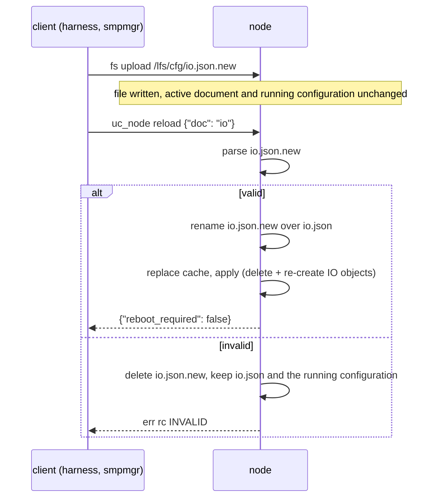

# Configuration

A node is configured at two levels:

| Level | What | Changed by | Takes effect |
|-------|------|------------|--------------|
| run-time documents | `/lfs/cfg/device.json`, `io.json`, `apps.json` | SMP file upload + `uc_node reload`, `uc_app install/remove`, the harness | reload (mostly without reboot) |
| build-time options | Kconfig `CONFIG_UC_*` and Zephyr options, devicetree | `prj.conf`, `boards/<board>.conf`, overlays, `-D` on the `west build` command line | rebuild and flash |

The JSON schemas in [`schemas/`](../schemas/) are normative for the documents;
the examples in [`schemas/examples/`](../schemas/examples/) are used by the
firmware unit tests. The firmware parses the documents with Zephyr's JSON
library ([`uc_config.c`](../firmware/src/config/uc_config.c)).

Common rules for all documents:

- Top-level `"schema": 1` is required.
- Unknown keys are rejected by the schemas (`additionalProperties: false`);
  the firmware skips them.
- Maximum document size: `CONFIG_UC_CONFIG_DOC_MAX` (8192 bytes).
- A missing document gives its defaults. An invalid document is rejected as a
  whole; the log names the first offending field
  (`WRN uc_config: io.json: invalid or missing points.type (entry 2)`).
- Strings are UTF-8; length limits are in bytes.

## 1. `device.json`

Schema: [`schemas/device.schema.json`](../schemas/device.schema.json).

```json
{
  "schema": 1,
  "device": {"instance": 1001, "name": "uc-sensor", "description": "Room sensor node", "location": "Lab 1"},
  "network": {"dhcp": false, "ipv4": "192.168.10.51", "netmask": "255.255.255.0", "gateway": "192.168.10.1"},
  "bacnet": {
    "udp_port": 47808,
    "apdu_timeout_ms": 3000,
    "apdu_retries": 3,
    "static_bindings": [{"device": 1002, "address": "192.168.10.52", "port": 47808}]
  },
  "log": {"level": "inf"}
}
```

| Field | Type | Required | Default | Range / format | Applied on `reload device` |
|-------|------|----------|---------|----------------|----------------------------|
| `device.instance` | integer | yes | 260001 (`CONFIG_UC_DEVICE_INSTANCE_DEFAULT`) without document | 0..4194302 | reboot required |
| `device.name` | string | yes | `bacnet-uc` (`CONFIG_UC_DEVICE_NAME_DEFAULT`) | 1..63 bytes; Object_Name of the Device object, unique on the internetwork | immediately |
| `device.description` | string | no | "" | ≤ 63 | immediately |
| `device.location` | string | no | "" | ≤ 63 | immediately |
| `network.dhcp` | boolean | no | true | | reboot required |
| `network.ipv4` | string | when `dhcp` is false | - | dotted IPv4; with `dhcp: false` and no `ipv4` the firmware falls back to DHCP (warning) | reboot required |
| `network.netmask` | string | no | 255.255.255.0 (static) | contiguous netmask | reboot required |
| `network.gateway` | string | no | none | dotted IPv4 | reboot required |
| `bacnet.udp_port` | integer | no | 47808 | 1..65535 | reboot required |
| `bacnet.apdu_timeout_ms` | integer | no | 3000 | 100..60000 | immediately |
| `bacnet.apdu_retries` | integer | no | 3 | 0..10 | immediately |
| `bacnet.foreign_device.bbmd` | string | when `foreign_device` is present | - | IPv4 of the BBMD | immediately (registers, or deletes the old registration) |
| `bacnet.foreign_device.port` | integer | no | 47808 | 1..65535 | immediately |
| `bacnet.foreign_device.ttl_s` | integer | no | 60 | 10..65535; re-registration every TTL/2 | immediately |
| `bacnet.static_bindings[]` | array | no | [] | ≤ 16 (`CONFIG_UC_BACNET_STATIC_BINDINGS_MAX`) | immediately (removed entries are dropped from the address cache) |
| `…static_bindings[].device` | integer | yes | | 0..4194302; the node's own instance is ignored | |
| `…static_bindings[].address` | string | yes | | IPv4 | |
| `…static_bindings[].port` | integer | no | 47808 | 1..65535 | |
| `bacnet.password` | string | no | none | 1..20 printable ASCII characters (BACnet CharacterString of DeviceCommunicationControl and ReinitializeDevice) | immediately |
| `log.level` | string | no | `inf` | `err`, `wrn`, `inf`, `dbg` | immediately |

`bacnet.password` is the password that BACnet clients must send with
DeviceCommunicationControl and ReinitializeDevice (DM-DCC-B, DM-RD-B; it also
replaces bacnet-stack's built-in DCC password). Without it both services are
refused with Error security/password-failure, unless the firmware is built
with `CONFIG_UC_BACNET_REQUIRE_PASSWORD=n` (then they are accepted without a
password). The password is never logged or shown: `uc cfg show device` prints
`password: configured` or `none` ([bacnet.md](bacnet.md#7-network-security)).

On `native_sim` (host sockets) `network.ipv4` must be an address of the host
(or omitted: 127.0.0.1/8 is used), and every node on one host needs its own
`bacnet.udp_port` plus static bindings to its peers, see
[simulation.md](simulation.md).

## 2. `io.json`

Schema: [`schemas/io.schema.json`](../schemas/io.schema.json). Concepts and
transformations: [io.md](io.md).

```json
{
  "schema": 1,
  "points": [
    {"channel": "di0", "type": "binary-input", "instance": 1, "name": "User Button", "debounce_ms": 30},
    {"channel": "do0", "type": "binary-output", "instance": 1, "name": "Heater Relay"},
    {"channel": "ai0", "type": "analog-input", "instance": 1, "name": "Room Temperature",
     "units": "degrees-celsius", "scale": 0.1, "offset": -50.0, "cov_increment": 0.2, "sample_ms": 500},
    {"channel": "ao0", "type": "analog-output", "instance": 1, "name": "Valve Position",
     "units": "percent", "min": 0, "max": 100}
  ]
}
```

`points`: at most 32 (`CONFIG_UC_IO_POINTS_MAX`; more rejects the document).

| Field | Type | Required | Default | Range / format | Meaning |
|-------|------|----------|---------|----------------|---------|
| `channel` | string | yes | | ≤ 15 bytes, a catalog channel | source/target channel |
| `type` | string | yes | | `analog-input`, `analog-output`, `analog-value`, `binary-input`, `binary-output`, `binary-value`, `multi-state-input` | object type; must match the channel kind ([io.md](io.md#31-allowed-combinations)) |
| `instance` | integer | yes | | 0..4194302 | object instance |
| `name` | string | no | channel name | ≤ 63 | Object_Name |
| `description` | string | no | catalog description | ≤ 63 | Description |
| `units` | string | no | `no-units` | bacnet-stack engineering unit text name (`degrees-celsius`, `percent`, `volts`, `percent-relative-humidity`, ...) or its number | Units (analog objects) |
| `scale` | number | no | 1.0 | finite; not 0 for `ao` | analog: PV = raw × scale + offset |
| `offset` | number | no | 0.0 | finite | |
| `min` | number | no | none | ≤ `max` | analog output clamp, engineering units |
| `max` | number | no | none | ≥ `min` | |
| `cov_increment` | number | no | 0.1 | ≥ 0 | COV_Increment (analog objects) |
| `sample_ms` | integer | no | 100 | 10..3600000 | scan period of this point |
| `debounce_ms` | integer | no | 20 | 0..10000 | digital input debounce |
| `invert` | boolean | no | false | | binary polarity on top of the devicetree flags |

Applied on `reload io`: all objects owned by `io` are deleted and the points
are bound again. A point that cannot be bound (unknown channel, kind and type
do not match, channel or object already bound, `scale` 0 for an `ao` channel,
object owned by an application or created over the network) is skipped with
an error log; the other points are bound and the reload succeeds
([io.md](io.md#31-allowed-combinations)). Present_Value, priority arrays and Out_Of_Service of IO
objects restart from their defaults; BACnet clients should re-read and
re-subscribe.

## 3. `apps.json`

Schema: [`schemas/apps.schema.json`](../schemas/apps.schema.json). Normally
written by the firmware on `uc_app install` / `remove`; it may also be uploaded
(staged as `/lfs/cfg/apps.json.new`) and applied with `reload apps`.

```json
{
  "schema": 1,
  "apps": [
    {
      "name": "thermostat",
      "file": "/lfs/apps/thermostat.wasm",
      "autostart": true,
      "period_ms": 1000,
      "heap_kb": 8,
      "stack_kb": 4,
      "perms": ["bacnet.local", "bacnet.remote"],
      "params": [
        {"key": "sensor_device", "value": "1001"},
        {"key": "sensor_instance", "value": "1"},
        {"key": "setpoint", "value": "21.5"}
      ]
    }
  ]
}
```

`apps`: at most `CONFIG_UC_APPS_MAX` (4) entries in the firmware (the schema
allows 8, the Kconfig maximum); more rejects the document.

| Field | Type | Required | Default | Range / format | Meaning |
|-------|------|----------|---------|----------------|---------|
| `name` | string | yes | | `^[a-z0-9_-]{1,23}$`, unique | application name, log prefix, `/lfs/data/<name>` |
| `file` | string | yes | | `^/lfs/apps/[A-Za-z0-9_.-]{1,40}\.(wasm\|aot)$` | module file |
| `autostart` | boolean | no | true | | start at boot, on install and on reload |
| `period_ms` | integer | no | 1000 | 0..3600000 (0 = no ticks); values below 10 are accepted here but not by `uc_set_tick_period()` | `uc_app_tick` period |
| `heap_kb` | integer | no | 8 | 0..256; multiple of 4 recommended | app heap for libc-builtin `malloc` |
| `stack_kb` | integer | no | 4 | 1..64 | WAMR execution stack |
| `perms` | array of strings | no | [] | `bacnet.local`, `bacnet.remote`, `io`, `kv` | granted host functions ([wasm-runtime.md](wasm-runtime.md#7-sandboxing)) |
| `params` | array of `{key, value}` | no | [] | ≤ 16 (`CONFIG_UC_APP_PARAMS_MAX`); key `^[A-Za-z0-9_.-]{1,23}$`, value ≤ 95 bytes | read with `uc_param_get()`; all values are strings |
| `sha256` | string | no | none | 64 lowercase hex digits | verified at install and every start |

The SMP `install` command takes the same fields with `params` as a CBOR map
and `sha256` as a byte string ([management-protocol.md](management-protocol.md#group-64-uc_app---webassembly-applications)).
An `install` request must fit one SMP request (1024 bytes over UDP); an entry
with many or long `params` is written into `apps.json` instead, which the
harness's `deploy_app` does automatically (`installed_via: apps.json`).

## 4. Apply and reload semantics

Documents are changed by staging: the client uploads `<doc>.json.new`, and
the reload validates it and renames it over the active document in one
atomic LittleFS commit ([management-protocol.md](management-protocol.md#staged-documents-jsonnew)).
The harness always stages; a document uploaded directly over `<doc>.json` is
still accepted (the reload then re-reads it).



| Situation | Boot | `uc_node reload` |
|-----------|------|------------------|
| staged `<doc>.json.new` present and valid | activated (renamed over `<doc>.json`), then loaded | activated, then loaded and applied |
| staged `<doc>.json.new` invalid | deleted, warning; the active document is loaded | deleted; active document and configuration kept; rc `INVALID` (or `LIMIT` for too many entries) |
| staged file unreadable, rename failed | left in place, the active document is loaded | left in place for another attempt; rc `IO` |
| document missing | defaults | defaults are applied (e.g. no IO points) |
| document invalid | defaults for that document, warning | rejected, active configuration kept, rc `INVALID` (or `LIMIT` for too many entries) |
| `doc: "all"` | - | device, io, apps in this order; each is loaded and applied on its own; the first error is returned, `reboot_required` is the OR of all |
| `device` changes of instance, network or UDP port | applied | stored, `reboot_required: true`; the running stack keeps the old values until reboot |
| `device` name, description, location | applied | applied, Database_Revision incremented |
| `device` `bacnet.password`, `log.level`, APDU timeout/retries, foreign device, static bindings | applied | applied |
| `apps` | autostart apps started | apps removed from the document or with a changed entry are stopped; autostart apps that do not run are started |

A staged document stays on the node until the next reload of that document
or the next boot activates (or deletes) it, including one staged without a
reload (`set_config(reload=false)`, `bacnet-uc config set --no-reload`).

Reboot: SMP OS group `reset` (`smpmgr --ip <node> os reset`), the harness, or
BACnet ReinitializeDevice (needs `bacnet.password`). On `native_sim` a reboot
restarts the process in place (`CONFIG_NATIVE_SIM_REBOOT=y`).

Order for a new node: `device.json` (reboot if the instance or the network
changed) → `io.json` → modules and `uc_app install` (or `apps.json` +
`reload apps`). The harness applies a system manifest in this order
([distributed-apps.md](distributed-apps.md)).

## 5. Defaults without any document

| Item | Value |
|------|-------|
| device | instance 260001, name `bacnet-uc`, DHCPv4 |
| BACnet/IP | UDP 47808, APDU timeout 3000 ms, 3 retries, no foreign device, no static bindings |
| IO | no points: every channel is reachable through `uc_io` and the shell only |
| applications | none |
| log level | `inf` |

Several default nodes on one network would all use instance 260001: set a
unique `device.instance` before connecting a second node.

## 6. Kconfig options (`CONFIG_UC_*`)

Defined in [`firmware/Kconfig`](../firmware/Kconfig). Board files override
some of the defaults.

| Option | Default | Board overrides | Meaning |
|--------|---------|-----------------|---------|
| `CONFIG_UC_FW_VERSION` | "0.1.0" | | firmware version (Firmware_Revision, `uc_node info`) |
| `CONFIG_UC_STORAGE_FORMAT_ON_FAIL` | y | | format `/lfs` when mounting fails |
| `CONFIG_UC_CONFIG_DOC_MAX` | 8192 | | maximum document size in bytes |
| `CONFIG_UC_DEVICE_INSTANCE_DEFAULT` | 260001 | | device instance without `device.json` |
| `CONFIG_UC_DEVICE_NAME_DEFAULT` | "bacnet-uc" | | device name without `device.json` |
| `CONFIG_UC_BACNET_THREAD_STACK_SIZE` | 8192 | | BACnet thread stack |
| `CONFIG_UC_BACNET_THREAD_PRIORITY` | 5 | | BACnet thread priority (preemptible) |
| `CONFIG_UC_BACNET_POLL_MS` | 5 | | BACnet loop period |
| `CONFIG_UC_BACNET_EXEC_QUEUE_LEN` | 16 | | executor queue (1..255) |
| `CONFIG_UC_BACNET_CLIENT_SLOTS` | 8 | | concurrent blocking client requests of applications |
| `CONFIG_UC_BACNET_COV_SUBS_MAX` | 16 | | application COV subscriptions (local + remote) |
| `CONFIG_UC_BACNET_COV_POLL_MS` | 2000 | | poll period when a device refuses COV |
| `CONFIG_UC_BACNET_STATIC_BINDINGS_MAX` | 16 | | `static_bindings` entries |
| `CONFIG_UC_BACNET_OBJECTS_MAX` | 64 | | owner table (objects created by IO, applications and CreateObject) |
| `CONFIG_UC_BACNET_REMOTE_CREATE_DELETE` | n | | accept CreateObject/DeleteObject from the network: n = both services unregistered (Reject unrecognized-service); y = AI..MSV may be created (owner `network`) and only those deleted ([bacnet.md](bacnet.md#32-ownership)) |
| `CONFIG_UC_BACNET_REQUIRE_PASSWORD` | y | | without `bacnet.password`: y = ReinitializeDevice and DCC refused (security/password-failure), n = accepted without a password |
| `CONFIG_UC_NET_WAIT_MS` | 30000 | | wait for IPv4 before starting BACnet anyway |
| `CONFIG_UC_IO_POINTS_MAX` | 32 | | `io.json` points |
| `CONFIG_UC_APPS` | y | | WebAssembly runtime (selects `CONFIG_WAMR`) |
| `CONFIG_UC_APPS_MAX` | 4 | | installed applications (1..8) |
| `CONFIG_UC_APP_PARAMS_MAX` | 16 | | parameters per application |
| `CONFIG_UC_APP_POOL_SIZE` | 131072 | F767 114688 (DTCM), MCXN947 98304 (SRAMX), native_sim 262144 | WAMR memory pool; its region is the chosen node `uc,app-pool` of the board overlay, else `.noinit` of the main RAM |
| `CONFIG_UC_APP_THREAD_STACK_SIZE` | 8192 | | native stack per application thread |
| `CONFIG_UC_APP_THREAD_PRIORITY` | 10 | | application thread priority |
| `CONFIG_UC_APP_MAX_FILE_SIZE` | 262144 | `uc-ramfs`: 32768 | maximum module size |
| `CONFIG_UC_APP_WATCHDOG_MS` | 2000 | | execution time per callback (not effective on `native_sim`, see `CONFIG_WAMR_INSTRUCTION_LIMIT`) |
| `CONFIG_UC_APP_EVENT_QUEUE_LEN` | 16 | | pending events per application |
| `CONFIG_UC_APP_KV_VALUE_MAX` | 256 | | maximum `uc_kv_set` value size |
| `CONFIG_UC_MGMT` | y (needs `CONFIG_MCUMGR`) | | custom SMP groups 64..66 |
| `CONFIG_UC_SHELL` | y (needs `CONFIG_SHELL`) | | `uc` shell commands |
| `CONFIG_UC_LOG_LEVEL_*` | `DBG` (prj.conf) | | compiled log level of the BACnet-uc modules; the run-time level comes from `device.json` |

### Related Zephyr and module options

| Option | Value | Where | Meaning |
|--------|-------|-------|---------|
| `CONFIG_HEAP_MEM_POOL_SIZE` | 65536 (MCUs; 49152 with `uc-ramfs`), 131072 (native_sim) | prj.conf, board conf, `snippets/uc-ramfs/boards/ram.conf` | kernel heap |
| `CONFIG_COMMON_LIBC_MALLOC_ARENA_SIZE` | 65536 (MCUs; 32768 with `uc-ramfs`; minimum 24 KiB) | board conf, `snippets/uc-ramfs/boards/ram.conf` | picolibc `malloc` arena (BACnet objects); fixed so that the link fails instead of the arena shrinking ([architecture.md](architecture.md#61-static-allocation-plan)) |
| `CONFIG_MCUMGR_TRANSPORT_UDP_PORT` | 1337 | Zephyr default | SMP UDP port |
| `CONFIG_MCUMGR_TRANSPORT_UDP_MTU` | 1024 | prj.conf | largest SMP request datagram |
| `CONFIG_MCUMGR_TRANSPORT_NETBUF_SIZE` | 1152 | prj.conf | SMP buffer (request and response), reported as `buf_size` by `os mcumgr_params` |
| `CONFIG_MCUMGR_TRANSPORT_SHELL_RX_BUF_COUNT` | 16 | prj.conf | receive buffers of the SMP shell transport: a full 1152-byte request (13 lines) without pacing |
| `CONFIG_MCUMGR_GRP_FS_PATH_LEN` | 95 | prj.conf | longest FS group path (`UC_PATH_MAX` 96 incl. NUL) |
| `CONFIG_MCUMGR_GRP_FS_MAX_FILE_SIZE_4GB` | y | prj.conf | FS download framing for files above 64 KiB (modules up to 256 KiB) |
| `CONFIG_MCUMGR_TRANSPORT_WORKQUEUE_STACK_SIZE` | 4096 | prj.conf | SMP handler stack |
| `CONFIG_LOG_BACKEND_FS_FILE_SIZE`, `_FILES_LIMIT` | 16384, 4 | prj.conf | log rotation |
| `CONFIG_BACNET_MAX_TSM_TRANSACTIONS` | 16 | prj.conf | stack transaction slots |
| `CONFIG_BACNET_MAX_ADDRESS_CACHE` | 32 | prj.conf | device address bindings |
| `CONFIG_BACNET_BASIC_COV_SUBSCRIPTIONS_SIZE` | 16 | prj.conf | server-side COV subscriptions |
| `CONFIG_BACNET_MAX_CHARACTER_STRING_BYTES` | 64 | prj.conf | longest BACnet string |
| `CONFIG_WAMR_FAST_INTERP`, `CONFIG_WAMR_AOT`, `CONFIG_WAMR_THREAD_MGR` | y, n, y | prj.conf, module Kconfig | [wasm-runtime.md](wasm-runtime.md#2-wamr-configuration) |
| `CONFIG_WAMR_AOT_MPU_EXEC` | n | module Kconfig (needs `CONFIG_WAMR_AOT` and an ARM MPU) | clears XN of the MPU region(s) holding the WAMR pool so that AOT files can run on the boards ([wasm-runtime.md](wasm-runtime.md#21-aot-and-the-mpu)) |
| `CONFIG_WAMR_INSTRUCTION_LIMIT` | 100000000 on `native_sim`, 0 (off) on the boards | module Kconfig | interpreted instructions per call into a module; replaces the watchdog on `native_sim` |
| `CONFIG_SPI_NOR_FLASH_LAYOUT_PAGE_SIZE` | 4096 (firmware Kconfig default when `CONFIG_SPI_NOR` is built; Zephyr's default is 65536) | F767 only | LittleFS block size on the SPI NOR ([storage-and-logging.md](storage-and-logging.md#2-littlefs-parameters)) |
| `CONFIG_NATIVE_SIM_REBOOT` | y | native_sim conf | `sys_reboot()` (SMP `os reset`, ReinitializeDevice) restarts the process with the same arguments instead of exiting |

### Build variants

| Variant | Arguments |
|---------|-----------|
| remote logging | `-- -DEXTRA_CONF_FILE=overlay-syslog.conf '-DCONFIG_LOG_BACKEND_NET_SERVER="a.b.c.d:514"'` |
| MCUboot + SMP firmware update | `--sysbuild` (uses `sysbuild.conf`), or `-- -DEXTRA_CONF_FILE=overlay-mcuboot.conf` for an MCUboot flashed separately |
| volatile `/lfs` in RAM | `-S uc-ramfs` |
| without applications | `-- -DCONFIG_UC_APPS=n` (Kconfig warns about the WAMR and pool settings of `prj.conf` and the board files, which then have no effect) |
| AOT modules | `-- -DCONFIG_WAMR_AOT=y` (`native_sim`); on the boards also `-DCONFIG_WAMR_AOT_MPU_EXEC=y`, otherwise AOT files are refused ([wasm-runtime.md](wasm-runtime.md#21-aot-and-the-mpu)) |
| CreateObject/DeleteObject from BACnet clients | `-- -DCONFIG_UC_BACNET_REMOTE_CREATE_DELETE=y` |
| ReinitializeDevice/DCC without a password | `-- -DCONFIG_UC_BACNET_REQUIRE_PASSWORD=n` (open device; for closed test networks) |
| different defaults | `-- -DCONFIG_UC_DEVICE_INSTANCE_DEFAULT=1234` (any Kconfig option) |
