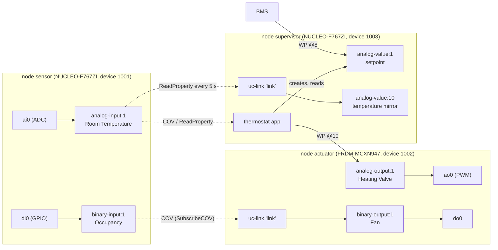
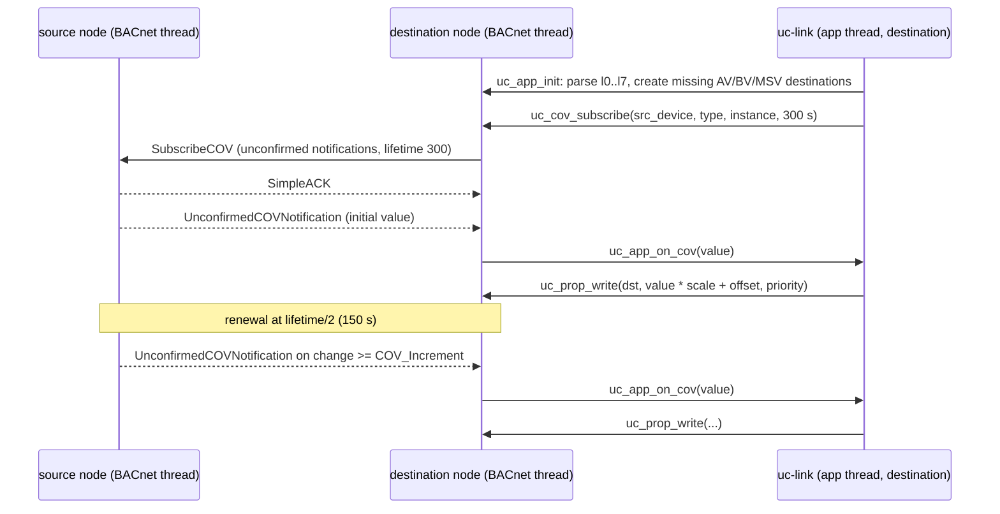
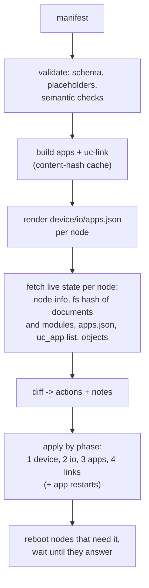

# Distributed applications

A distributed BACnet-uc application is a set of nodes whose IO points,
WebAssembly applications and point-to-point links together implement one
control function (a room, an air handler, a pump group). It is described
declaratively in a **system manifest**
([`schemas/system.schema.json`](../schemas/system.schema.json)); the MCP
harness validates it, renders the per-node configuration documents, compares
them with the live nodes and applies the difference.

This document describes the model: BACnet as the data bus, the manifest
section by section (using the HVAC zone example), placement, how links are
realised, timing, failure behaviour, commissioning order, rollout and
testing, and the scaling limits. Tool usage is in
[harness-mcp.md](harness-mcp.md), simulation in [simulation.md](simulation.md).

Items marked **Planned** are not implemented.

## 1. Model



`WP @p` = WriteProperty at priority `p`.

| Concept | Manifest section | Realised on the node as |
|---------|------------------|-------------------------|
| node | `nodes[]` | a BACnet device: `device.json` (identity, network, BACnet options) |
| point | `nodes[].io[]` | an IO channel bound to a BACnet object: `io.json`, object owner `io` |
| application | `apps[]` | a WebAssembly module in `/lfs/apps/` and an `apps.json` entry |
| link | `links[]` | parameters of the stock `uc-link` application on the destination node |
| acceptance test | `tests[]` | nothing on the node; executed by the harness |

Nodes exchange data **only through BACnet/IP**. The management plane (SMP) is
used to configure nodes, never to move process data between them. This keeps
every inter-node value visible to and interoperable with third-party BACnet
tools (a BMS can read and override every point).

## 2. BACnet as the data bus

| Mechanism | BACnet service | Used by | Behaviour in BACnet-uc |
|-----------|----------------|---------|------------------------|
| Event-driven transfer | SubscribeCOV + (Un)ConfirmedCOVNotification | `uc_cov_subscribe()`; `uc-link` `mode: cov`; thermostat and alarm sensor inputs | subscriber requests **unconfirmed** notifications, lifetime 300 s (`uc-link`, `uc_point.h`), renewed at lifetime/2; the current value is delivered once after subscribing |
| Polling | ReadProperty | `uc_remote_read()`; `uc-link` `mode: poll`; COV fallback | the destination reads every `period_ms`; `uc-link` writes the destination only when the value changed |
| COV fallback | ReadProperty | firmware COV module | a device that answers SubscribeCOV with Error/Reject/Abort is polled every `CONFIG_UC_BACNET_COV_POLL_MS` (2000 ms) for the lifetime of the subscription; after a timeout it is polled and SubscribeCOV is retried every 60 s ([bacnet.md](bacnet.md#52-client-for-applications)) |
| Commanding | WriteProperty with priority | `uc_remote_write()`, `uc_prop_write()`; `uc-link` `priority` | commandable objects (AO, BO, MSO) arbitrate writers through the priority array; writing NULL at a priority relinquishes it. Value objects (AV, BV, MSV) take every write whatever the priority; NULL changes nothing |
| Discovery / binding | Who-Is / I-Am, static bindings | firmware client | static bindings from `device.json` first (the harness renders them), Who-Is otherwise |

Priorities (convention from [bacnet.md](bacnet.md#34-priority-array-use-convention)):
8 for the operator (BMS), 10..14 for applications and links, one distinct
priority per writer of an output; priority 6 is reserved and rejected.
Analog Value, Binary Value and Multi-state Value objects of BACnet-uc nodes
have **no priority array**: several writers to one AV/BV/MSV overwrite each
other regardless of priority, and a relinquish (NULL) does not restore
anything. Use AO, BO or MSO as a destination that more than one writer
commands, and priority 0 for links to value objects.

Value encoding across the application ABI is `double`
([`bacnet_uc.h`](../wasm/sdk/include/bacnet_uc.h)): REAL, UNSIGNED, SIGNED,
ENUMERATED and BOOLEAN convert; binary Present_Values are 0.0/1.0. Links and
apps therefore move numeric Present_Values only; CharacterString, bit string
and date/time values are out of scope.

## 3. The system manifest

The manifest is YAML or JSON. Top-level keys:

| Key | Required | Content |
|-----|----------|---------|
| `apiVersion` | yes | `bacnet-uc/v1` |
| `kind` | yes | `System` |
| `metadata` | yes | `name` (`^[a-z0-9][a-z0-9-]{0,62}$`, used for the simulation directory and network names), `description` |
| `nodes` | yes | at least one node |
| `apps` | no | WebAssembly applications placed on nodes |
| `links` | no | point-to-point value copies |
| `tests` | no | acceptance tests |

String values may reference other manifest values with placeholders:
`"{{ nodes.sensor.device.instance }}"` resolves to `1001`. A string that is
exactly one placeholder takes the referenced value's type; otherwise the
value is inserted as text. Unknown paths and cycles are errors.

The walk-through uses
[`harness/examples/systems/hvac-demo.yaml`](../harness/examples/systems/hvac-demo.yaml):
a room with a temperature sensor and an occupancy input on one board, a
heating valve and a fan on a second board, and a PI thermostat on a third.

### 3.1 `nodes`

```yaml
nodes:
  - name: sensor
    board: nucleo_f767zi
    transport: {kind: udp, host: 192.168.10.51}
    device: {instance: 1001, name: uc-sensor, location: Lab 1}
    network: {dhcp: false, ipv4: 192.168.10.51, netmask: 255.255.255.0, gateway: 192.168.10.1}
    io:
      - {channel: ai0, type: analog-input, instance: 1, name: Room Temperature,
         units: degrees-celsius, scale: 0.1, cov_increment: 0.2, sample_ms: 500}
      - {channel: di0, type: binary-input, instance: 1, name: Occupancy, debounce_ms: 50}
```

| Field | Meaning | Rendered into |
|-------|---------|---------------|
| `name` | node name (`^[a-z0-9][a-z0-9-]{0,30}$`), used in point references and the inventory | – |
| `board` | `nucleo_f767zi`, `frdm_mcxn947/mcxn947/cpu0`, `native_sim/native/64` (or `native_sim`) | selects the offline IO catalog `firmware/boards/io/<board>.dtsi` and the AOT target |
| `transport` | how the harness reaches SMP: `{kind: udp, host, port: 1337}`, `{kind: serial, device, baud: 115200}`, `{kind: sim, ipv4?}` | inventory entry |
| `bacnet_address` | `host[:port]` of the BACnet/IP interface; default: transport host and 47808 | peers' static bindings; harness BACnet client |
| `device` | `instance` (0..4194302, unique in the manifest), `name`, `description`, `location` | `device.json` `device` |
| `network` | `dhcp`, `ipv4`, `netmask`, `gateway` | `device.json` `network` |
| `bacnet` | `udp_port`, `apdu_timeout_ms`, `apdu_retries`, `foreign_device`, `static_bindings`, `password` | `device.json` `bacnet` (static bindings merged, section 5; `password` enables DCC and ReinitializeDevice on the node) |
| `io` | points as in `io.json` | `io.json` `points` |

Here `ai0` is a 10 mV/K sensor: 215 mV × 0.1 = 21.5 °C. `cov_increment: 0.2`
limits COV traffic to changes of 0.2 K; `sample_ms: 500` samples twice per
second.

### 3.2 `apps`

```yaml
apps:
  - name: thermostat
    node: supervisor
    source: ../../../wasm/examples/thermostat/thermostat.c
    period_ms: 1000
    params:
      sensor_device: "{{ nodes.sensor.device.instance }}"
      sensor_type: 0            # analog-input
      sensor_instance: 1
      out_device: "{{ nodes.actuator.device.instance }}"
      out_type: 1               # analog-output
      out_instance: 1
      out_priority: 10
      setpoint: 21.5
      sp_instance: 1            # analog-value:1 on the supervisor
      kp: 20
      ti_s: 600
      poll_ms: 5000
```

| Field | Default | Meaning |
|-------|---------|---------|
| `name` | – | `^[a-z0-9_-]{1,23}$`, unique per node |
| `node` | – | placement |
| `source` / `wasm` | – | exactly one: C source (built with the SDK, relative to the manifest) or a prebuilt module |
| `aot` | false | also compile ahead of time for the node's board and deploy the `.aot` (needs firmware built with `CONFIG_WAMR_AOT=y`, on the boards also `CONFIG_WAMR_AOT_MPU_EXEC=y`; both off by default) |
| `autostart` | true | start on install and at boot |
| `period_ms` | 1000 | `uc_app_tick` period, 0 = events only |
| `heap_kb`, `stack_kb` | 8, 4 | app heap and WAMR stack (from the node's WAMR pool); none of the stock apps allocates, `heap_kb: 0` saves 8 KiB of pool per app (generated `uc-link` instances get 0) |
| `perms` | derived | `bacnet.local`, `bacnet.remote`, `io`, `kv`; derived from the stock app's parameters or from the module's imports when omitted (the thermostat above gets `bacnet.local`, `bacnet.remote`, `kv`) |
| `params` | – | string, number or boolean values; rendered as strings (max 16 per app, keys `[A-Za-z0-9_.-]{1,23}`, values ≤ 95 characters) |

### 3.3 `links`

```yaml
links:
  - from: sensor/binary-input:1       # the fan follows the occupancy input
    to: actuator/binary-output:1
    mode: cov
    priority: 8
  - from: sensor/analog-input:1       # temperature mirror on the supervisor
    to: supervisor/analog-value:10    # a value object: priority 0
    mode: poll
    period_ms: 5000
    priority: 0
```

| Field | Default | Meaning |
|-------|---------|---------|
| `from` | – | source point `<node>/<type>:<instance>`; any readable numeric Present_Value on any node of the manifest |
| `to` | – | destination on a node of the manifest; must be writable: AO, AV, BO, BV, MSO, MSV |
| `mode` | `cov` | `cov`: SubscribeCOV with polling fallback; `poll`: ReadProperty every `period_ms` |
| `period_ms` | 1000 | poll period, and the fallback poll period of a `cov` link (min 100) |
| `priority` | 0 | write priority 1..16 for commandable destinations (AO, BO, MSO; not 6), 0 = no priority; value objects (AV, BV, MSV) ignore it: use 0 |
| `scale`, `offset` | 1, 0 | destination = source × `scale` + `offset` |

The example's fan link uses priority 8; with the priority convention of
[bacnet.md](bacnet.md#34-priority-array-use-convention) a link would use
10..14 and leave 8 to the operator.

### 3.4 `tests`

```yaml
tests:
  - name: occupancy-switches-fan
    steps:
      - force: {node: sensor, channel: di0, value: 1}
      - expect: {point: actuator/binary-output:1, op: eq, value: 1, within_ms: 5000}
      - force: {node: sensor, channel: di0, value: 0}
      - expect: {point: actuator/binary-output:1, op: eq, value: 0, within_ms: 5000}
      - release: {node: sensor, channel: di0}
```

| Step | Fields | Action |
|------|--------|--------|
| `force` | `node`, `channel`, `value` | `uc_io force` (raw value: di/do 0\|1, ai mV, ao %) |
| `release` | `node`, `channel` | release the force |
| `write` | `point`, `property?` (`present-value`), `value` (`null` relinquishes; no effect on value objects), `priority?` | WriteProperty (SMP `prop_write` fallback) |
| `wait` | milliseconds | sleep |
| `expect` | `point`, `property?`, `op` (`eq`, `ne`, `gt`, `ge`, `lt`, `le`, `approx`), `value`, `tolerance?` (0.01), `within_ms?` (0) | read every 200 ms until the comparison holds or `within_ms` elapsed |

Binary values compare as numbers (`active`/`true` = 1); `eq`/`ne` on numbers
allow a relative error of 1e-6 (REAL is single precision). Channels a test
forced are released when the test ends, also after a failure.

## 4. Placement rules

| Rule | Enforced by | Reason |
|------|-------------|--------|
| A link runs on its **destination** node | construction (`render.py`) | the write is local; only the read crosses the network, and it is repeated (COV renewal, polling) until it succeeds |
| At most `CONFIG_UC_APPS_MAX` (default 4) apps per node, counting generated `uc-link` instances | `validate_system` warning above 4, error above 8 | one firmware slot (thread, event queue) per app |
| The node's WAMR pool must hold all its apps | `validate_system` estimate, warning above 90 % (`wamr_pool` in the report; the firmware answers `NO_MEM` when an app does not fit) | 112 KiB (F767), 96 KiB (MCXN947), 256 KiB (`native_sim`); the examples need 28..44 KiB each with `heap_kb: 0` and 38..54 KiB with `heap_kb: 8` (`native_sim` figures, [wasm-runtime.md](wasm-runtime.md#5-memory-model)) |
| Object instances do not collide between IO points, stock apps and link destinations | `validate_system` error | a second creator gets `UC_ERR_EXISTS` |
| At most one link per destination object and priority; at most one link per value object (AV, BV, MSV) | `validate_system` error | two writers at one priority, or two writers of an object without priority array, overwrite each other |
| No priority 6 on outputs (links, test writes; also on analog-value in tests) | `validate_system` error; a priority or a `null` write on a value object is a warning | the node rejects priority 6 (write-access-denied); value objects ignore priorities |
| Place a controller on the node that owns its **output** | recommendation | the output path stays local; on loss of a remote sensor the controller can drive its fail-safe value (the thermostat does, `stale_ms`/`fail_output`); a remote writer that loses the network can neither update nor relinquish its command |
| Keep latency-critical interlocks inside one node | recommendation | see the timing budget (section 6); inter-node paths depend on the LAN and on COV behaviour of the peer |
| Put sensor-only nodes on the board with the matching IO | recommendation | nodes without apps have the smallest failure surface |

The HVAC example deliberately places the thermostat on a separate
`supervisor` node to exercise remote reads and writes. For production the
thermostat belongs on `actuator` (local valve, remote temperature via COV).

## 5. Rendering

`render.py` turns the manifest into three documents per node, validated
against the node schemas and the document size limit
(`CONFIG_UC_CONFIG_DOC_MAX`, 8192 bytes). `bacnet-uc system render
MANIFEST -o DIR` writes them for review.

| Document | Content |
|----------|---------|
| `device.json` | the node's `device`, `network`, `bacnet`; `bacnet.static_bindings` for the peers; simulated nodes in namespaces get `network: {dhcp: false, ipv4: 10.47.0.<n>, netmask: 255.255.255.0}` |
| `io.json` | `{"schema": 1, "points": <nodes[].io>}` |
| `apps.json` | the manifest apps on the node, then the generated `uc-link` instances; `file: /lfs/apps/<name>.wasm` (`.aot` with `aot: true`), `params` as `[{key, value}]` strings, `perms` explicit or derived, `sha256` of the built module |

Static bindings: the peers of a node, ordered by relevance (link partners and
devices referenced by `*_device` app parameters first, then the other nodes),
at most 16 (`CONFIG_UC_BACNET_STATIC_BINDINGS_MAX`). Entries written in the
manifest's `bacnet.static_bindings` come first and win. A peer's address is,
in this order: its `bacnet_address`, its static `network.ipv4`, its UDP
transport host, its simulation address. A peer without an IPv4 address is
skipped with a warning (it is then found by Who-Is, which does not work in
`native_sim`).

Rendered `apps.json` of `supervisor` (formatted; the harness writes compact
JSON):

```json
{"schema": 1, "apps": [
  {"name": "thermostat", "file": "/lfs/apps/thermostat.wasm", "autostart": true,
   "period_ms": 1000, "heap_kb": 8, "stack_kb": 4,
   "perms": ["bacnet.local", "bacnet.remote", "kv"],
   "params": [{"key": "sensor_device", "value": "1001"}, {"key": "sensor_type", "value": "0"},
              {"key": "sensor_instance", "value": "1"}, {"key": "out_device", "value": "1002"},
              {"key": "out_type", "value": "1"}, {"key": "out_instance", "value": "1"},
              {"key": "out_priority", "value": "10"}, {"key": "setpoint", "value": "21.5"},
              {"key": "sp_instance", "value": "1"}, {"key": "kp", "value": "20"},
              {"key": "ti_s", "value": "600"}, {"key": "poll_ms", "value": "5000"}]},
  {"name": "link", "file": "/lfs/apps/link.wasm", "autostart": true,
   "period_ms": 5000, "heap_kb": 0, "stack_kb": 4,
   "perms": ["bacnet.local", "bacnet.remote"],
   "params": [{"key": "count", "value": "1"},
              {"key": "l0", "value": "1001 0 1 2 10 poll 5000 0 1 0"}]}]}
```

and its `device.json`:

```json
{"schema": 1,
 "device": {"instance": 1003, "name": "uc-supervisor", "location": "Lab 1"},
 "network": {"dhcp": false, "ipv4": "192.168.10.53", "netmask": "255.255.255.0",
             "gateway": "192.168.10.1"},
 "bacnet": {"password": "hvac-demo-change-me",
            "static_bindings": [{"device": 1001, "address": "192.168.10.51", "port": 47808},
                                {"device": 1002, "address": "192.168.10.52", "port": 47808}]}}
```

(`sha256` fields are added when the modules have been built, i.e. during
`plan_system`/`apply_system`; `render` without a build omits them.)

## 6. Link realisation with uc-link

Every node that is the destination of at least one link gets one `uc-link`
instance per 8 links: app name `link`, or `link-1`, `link-2`, ... when more
than 8 links target the node. Parameters follow
[`wasm/examples/uc-link/README.md`](../wasm/examples/uc-link/README.md):

| Manifest link | `l<i>` field |
|---------------|--------------|
| source node's `device.instance` | `src_device` |
| `from` type (numeric), instance | `src_type`, `src_instance` |
| `to` type (numeric), instance | `dst_type`, `dst_instance` |
| `mode` | `cov` \| `poll` |
| `period_ms` | `period_ms` |
| `priority` | `priority` |
| `scale`, `offset` | `scale`, `offset` (shortest decimal text) |

The instance's `period_ms` is the smallest link period of the chunk (at least
100 ms); its permissions are `bacnet.local` and `bacnet.remote`, `heap_kb` 0
(uc-link does not allocate).



Behaviour details that matter for a system:

| Situation | `uc-link` behaviour |
|-----------|---------------------|
| destination AV/BV/MSV does not exist | created by the app, owned by it, named `link-<i>`; deleted when the app stops or fails |
| destination of another type does not exist | link skipped with an error log (create it through `io.json` first) |
| `uc_cov_subscribe` fails (no free subscription slot, bad device) | link polled with its `period_ms`; subscription retried every 30 s |
| source device rejects COV | handled below the app: the firmware polls every 2 s and delivers changes as COV events |
| poll read fails | destination keeps its last value; error logged once per error episode |
| regular stop | unsubscribes; relinquishes commandable destinations (AO, BO, MSO) it did not create and wrote with a priority; destinations it created are deleted by the host |
| trap or watchdog stop | no `uc_app_deinit`: commands stay in the priority array; objects it created are deleted |

## 7. Planning and apply



| Action | Emitted when | Phase |
|--------|--------------|-------|
| `push_config device` | `device.json` missing or its SHA-256 differs | 1 device |
| `push_config io` | `io.json` missing or differs | 2 io |
| `reload io` | `io.json` current but IO objects missing on the node | 2 io |
| `remove_app` | installed but not in the manifest, only with `prune` (otherwise a warning note) | 3 apps |
| `deploy_app` | not installed; module hash differs (upload + install); manifest fields differ (install only) | 3 apps (`uc-link`: 4 links) |
| `start_app` | installed and current, `autostart`, but not running (e.g. `failed`) | 3 apps / 4 links |
| `restart_app` | the app (stock app or `uc-link` instance, on any node) reads or writes an IO object of a node whose `io.json` is pushed or reloaded in this plan, and it is not deployed or started anyway: the reload re-creates the IO objects, so outputs fall back to Relinquish_Default and subscriptions to the old objects are gone | 4 links (after the others) |
| note `reboot_required` | device instance, BACnet UDP port or static IPv4 differ from what the node runs | – |
| note `unreachable` | the node does not answer | – |

Within a phase the nodes are processed in manifest order; all nodes finish
phase 1 before any node starts phase 2, and so on. After a failed action the
remaining actions of **that node** are skipped; other nodes continue. With
`reboot=true` (default) nodes that report `reboot_required` are reset at the
end and the harness waits until they answer: boards with SMP `os reset`;
simulated nodes by the simulation manager (kill and re-spawn) when it may
(root for `netns`), otherwise also with `os reset`, which restarts the
`native_sim` process in place.

Configuration documents are uploaded as staged `<doc>.json.new` files and
activated by the reload; if the node rejects a document (rc `INVALID`) it
deletes the staged file and keeps its configuration, and the action fails.
A staged file found on a node that the plan does not replace (left by a
`set_config` without reload) is removed first (`clear_staged`), since the
next reload or the apply's own reboot would activate it.

## 8. Timing and latency budget

The firmware runs the BACnet stack, the IO scan and COV detection in one
thread with a 5 ms loop (`CONFIG_UC_BACNET_POLL_MS`); applications run in
their own threads at lower priority ([architecture.md](architecture.md#3-threads-and-priorities)).

### 8.1 COV link, digital input to digital output (e.g. occupancy → fan)

| Stage | Worst case (defaults) | Parameter |
|-------|----------------------:|-----------|
| edge → Present_Value on the source (sample + debounce + loop) | 125 ms | `sample_ms` 100, `debounce_ms` 20, loop 5 ms |
| COV detection and notification sent | 5 ms | loop |
| network (switched LAN) | < 1 ms | |
| notification received, event queued, app thread scheduled | 5 ms | loop; app thread priority 10 |
| `uc_prop_write` through the executor to the BACnet thread | 5 ms | executor wakes the BACnet thread |
| Present_Value → output channel | 105 ms | output `sample_ms` 100 + loop |
| **total** | **≈ 245 ms** | typical about half |

With `sample_ms: 10` on both points and `debounce_ms: 10` the worst case is
about 55 ms. The simulated two-node test `switch-drives-lamp` (two edges,
harness polling every 200 ms) completed in 488 ms.

### 8.2 Poll link and COV fallback

| Path | Worst case |
|------|------------|
| `mode: poll` | input stage + `period_ms` + request round trip + output stage |
| `mode: cov`, source refuses COV | input stage + 2000 ms (`CONFIG_UC_BACNET_COV_POLL_MS`) + round trip + output stage |
| `mode: cov`, subscription call failed in the app | input stage + link `period_ms` + round trip + output stage |

### 8.3 Timeouts

| Timer | Default | Where |
|-------|--------:|-------|
| APDU timeout / retries (stack TSM) | 3000 ms / 3 | `device.json` `bacnet.apdu_timeout_ms`, `apdu_retries` |
| per-request deadline of an application | `timeout_ms` argument; 0 = 5000 ms; `uc-link` 2000 ms; thermostat `timeout_ms` param 2000 ms | `bacnet_uc.h` |
| effective | the earlier of the caller's deadline and the TSM giving up | `uc_bn_client.c` |
| Who-Is repetition while unbound | 1000 ms | firmware client |
| COV lifetime / renewal | 300 s / 150 s | `uc-link`, `uc_point.h` |
| app callback watchdog | 2000 ms of execution time | `CONFIG_UC_APP_WATCHDOG_MS` |

A tight `within_ms` in a test should be derived from this budget plus the
harness's 200 ms read interval.

## 9. Failure modes and degraded operation

| Failure | Effect | Detection | Mitigation available today |
|---------|--------|-----------|----------------------------|
| source node offline | COV renewals and polls time out; `uc-link` destinations **hold the last value** (no stale marking); thermostat enters fail-safe after `stale_ms` (60 s) and writes `fail_output` (0 %) | `system_status` (unreachable), app `errors`, logs of `uc_bn_cov`/`uc_app` | implement staleness in consuming apps (thermostat pattern); `alarm` app warns on stale input |
| destination (actuator) node reboots | Present_Values and priority arrays are RAM-only: outputs start at Relinquish_Default (0 / inactive); a remote writer rewrites only on change or after its refresh interval (thermostat `refresh_ms` 60 s) | uptime in `node_info` | local controllers (placement rule); planned persistence of output priority arrays |
| writer node offline | its command stays in the destination's priority array indefinitely | `system_status` | place writers on the output's node; operator relinquish via `bacnet_write(value=null, priority=p)` |
| `io.json` changed on a destination node (`reload io`) | all IO objects are deleted and re-created, so their priority arrays are cleared; `uc-link` writes a destination again only when the source value changes (COV event or a changed poll result), so a linked output stays at Relinquish_Default until then | test failures after an IO change | the harness restarts every app that uses the re-created objects: `set_config`/`configure_io`/`reload_config` (`restarted_apps`) and the planner (`restart_app`). After an out-of-band IO change restart them by hand (`app_control(action="restart")`) |
| app trap or watchdog | app state `failed`, owned objects deleted, subscriptions cancelled, **no** `uc_app_deinit` (commands stay); no automatic restart | `list_apps`, `system_status`, `last_error`; `plan_system` proposes `start_app` | `apply_system` restarts it; fix the cause first |
| app floods events | queue (16) full: events dropped and counted as errors | `errors` counter | reduce COV traffic (`cov_increment`), slower polls |
| COV subscription table of the source full (16 entries for all subscribers) | SubscribeCOV rejected → subscriber polls every 2 s | logs (`uc_bn_cov`) | fewer COV links per source; `mode: poll` for slow values |
| client slots busy (8 per node) | `UC_ERR_BUSY` to the app | app `errors` | fewer concurrent remote requests; stagger polls |
| peer IP address changed | static binding points to the old address; requests time out | timeouts in logs | re-render and apply (static addresses belong in the manifest) |
| duplicate device instance on the network | requests reach the wrong device | `discover_devices` | unique instances (checked within a manifest only) |
| WAMR pool exhausted | app does not start (`failed`, WAMR message in `last_error`) | `app_status`, `node_info` `wasm.pool_free` | fewer apps, `heap_kb: 0` for apps that do not allocate |
| firmware hang / fatal error | node stops | unreachable | **Planned**: hardware watchdog (IWDG / WWDT0) |

Safe states: an output's safe state today is its Relinquish_Default (AO 0.0,
BO inactive), reached when all priorities are relinquished. `io.json` has no
field for Relinquish_Default; a configurable value is **Planned**.

Heartbeat pattern (recommendation, no stock app yet): a small app on each
node increments an analog-value every few seconds; consumers subscribe to it
and treat the node's data as stale when the counter stops.

## 10. Commissioning order

For a new installation:

1. **Firmware** on every board (`build_firmware`, `flash_firmware`), with
   MCUboot (sysbuild) if nodes shall be updated over the network later.
2. **Reachability**: `add_node` per board (DHCP address or serial console),
   `node_info`.
3. **Identity and network**: apply the manifest; phase 1 writes
   `device.json` everywhere, the reboot at the end activates new instances
   and static addresses. After this step the manifest's transports must match
   the new addresses.
4. **IO**: phase 2 (`io.json`); verify with `run_system_tests` or the
   `commission_node` prompt (force every input, write every output).
5. **Applications** (phase 3) and **links** (phase 4) follow in the same
   apply. Producers before consumers is not required: a consumer that starts
   before its source exists retries (Who-Is, COV retry, polling).
6. **Acceptance**: `run_system_tests`, then `system_status` (`in_sync`).

When step 3 changes the address a node is reached at (DHCP → static), the
manifest's `transport.host` names the new address, which the node does not
use yet: the planner reports it as unreachable. Change the address first
through an inventory entry for the old address (`set_config` of
`device.json`, then a reboot), or over `transport: serial`, and apply the
manifest afterwards.

## 11. Versioning and rollout

| Artifact | Version identity | Compatibility rule |
|----------|------------------|--------------------|
| system | git commit of the manifest | – |
| configuration documents | SHA-256 of the canonical JSON | – |
| app module | SHA-256 (in `apps.json` `sha256`, verified by the firmware at install and start) | `UC_API_VERSION` major must match the firmware; a new minor import fails to link on older firmware |
| firmware | `fw` in `node_info` (`CONFIG_UC_FW_VERSION`), MCUboot image hash | update firmware before deploying apps that need a newer API minor |

Rollout:

- **Order**: firmware first (`update_firmware`, one node at a time, each
  test-booted and confirmed), then the manifest.
- **Canary**: the planner only acts on differences, so a change confined to
  one node in one commit is a canary rollout: change the app on the canary
  node (e.g. a new `source` for that node only), apply, run the tests, then
  change the others. A `nodes` filter for `plan_system`/`apply_system` is
  **Planned**.
- **Staging**: run the same `apps`, `links` and `tests` against a simulated
  copy first ([simulation.md](simulation.md)).
- **Rollback**: revert the manifest commit and apply; modules are rebuilt from
  the old sources (or taken from the cache). Firmware: an unconfirmed image
  is reverted by MCUboot at the next reset; a confirmed one is replaced by
  updating to the previous build.

## 12. Testing

| Level | What | Where |
|-------|------|-------|
| app logic | unit tests against the native host stub (`wasm/sdk/host-stub`) | `make -C wasm test` |
| app on WAMR | scenario runner with the firmware's WAMR configuration | `make -C wasm validate` |
| manifest | schema + semantic validation, rendering | `validate_system`, `bacnet-uc system render` |
| system, simulated | `tests` of the manifest against `native_sim` nodes | `sim_start` + `apply_system` + `run_system_tests` |
| system, hardware | the same tests against the boards | `run_system_tests` |

Writing good manifest tests:

- Force inputs at the **source** and expect at the **final** destination;
  this covers IO scaling, COV, the link and the output in one step.
- Use `approx` with a tolerance for analog values (REAL, scaling).
- Derive `within_ms` from section 8 plus margin; long values hide
  regressions, short ones make tests flaky on hardware.
- End every test in a neutral state (release forces, relinquish written
  priorities with `write: {value: null, priority: p}`).
- Test both directions of a control loop (heat when cold, stop when warm),
  as `thermostat-heats-when-cold` in `sim-demo.yaml` does.

Failure-mode tests (stop a node, stop an app, cut the network between two
nodes) are not expressible as test steps today; `app` and `node` step kinds
are **Planned**. In simulation they can be scripted around the CLI
(`bacnet-uc app stop`, `sim down`).

## 13. Scaling limits

| Resource | Limit | Source |
|----------|------:|--------|
| nodes per manifest | no schema limit; 253 simulated nodes per subnet | `sim_address_plan` |
| static bindings per node | 16 (more peers need Who-Is / BBMD) | `CONFIG_UC_BACNET_STATIC_BINDINGS_MAX`, `device.schema.json` |
| address cache | 32 devices | `CONFIG_BACNET_MAX_ADDRESS_CACHE` |
| apps per node | 4 (Kconfig range 1..8; schema 8) | `CONFIG_UC_APPS_MAX` |
| links per `uc-link` instance | 8 | uc-link README |
| incoming links per node | 8 × free app slots (32 with no other apps) | derived |
| parameters per app | 16, values ≤ 95 characters | `CONFIG_UC_APP_PARAMS_MAX`, `apps.schema.json` |
| COV subscriptions made by apps, per node | 16 (local + remote) | `CONFIG_UC_BACNET_COV_SUBS_MAX` |
| COV subscriptions served, per node (all subscribers incl. BMS) | 16 | `CONFIG_BACNET_BASIC_COV_SUBSCRIPTIONS_SIZE` |
| concurrent remote requests from apps, per node | 8 | `CONFIG_UC_BACNET_CLIENT_SLOTS` |
| stack transactions (TSM) | 16 | `CONFIG_BACNET_MAX_TSM_TRANSACTIONS` |
| objects created by IO and apps, per node | 64 | `CONFIG_UC_BACNET_OBJECTS_MAX` |
| IO points per node | 32 | `CONFIG_UC_IO_POINTS_MAX`, `io.schema.json` |
| configuration document size | 8192 bytes | `CONFIG_UC_CONFIG_DOC_MAX` |
| WAMR pool | 112 KiB / 96 KiB / 256 KiB | `CONFIG_UC_APP_POOL_SIZE` per board |
| events queued per app | 16 | `CONFIG_UC_APP_EVENT_QUEUE_LEN` |

Consequences: a sensor node that feeds more than 16 COV links (from all
consumers together, plus BMS subscriptions) degrades to polling for the rest;
a node with more than 16 peers needs a working Who-Is path (same subnet or a
BBMD) for the peers beyond the 16 static bindings.
