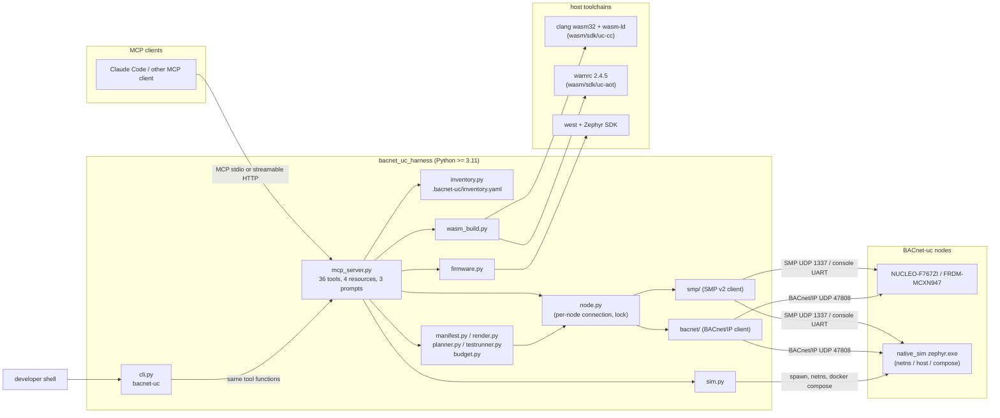
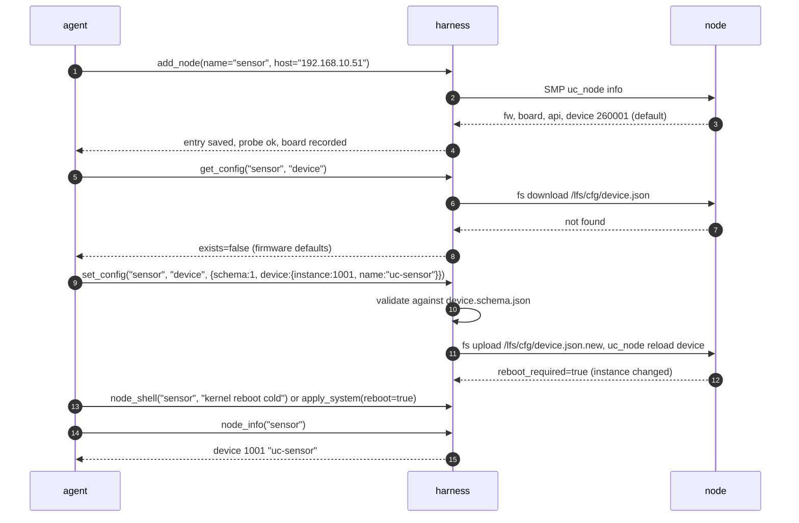
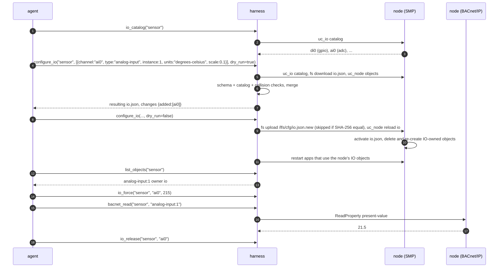
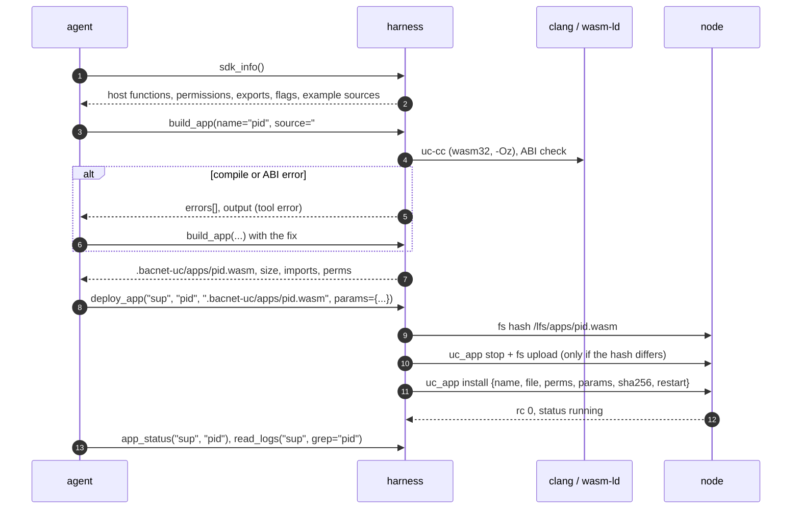
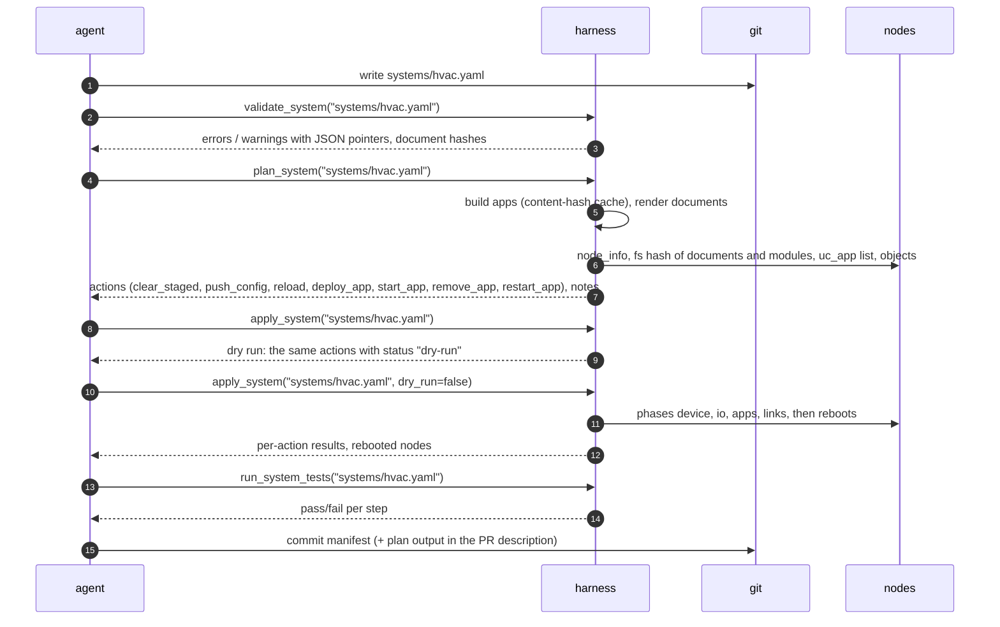
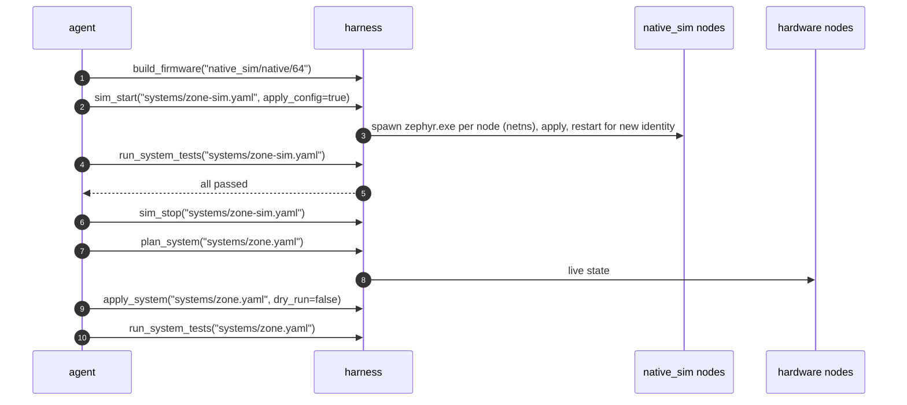
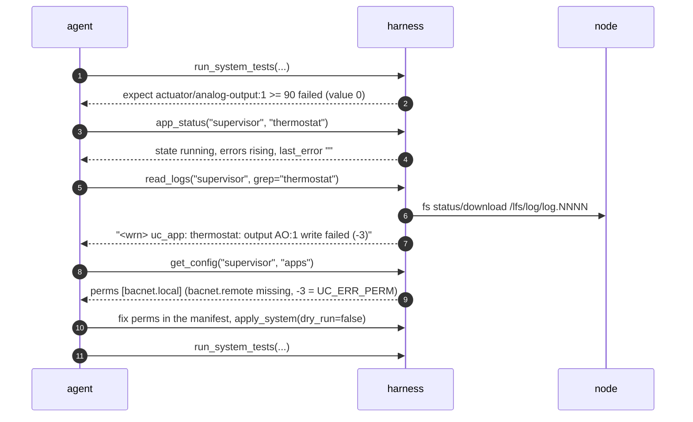
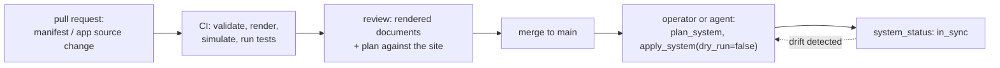

# Development harness and MCP server

The development harness is the Python package `bacnet_uc_harness` in
[`harness/`](../harness/). It gives an AI agent (through the Model Context
Protocol) and a developer (through the `bacnet-uc` command line) the same set
of operations on BACnet-uc nodes: commissioning, IO configuration, BACnet
property access, building and deploying WebAssembly applications, logs,
firmware builds and updates, `native_sim` simulation, and declarative
distributed applications.

This document is the concept: goals, architecture, the tool catalog, agent
workflows, the safety model and how the harness fits into version control and
CI. The package reference (installation, every CLI command, library use) is
[`harness/README.md`](../harness/README.md). The manifest model is described in
[distributed-apps.md](distributed-apps.md), simulation in
[simulation.md](simulation.md), the wire protocol in
[management-protocol.md](management-protocol.md).

Items marked **Planned** are not implemented. Everything else was checked
against `harness/src/bacnet_uc_harness/` (tool names, arguments and
annotations are taken from the running server, see [Verification](#12-verification)).

## 1. Goals

| # | Goal | How the harness meets it | Status |
|---|------|--------------------------|--------|
| G1 | An agent can commission a node without knowing SMP or CBOR | node tools (`add_node`, `node_info`, `set_config`, `configure_io`) hide the transport; schemas and docs are MCP resources | Implemented |
| G2 | IO is configured from the board's own catalog, not from pin tables in a prompt | `io_catalog` reads the devicetree catalog from the node; `configure_io` validates against it | Implemented |
| G3 | The agent can write, compile and deploy control logic | `sdk_info` + header resource, `build_app` (C to WebAssembly with ABI check), `deploy_app` (hash-based upload, install, start) | Implemented |
| G4 | Multi-node BACnet applications are described, not scripted | system manifest (`schemas/system.schema.json`), `validate_system` / `plan_system` / `apply_system` | Implemented |
| G5 | Every change can be verified by the agent | BACnet reads/writes, IO forcing, manifest acceptance tests (`run_system_tests`), logs | Implemented |
| G6 | The same workflow runs without hardware | `sim_start` runs `native_sim` nodes in network namespaces or containers | Implemented |
| G7 | An agent cannot cause irreversible damage by accident | dry-run defaults, `confirm` flags, shell disabled by default, MCP tool annotations | Implemented (partially, see [section 7](#7-safety-model)) |
| G8 | Humans can review and reproduce what the agent did | manifests in git, deterministic rendering, plans as data; audit log of tool calls | Manifests: implemented; audit log: **Planned** |

Non-goals: the harness is not a BACnet operator workstation (no trend
display, no alarm console) and not a production commissioning tool for
third-party devices. It talks BACnet/IP only to verify what it configured.

## 2. Architecture



| Layer | Module | Responsibility |
|-------|--------|----------------|
| Protocol front ends | `mcp_server.py`, `cli.py` | MCP tools/resources/prompts; the CLI calls the same tool functions (`server.harness_tools`) and prints YAML or JSON |
| Context | `HarnessContext` in `mcp_server.py` | inventory, connection pool, per-node `asyncio.Lock`, loaded systems, running simulations, artifact builder |
| Node access | `node.py`, `smp/`, `bacnet/` | SMP v2 client (UDP, serial framing), BACnet/IP client (Who-Is, ReadProperty, WriteProperty), SHA-256 based uploads |
| System model | `manifest.py`, `render.py`, `planner.py`, `testrunner.py`, `budget.py` | load/validate manifests, render per-node documents, WAMR pool budget per node, diff against live state, apply, run acceptance tests |
| Toolchains | `wasm_build.py`, `firmware.py` | `uc-cc`/clang, ABI check, `uc-aot`/wamrc; `west build`, `west flash`, MCUboot image inspection |
| Simulation | `sim.py` | `native_sim` processes in network namespaces, on the host, or under docker compose |
| Test double | `testing/fake_node.py` | in-process node (SMP + BACnet/IP over real UDP sockets) used by the harness test suite |

### 2.1 Transports

| Path | Protocol | Used for | Details |
|------|----------|----------|---------|
| MCP client → server | MCP over stdio (default) or streamable HTTP (`--http`, default `127.0.0.1:8000/mcp`) | all tools | official MCP Python SDK (`MCPServer` with mcp >= 2, `FastMCP` with mcp 1.x) |
| harness → node, management | SMP v2 over UDP port 1337, or over the console UART (shell transport framing, 115200 8N1, frames up to 1152 bytes without line pacing; needs the `serial` extra) | configuration (staged `*.json.new` uploads), files, apps, IO, logs, firmware images | requests are retried with the same sequence number; default timeout 3 s, 2 retries in the MCP server context |
| harness → node, verification | BACnet/IP (unsegmented confirmed requests, max APDU 1476) | `bacnet_read`, `bacnet_write`, test `expect`/`write` | `via="auto"` falls back to SMP `prop_read`/`prop_write` when BACnet/IP is unavailable (no address, timeout); a BACnet Error/Reject/Abort is returned as a tool error |
| harness → toolchains | subprocess | `build_app`, `build_firmware`, `flash_firmware` | clang/wasm-ld, wamrc, west |

Every node tool takes the node's lock, so two concurrent tool calls on one
node are serialised (a file upload is never interleaved with another SMP
request). Calls on different nodes run concurrently.

## 3. Tool catalog

Annotations are the MCP tool hints the server declares: **ro** =
`readOnlyHint`, **destr** = `destructiveHint`, **idem** = `idempotentHint`,
**closed** = `openWorldHint: false` (the tool does not touch a node or the
network). `?` marks optional arguments; defaults in parentheses. Errors are
MCP tool errors whose text is a JSON object with `error`, `message` and,
depending on the error, `issues` (JSON-pointer paths), `group`/`rc`/`rc_name`
(SMP), `kind`/`error_class`/`error_code` (BACnet) or `errors`/`output`
(compiler).

### 3.1 Inventory and discovery

| Tool | Purpose | Key arguments | Hints | Gate |
|------|---------|---------------|-------|------|
| `list_nodes` | inventory entries, nodes of loaded manifests, running simulations | – | ro, idem, closed | |
| `add_node` | add or replace an inventory entry, probe it with `node_info` | `name`, `transport?` (`udp`\|`serial`\|`sim`, default `udp`), `host?`, `port?` (1337), `device?`, `baud?` (115200), `bacnet_address?`, `board?`, `replace?` (false), `probe?` (true) | idem, closed | |
| `remove_node` | remove an inventory entry (the node is not touched) | `name` | destr, idem, closed | |
| `discover_devices` | Who-Is / I-Am | `broadcast?` (255.255.255.255), `low?`, `high?`, `timeout_s?` (3), `target?` (unicast Who-Is) | ro | |

### 3.2 Node and configuration documents

| Tool | Purpose | Key arguments | Hints | Gate |
|------|---------|---------------|-------|------|
| `node_info` | firmware, board, API version, device identity, network, FS usage, apps, WASM runtime | `node` | ro, idem | |
| `get_config` | read `/lfs/cfg/<doc>.json` (`exists=false`: firmware defaults) | `node`, `doc` (`device`\|`io`\|`apps`) | ro, idem | |
| `set_config` | schema-validated upload of a whole document as `/lfs/cfg/<doc>.json.new`, then `uc_node reload` (the node activates it, or rejects and deletes it: rc `INVALID`); after an `io` reload the node's apps that use its IO objects are restarted (`restarted_apps`) | `node`, `doc`, `content`, `reload?` (true), `force?` (false) | destr, idem | schema validation before upload; firmware validation at the reload |
| `reload_config` | `uc_node reload` of one or all documents (a staged `.new` is activated first); `io`/`all` restart the apps that use IO objects | `node`, `doc?` (`all`) | idem | |

### 3.3 IO

| Tool | Purpose | Key arguments | Hints | Gate |
|------|---------|---------------|-------|------|
| `io_catalog` | channels from the node's devicetree catalog: name, kind, hw, description, forced, bound object | `node` | ro, idem | |
| `configure_io` | merge or replace `io.json` points, validated against schema, catalog and app-owned objects; staged upload + reload, then restart of the apps that use the node's IO objects (`restarted_apps`) | `node`, `points`, `mode?` (`merge`\|`replace`), `dry_run?` (false) | destr, idem | `dry_run` |
| `io_read` | raw channel values (di/do 0\|1, ai mV, ao %) | `node`, `channel?` | ro | |
| `io_write` | drive an output channel directly (on a bound channel until the object's Present_Value changes) | `node`, `channel`, `value` | destr, idem | firmware rejects inputs (rc `PERM`) |
| `io_force` | force a channel (test stimulus) until released | `node`, `channel`, `value` | destr, idem | |
| `io_release` | release a forced channel | `node`, `channel` | destr, idem | |

### 3.4 BACnet objects

| Tool | Purpose | Key arguments | Hints | Gate |
|------|---------|---------------|-------|------|
| `bacnet_read` | ReadProperty (or SMP `prop_read`); `index` 0 is the array size; over SMP an array or list without `index` comes back whole (read element by element when it does not fit one SMP response) | `node`, `object` (`analog-input:1`), `property?` (`present-value`), `index?`, `via?` (`auto`\|`bacnet`\|`smp`) | ro | |
| `bacnet_write` | WriteProperty with read-back; `null` relinquishes | `node`, `object`, `value` (`null` relinquishes), `property?` (`present-value`), `priority?`, `index?`, `via?` (`auto`\|`bacnet`\|`smp`) | destr | |
| `list_objects` | objects with name, owner (`system`, `io`, `app:<name>`, `network`) and present value | `node` | ro, idem | |

### 3.5 Applications

| Tool | Purpose | Key arguments | Hints | Gate |
|------|---------|---------------|-------|------|
| `sdk_info` | host API parsed from `bacnet_uc.h` (prototypes, permissions), exports, error codes, libc subset, compiler flags, example sources | – | ro, idem, closed | |
| `build_app` | C to `.wasm` (+ `.aot`), ABI check, derived permissions | `name`, `source_path?` or `source?` (inline C), `aot_board?`, `opt?` (`-Oz`), `defines?`, `output_dir?` (`.bacnet-uc/apps`) | idem, closed | ABI check rejects the module |
| `deploy_app` | upload to `/lfs/apps/<name>.wasm\|.aot` if the hash differs, `uc_app install` (or, when the install request would exceed one SMP request, an `apps.json` entry and `reload apps`: `installed_via`), start | `node`, `name`, `module_path`, `autostart?` (true), `period_ms?` (1000), `heap_kb?` (8), `stack_kb?` (4), `perms?` (derived from imports), `params?`, `force?` (false) | destr, idem | ABI check; firmware checks sha256, size, magic, API major |
| `app_control` | start, stop, restart, remove | `node`, `name`, `action`, `delete_file?` (true) | destr | |
| `list_apps` | apps with state and counters | `node` | ro, idem | |
| `app_status` | one app: state, ticks, events, errors, `last_error`, uptime | `node`, `name` | ro, idem | |
| `read_logs` | tail of `/lfs/log/log.NNNN` | `node`, `lines?` (200), `grep?` (regex) | ro | |
| `node_shell` | Zephyr shell command through the SMP shell group | `node`, `command` | destr | disabled unless `BACNET_UC_ALLOW_SHELL=1` or `--allow-shell` |

### 3.6 Firmware

| Tool | Purpose | Key arguments | Hints | Gate |
|------|---------|---------------|-------|------|
| `build_firmware` | `west build` of `firmware/` | `board` (`nucleo_f767zi`\|`frdm_mcxn947/mcxn947/cpu0`\|`native_sim/native/64`), `pristine?` (false), `sysbuild?` (false; true = MCUboot), `snippets?`, `extra_conf?`, `cmake_args?`, `build_dir?` (`.bacnet-uc/build/fw-<board>`) | idem, closed | |
| `flash_firmware` | `west flash` of a locally attached board | `build_dir`, `runner?`, `confirm?` (false) | destr | `confirm=true`; otherwise returns the command it would run |
| `update_firmware` | OTA over SMP: upload `zephyr.signed.bin`, test boot, reset, wait, confirm | `node`, `build_dir`, `confirm?` (false), `make_permanent?` (true), `timeout_s?` (90) | destr | `confirm=true`; MCUboot reverts an unconfirmed image |

### 3.7 Distributed systems

| Tool | Purpose | Key arguments | Hints | Gate |
|------|---------|---------------|-------|------|
| `validate_system` | schema, placeholders, semantic checks (object collisions, link priorities, value objects), rendered document hashes, WAMR pool budget per node (`wamr_pool`; builds the apps, warning above 90 %) | `system` (manifest path), `live_catalogs?` (false) | ro, idem | |
| `plan_system` | diff manifest vs. live nodes; list of actions (`clear_staged`, `push_config`, `reload`, `remove_app`, `deploy_app`, `start_app`, `restart_app`) and notes (builds apps, cached) | `system`, `prune?` (false) | ro | |
| `apply_system` | execute the plan: device → IO → apps → links (then app restarts); reboot nodes that need it | `system`, `dry_run?` (**true**), `prune?` (false), `reboot?` (true) | destr | dry run by default |
| `run_system_tests` | manifest acceptance tests (force, release, write, wait, expect) | `system`, `tests?`, `stop_on_failure?` (true) | destr | forced channels are released after each test |
| `system_status` | per node: reachability, firmware, identity, uptime, app states, pending actions | `system` | ro | |

### 3.8 Simulation

| Tool | Purpose | Key arguments | Hints | Gate |
|------|---------|---------------|-------|------|
| `sim_start` | start the manifest's `transport: sim` nodes as `native_sim` processes, add them to the inventory | `system`, `firmware_exe?`, `mode?` (`netns`\|`host`\|`compose`, default `netns`), `erase_flash?` (false), `apply_config?` (false) | destr | `netns` needs root |
| `sim_stop` | stop the processes, remove the network, drop the inventory entries (flash images kept) | `system` (manifest or name) | destr, idem | |
| `sim_status` | mode, addresses, pids, liveness, console log tails | `system?` | ro, idem, closed | |

## 4. Resources and prompts

| Resource URI | Content |
|--------------|---------|
| `bacnet-uc://docs/{name}` | `docs/<name>.md` (e.g. `management-protocol`, `distributed-apps`), plus the aliases `wasm-sdk` (`wasm/README.md`), `uc-link` (`wasm/examples/uc-link/README.md`), `harness` (`harness/README.md`) |
| `bacnet-uc://schemas/{name}` | `device`, `io`, `apps`, `system` schemas; `example-device`, `example-io`, `example-apps` |
| `bacnet-uc://sdk/bacnet_uc.h` | the WebAssembly guest ABI header |
| `bacnet-uc://nodes/{name}/info` | live `node_info` of an inventory node (JSON) |

| Prompt | Arguments | Steps it gives the agent |
|--------|-----------|--------------------------|
| `design_distributed_app` | `goal` | inventory and catalogs, read the contracts, write a manifest (nodes, IO, apps, links, tests), validate, plan, apply, test, iterate |
| `commission_node` | `node` | check `node_info`, set identity, propose and apply an IO mapping, verify every point by forcing/reading and writing/reading, review logs |
| `debug_app` | `node`, `app` | status and `last_error`, logs, `apps.json` entry (perms, params), owned objects, permissions vs. imports, remote bindings, fix and restart |

The server also sends MCP `instructions` (a short workflow summary and the
value conventions: raw channel values vs. engineering units, object
references as `<type>:<instance>`).

## 5. Agent workflows

### 5.1 Commission a board



A device instance, BACnet port or static IPv4 change takes effect after a
reboot only. Without the shell enabled, an agent reboots nodes through
`apply_system(reboot=true)` (which uses SMP `os reset`) or asks the operator.

### 5.2 Configure IO end to end

The IO path crosses four representations: the devicetree catalog (compiled
into the firmware), the `io.json` document, the BACnet objects the firmware
creates from it, and the values a BACnet client reads.



| Stage | Artifact | Validation |
|-------|----------|------------|
| catalog | `firmware/boards/io/<board>.dtsi`, binding [`dts/bindings/uc,io-channels.yaml`](../dts/bindings/uc,io-channels.yaml); served by `uc_io catalog` | build time (devicetree) |
| points | `io.json` ([`schemas/io.schema.json`](../schemas/io.schema.json)) | `configure_io`: schema; channel exists; channel bound once; object bound once; object type allowed for the channel kind (di → binary-input\|multi-state-input, do → binary-output\|binary-value, ai → analog-input, ao → analog-output\|analog-value); object not owned by an app |
| objects | BACnet objects with owner `io` | firmware on `reload io` (points it cannot bind are skipped and logged); `list_objects` |
| values | Present_Value = raw × `scale` + `offset` (analog) | `io_force` + `bacnet_read` for inputs; `bacnet_write` + `io_read` for outputs |

Details of scaling, debouncing and forcing: [io.md](io.md).

### 5.3 Write and deploy a control application



Permissions default to what the module imports (`bacnet.local` for local
object functions, `bacnet.remote` for remote requests, `io`, `kv`). An agent
that passes `perms` explicitly narrows or widens them; the firmware enforces
them per host call (`UC_ERR_PERM`). The API contract is
[`bacnet_uc.h`](../wasm/sdk/include/bacnet_uc.h); runtime behaviour is in
[wasm-runtime.md](wasm-runtime.md).

### 5.4 Plan and apply a distributed system



The planner, the apply order and failure handling are described in
[distributed-apps.md](distributed-apps.md#7-planning-and-apply).

### 5.5 Test in simulation, then on hardware

A manifest whose nodes use `transport: {kind: sim}` runs unchanged against
`native_sim`. The hardware variant differs in `board`, `transport` and
possibly `network`; apps, links and tests stay the same.



Keeping two manifests in sync by hand is error-prone; the recommended layout
is one manifest per target with identical `apps`, `links` and `tests`
sections (checked in review). A manifest overlay mechanism is **Planned**
([roadmap.md](roadmap.md)). Differences between simulation and hardware are
listed in [simulation.md](simulation.md#7-limitations-compared-with-hardware).

### 5.6 Debug through logs



The scenario is illustrative (the manifest set `perms` explicitly and left
out `bacnet.remote`; without `perms` the harness derives them). The log line
format is the one `thermostat.c` and the firmware's `uc_app` log source
produce. `debug_app` (prompt) encodes this sequence. Useful signals:

| Signal | Tool | Meaning |
|--------|------|---------|
| `state: failed`, `last_error` | `app_status` | load error (ABI major mismatch, unresolved import, pool exhausted), trap, watchdog |
| `errors` counter rising | `app_status` | host calls return negative codes (permissions, timeouts, missing objects) |
| log lines `<err>`/`<wrn>` of `uc_app`, `uc_bn_client`, `uc_bn_cov` | `read_logs` | remote binding failures, COV fallback to polling |
| objects with owner `app:<name>` missing | `list_objects` | app not running, or it failed before creating them |
| peer not answering | `bacnet_read` on the peer node | network, static binding or device instance mismatch |

## 6. Inventory, state and GitOps

### 6.1 State on the harness host

All state lives in `<home>/.bacnet-uc/` (`<home>` = `BACNET_UC_HOME` or the
current directory; ignored by git through `.gitignore`).

| Path | Content | Written by |
|------|---------|------------|
| `inventory.yaml` | node name → transport, addresses, board | `add_node`, `remove_node`, `sim_start`, `sim_stop` |
| `apps/` | modules from `build_app` | `build_app` |
| `cache/wasm/<key>/`, `cache/aot/<key>/<board>/` | manifest app builds keyed by source, optimisation level and SDK header hash | `plan_system`, `apply_system` |
| `build/fw-<board>/` | firmware builds | `build_firmware` |
| `sim/<system>/` | flash images, console logs, `sim-state.json`, `docker-compose.yml` | `sim_start` |

The inventory is host-specific (IP addresses of the bench, serial device
names). Everything that describes the *desired* state of a system belongs in
a manifest.

### 6.2 Manifests in git



| Property | Mechanism |
|----------|-----------|
| Reproducible documents | `render.py` serialises compact JSON with a trailing newline; the planner compares SHA-256 with the node's `fs hash` |
| Reproducible modules | app builds are cached by content hash; the manifest can pin prebuilt modules with `wasm:` |
| Reviewable change | `bacnet-uc system render MANIFEST -o out/` writes the per-node documents; `plan_system` output is a JSON list of actions |
| Drift detection | `system_status` reports `in_sync` and pending actions per node |
| Idempotent apply | re-applying an applied manifest yields an empty plan (verified in simulation, [section 12](#12-verification)) |

Out-of-band changes (a BMS writing a setpoint, an operator uploading a file)
are only detected if they change a managed document or module. Priority-array
entries and Present_Values are runtime state, not part of the plan.

## 7. Safety model

The harness assumes the agent is competent but fallible and that the MCP
client shows tool calls to a human (Claude Code asks before running a tool
that is not allowed by a permission rule). Controls:

| Control | Where | Status |
|---------|-------|--------|
| MCP annotations (`readOnlyHint`, `destructiveHint`, `idempotentHint`, `openWorldHint`) on every tool | `mcp_server.py` | Implemented |
| Plan before apply: `plan_system` is read-only; `apply_system` defaults to `dry_run=true` | planner | Implemented |
| Explicit confirmation for flashing and OTA: `flash_firmware` and `update_firmware` do nothing without `confirm=true` and return what they would do | `mcp_server.py` | Implemented |
| MCUboot test boot: an OTA image that does not answer after reset is not confirmed and is reverted at the next reset | `update_firmware`, MCUboot | Implemented (sysbuild builds only) |
| Remote shell off by default: `node_shell` fails unless the server was started with `BACNET_UC_ALLOW_SHELL=1` / `--allow-shell` | `mcp_server.py` | Implemented |
| Validation before upload: documents against the JSON schemas; IO points against the live catalog; modules against the ABI; manifests with semantic checks and a WAMR pool budget | `set_config`, `configure_io`, `build_app`/`deploy_app`, `validate_system` | Implemented |
| Staged configuration: documents are uploaded as `<doc>.json.new`; the node validates and activates them atomically at the reload, an invalid or half-transferred document never replaces the active one | `node.push_config`, firmware | Implemented |
| Apps that depend on re-created IO objects are restarted after an `io.json` reload, so linked outputs do not stay at Relinquish_Default | `set_config`, `configure_io`, `reload_config`, planner action `restart_app` | Implemented |
| Failure containment in apply: after a failed action the node's remaining actions are skipped; other nodes continue | `planner.apply` | Implemented |
| Serialisation per node (no interleaved uploads) | per-node `asyncio.Lock` | Implemented |
| Test cleanup: forced channels are released at the end of each test | `testrunner` | Implemented |
| Bounded retries: SMP requests retried a fixed number of times; test `expect` polls every 200 ms up to `within_ms` | `smp/client.py`, `testrunner.py` | Implemented |
| Firmware side limits the blast radius of an app (permissions, watchdog, pool, rate-limited logging) | firmware | Implemented, see [wasm-runtime.md](wasm-runtime.md#7-sandboxing) |
| Authenticated, encrypted management (SMP over DTLS with PSK or certificates) | firmware + `smp/transport.py` | **Planned** ([security.md](security.md#4-management-plane)) |
| Rate limits per node and per tool (e.g. writes to outputs per second, apply frequency) | harness | **Planned** |
| Audit log of tool calls (time, client, tool, arguments, node, result) as JSON lines in `.bacnet-uc/audit.log` | harness | **Planned** |
| Site scoping: an inventory or manifest flag `protected: true` that makes destructive tools require `confirm=true` for that node | harness | **Planned** |

Least privilege with Claude Code: allow the read-only tools, keep the
destructive ones behind the per-call prompt. Example project
`.claude/settings.json`:

```json
{
  "permissions": {
    "allow": [
      "mcp__bacnet-uc__list_nodes",
      "mcp__bacnet-uc__node_info",
      "mcp__bacnet-uc__get_config",
      "mcp__bacnet-uc__io_catalog",
      "mcp__bacnet-uc__io_read",
      "mcp__bacnet-uc__bacnet_read",
      "mcp__bacnet-uc__list_objects",
      "mcp__bacnet-uc__sdk_info",
      "mcp__bacnet-uc__build_app",
      "mcp__bacnet-uc__list_apps",
      "mcp__bacnet-uc__app_status",
      "mcp__bacnet-uc__read_logs",
      "mcp__bacnet-uc__validate_system",
      "mcp__bacnet-uc__plan_system",
      "mcp__bacnet-uc__system_status",
      "mcp__bacnet-uc__sim_status"
    ],
    "deny": [
      "mcp__bacnet-uc__flash_firmware",
      "mcp__bacnet-uc__update_firmware"
    ]
  }
}
```

Operational rules for sites with real plant:

1. Run the harness on a management host that can reach the nodes' SMP port;
   do not expose SMP UDP 1337 beyond that network ([security.md](security.md)).
2. Start the MCP server without `--allow-shell`.
3. Use HTTP transport only on `127.0.0.1` (the default); the streamable HTTP
   endpoint has no authentication of its own.
4. Treat `bacnet_write`, `io_write` and `io_force` on a live plant as
   operator actions: forcing an output bypasses the control logic.

## 8. CI usage

The CLI runs every tool headless, so the same checks an agent performs run in
CI. Exit status: 0 success, 1 failure (error, invalid manifest, failed apply
or test), 2 usage error.

### 8.1 The repository's workflow

[`.github/workflows/ci.yml`](../.github/workflows/ci.yml) runs on pushes to
`main`, on pull requests and by hand. It has not run on GitHub yet: the jobs'
commands were run locally, the workflow file was checked with `actionlint`.

| Job | Runner steps | Checks |
|-----|--------------|--------|
| `harness` (Python 3.11 and 3.12) | `pip install -e 'harness[dev,serial,sim]'`, clang + lld | `ruff check src tests`; `pytest -q -rs` (the e2e tests are skipped here) |
| `wasm-sdk` | WAMR sources at `WAMR-2.4.5`, clang, lld, CMake, Ninja; wamrc from the WAMR 2.4.5 release | `make -C BACNet-uc/wasm check` (examples, host tests, AOT, WAMR runner validation); without wamrc `make all test validate` |
| `firmware` | `zephyrproject-rtos/action-zephyr-setup@v1` (west workspace, Zephyr SDK 1.0.1, `arm-zephyr-eabi`) | pristine builds of `native_sim/native/64`, `nucleo_f767zi` and `frdm_mcxn947/mcxn947/cpu0` with `-DCONFIG_COMPILER_WARNINGS_AS_ERRORS=y`; unit tests (`-t run`, must print `PROJECT EXECUTION SUCCESSFUL`); uploads `zephyr.exe` of `native_sim` |
| `e2e` (needs `firmware`) | the `native_sim` firmware artifact, the harness | `sudo ... harness/tests/e2e/run-isolated.sh -m e2e tests/e2e`; fails if any e2e test was skipped |

### 8.2 End-to-end tests

`harness/tests/e2e/` (pytest marker `e2e`) runs the harness against the real
`native_sim` firmware given by `BACNET_UC_FIRMWARE`; without it the tests are
skipped.

| File | Tests | Content |
|------|------:|---------|
| `test_single_node.py` | 9 | one node in `host` mode: `node_info` and the SMP size limits; staged `device.json` (activation, an invalid staged file deleted, reboot in place); IO forcing observed over BACnet/IP (a point on an unknown channel skipped, force rules); `prop_read`/`prop_write` rules (whole arrays, priority 6, invalid values); `bacnet.password` for DCC/ReinitializeDevice; SMP over the console pty with full-size frames; deploying the example apps; a large manifest installed through `apps.json`; the `uc-link` restart after an `io.json` reload |
| `test_sim_demo.py` | 1 | [`sim-demo.yaml`](../harness/examples/systems/sim-demo.yaml) through the CLI in `netns` mode: `sim up`, `validate`, `plan`, `apply` (reboots), re-plan in sync, the three manifest tests, IO drift followed by `push_config io` and `restart_app`, `status`, `sim down` |

```sh
cd BACNet-uc/harness
sudo PYTHON=$(command -v python) BACNET_UC_FIRMWARE=/path/to/build-native/zephyr/zephyr.exe \
    tests/e2e/run-isolated.sh            # default arguments: -m e2e tests/e2e
```

`run-isolated.sh` runs pytest in new network and mount namespaces with a
private `/run/netns`, so the ports 1337/47808, the bridge `bnuc0` and the
namespace names cannot collide with other simulations on the machine, and
nothing is left behind. Result for the current state: 10 passed in about 22 s.

### 8.3 Custom systems in CI

A project that keeps its own manifests can run them with the same commands
(a recipe, not part of `ci.yml`; the commands were run locally as described
in [section 12](#12-verification)):

```yaml
      - name: Validate manifests
        run: |
          cd ws/BACNet-uc
          for m in harness/examples/systems/*.yaml; do bacnet-uc system validate "$m"; done
      - name: Build native_sim firmware
        run: cd ws/BACNet-uc && bacnet-uc firmware build native_sim/native/64
      - name: Simulate and test
        run: |
          cd ws/BACNet-uc
          M=harness/examples/systems/sim-demo.yaml
          sudo -E env "PATH=$PATH" bacnet-uc sim up "$M"
          sudo -E env "PATH=$PATH" bacnet-uc system apply "$M" --no-dry-run
          bacnet-uc system test "$M"
      - name: Stop simulation
        if: always()
        run: cd ws/BACNet-uc && sudo -E env "PATH=$PATH" bacnet-uc sim down sim-demo
      - uses: actions/upload-artifact@v4
        if: always()
        with: {name: sim-logs, path: ws/BACNet-uc/.bacnet-uc/sim/}
```

Notes:

- `sim up` in `netns` mode needs root. `system apply` as root restarts
  simulated nodes by killing and re-spawning the process inside its
  namespace after identity or address changes; without root it reboots them
  over SMP (the `native_sim` firmware restarts its process in place).
  `sim down` stops root-owned processes. `system test`, `plan` and `status`
  only talk to the nodes through the bridge `bnuc0` (`10.47.0.254`) and run
  unprivileged.
- `BACNET_UC_HOME` defaults to the current directory: run all commands in the
  same directory (with `sudo -E`, so that the same environment is used).
- Hardware-in-the-loop CI uses the same commands with a manifest whose nodes
  use `transport: udp` on a self-hosted runner attached to the bench network.

## 9. Extensibility

### 9.1 A new board

| Step | File |
|------|------|
| Firmware port: board `.conf`/`.overlay`, IO catalog `firmware/boards/io/<board>.dtsi`, storage partition | `firmware/boards/` (see [io.md](io.md#6-adding-a-board)) |
| Allow the board in manifests | `schemas/system.schema.json` `$defs/node/properties/board/enum` (contract change) |
| Build support | `firmware.BOARDS` in `firmware.py`, `build_firmware` `board` literal in `mcp_server.py` |
| AOT target (if the firmware enables AOT) | `wasm_build.AOT_TARGETS`, `wasm/sdk/uc-aot` |
| Offline catalog validation | nothing: `manifest.py` reads `firmware/boards/io/<board_key>.dtsi` |
| WAMR pool budget | nothing: `budget.py` reads `CONFIG_UC_APP_POOL_SIZE` from `firmware/boards/<board_key>.conf` |
| CI | a build step in the `firmware` job of `.github/workflows/ci.yml` |

### 9.2 A new tool group

Pattern used by all existing tools:

1. Protocol: new SMP command or group in the firmware
   (`firmware/src/mgmt/`), documented in
   [management-protocol.md](management-protocol.md) (contract change).
2. Client: method in `smp/client.py` (and `smp/groups.py` constants), then a
   `Node` method in `node.py`.
3. Tool: an `async def` inside `create_server()` decorated with
   `@tool(read_only=..., destructive=..., idempotent=..., open_world=...)`,
   typed arguments with `Annotated[..., Field(description=...)]`, taking
   `ctx.lock(node)` around node access. Errors are raised as `HarnessError`
   subclasses; the decorator turns them into JSON tool errors.
4. CLI: a sub-command in `cli.py` that calls the tool function.
5. Tests: `testing/fake_node.py` implements the command; `test_mcp_server.py`
   calls the tool through the SDK's in-memory client.

Candidate groups (**Planned**): `trend_*` (trend log objects), `schedule_*`
(schedule/calendar objects), `cert_*` (credential provisioning for DTLS and
BACnet/SC), `audit_*` (read the audit log). See [roadmap.md](roadmap.md).

## 10. Configuration of the server

| Setting | Effect |
|---------|--------|
| `bacnet-uc-mcp` | stdio server (default) |
| `bacnet-uc-mcp --http [--host 127.0.0.1] [--port 8000]` | streamable HTTP at `/mcp` |
| `--home DIR` / `BACNET_UC_HOME` | location of `.bacnet-uc/` |
| `--allow-shell` / `BACNET_UC_ALLOW_SHELL=1` | enables `node_shell` |
| `BACNET_UC_ROOT` | repository root (schemas, docs, SDK, board catalogs) when the working directory is outside the repository |
| `ZEPHYR_SDK_INSTALL_DIR` | passed to west |
| `UC_CLANG`, `WAMRC` | clang and wamrc executables |

Claude Code, project scope:

```sh
claude mcp add bacnet-uc --scope project \
  --env BACNET_UC_HOME="$PWD" -- /opt/zvenv/bin/bacnet-uc-mcp
```

This writes `.mcp.json` in the current directory with a `stdio` server entry.
A server started separately with `--http` is added with
`claude mcp add --transport http bacnet-uc http://127.0.0.1:8000/mcp`.

## 11. Limitations

| Limitation | Consequence |
|------------|-------------|
| SMP has no authentication in the default firmware | anyone who reaches UDP 1337 has the same power as the harness; see [security.md](security.md) |
| `discover_devices` binds UDP 47808 (shared) to see broadcast I-Ams | do not combine with a host-mode simulation on the same host |
| `native_sim` nodes cannot send or receive broadcasts (NSOS) | the harness renders static bindings; Who-Is discovery of simulated nodes needs `target=` |
| AOT modules need firmware built with `CONFIG_WAMR_AOT=y`, on the boards also `CONFIG_WAMR_AOT_MPU_EXEC=y` (both off by default; see [wasm-runtime.md](wasm-runtime.md#21-aot-and-the-mpu)) | `aot: true` in a manifest fails at install with rc `UNSUPPORTED` on the default firmware; `node_info` `wasm.aot` tells whether a node loads AOT files |
| One manifest per target | simulation and hardware variants are separate files (overlay **Planned**) |
| The WAMR pool budget is an estimate | `validate_system` predicts each node's pool use from the built modules and warns above 90 % of `CONFIG_UC_APP_POOL_SIZE`; the constants are fitted to `native_sim` (64-bit) measurements, so they are conservative for the boards, and Thumb AOT files are not calibrated. A node that runs out still fails the start (`NO_MEM`, `last_error`) |
| Value objects ignore priorities | AV, BV and MSV on BACnet-uc nodes have no priority array: `validate_system` rejects two links to one value object and priority 6 on outputs, and warns about a priority or a `null` test write on a value object |
| A staged document waits for the next reload | a `set_config(reload=false)` leaves `<doc>.json.new` on the node, and the next reload or boot activates it. A later `set_config` of the document that is already active removes it (`staged_cleared`), and `plan_system` plans `clear_staged` for a staged document that differs from the manifest, so `apply_system` removes it before any reload or reboot |
| No partial apply per node | `apply_system` applies all nodes of a manifest; use a manifest with fewer nodes for a canary ([distributed-apps.md](distributed-apps.md#11-versioning-and-rollout)) |

## 12. Verification

What was checked for this document, and how:

| Check | Command / method | Result |
|-------|------------------|--------|
| Tool names, arguments, defaults, annotations, resources, prompts | `create_server()`, then `list_tools()`, `list_resource_templates()`, `list_resources()`, `list_prompts()` through the in-memory `mcp.Client` of the installed MCP SDK (mcp 2.2.0) | 36 tools, 3 resource templates + 1 resource, 3 prompts; the tables of sections 3 and 4 match |
| stdio server and shell gate | MCP SDK stdio client against `bacnet-uc-mcp --home <dir>`: `initialize`, `list_tools`, `node_info` of a `native_sim` node, `node_shell` | 36 tools; `node_info` answered; `node_shell` returns the "disabled" tool error |
| `claude mcp add` | the command of section 10 in a scratch directory | writes `.mcp.json` with the `stdio` entry and `BACNET_UC_HOME` |
| Single-node CLI flow (sections 5.1-5.3 equivalents) | `native_sim/native/64` build, one node in a private network namespace; the quick start of the top-level README and [getting-started.md](getting-started.md) sections 4-10 | all succeeded; `analog-input:1` read 21.5 after forcing `ai0` to 2150 mV with scale 0.01 |
| Distributed flow | `harness/examples/systems/sim-demo.yaml` in `netns` mode inside private network and mount namespaces: `sim up --erase`, `system plan`, `system apply --no-dry-run`, `system status`, `system test`, `sim down` | 6 actions applied, both nodes rebooted, `in_sync: true`, 3 of 3 tests passed |
| Harness test suite | `cd harness && python -m pytest -q` (in a private network namespace) | 596 passed, 10 skipped (the e2e tests without a firmware); `ruff check src tests` clean |
| End-to-end tests | `sudo PYTHON=... BACNET_UC_FIRMWARE=<build>/zephyr/zephyr.exe tests/e2e/run-isolated.sh` | 10 passed |
| CI workflow | not run on GitHub; its commands were run locally by the harness integration | - |
