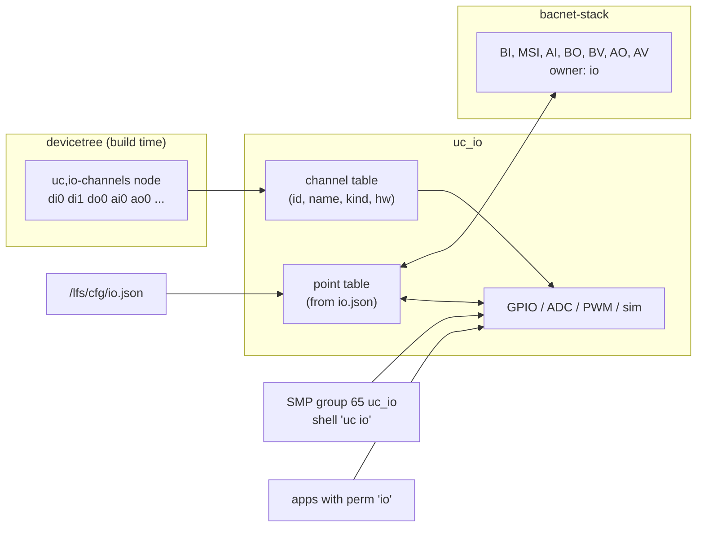

# IO

How physical and simulated inputs and outputs reach BACnet objects: the
channel catalog in the devicetree, the point mapping in `io.json`, value
transformations, scan timing, forcing for tests and how to add a board.

Implementation: [`firmware/src/io/uc_io.c`](../firmware/src/io/uc_io.c), API
[`uc_io.h`](../firmware/include/uc/uc_io.h), binding
[`dts/bindings/uc,io-channels.yaml`](../dts/bindings/uc,io-channels.yaml),
schema [`schemas/io.schema.json`](../schemas/io.schema.json).

## 1. Channels and points

| Concept | Defined in | Identity | Value | Changes at run time |
|---------|------------|----------|-------|---------------------|
| **Channel** | devicetree catalog (`firmware/boards/io/<board>.dtsi`), compiled into the firmware | name (`di0`, `ai1`, ...) and id (index in the catalog) | raw engineering value: `di`/`do` 0 or 1, `ai` millivolts, `ao` duty cycle 0..100 % | no (rebuild) |
| **Point** | `/lfs/cfg/io.json` | the BACnet object it creates (`analog-input:1`) | Present_Value in engineering units (°C, %, ...) | yes: upload `io.json`, `uc_node reload io` |

A channel is what the board offers; a point says which BACnet object
represents a channel and how raw values convert. Channels without a point
can still be read and written through the management interface
(`uc_io read/write/force`) and, with the `io` permission, by applications
(`uc_io_find/read/write`).



## 2. The channel catalog

### 2.1 Binding

A board provides exactly one node with `compatible = "uc,io-channels"`. Each
child node is one channel; the child's node name is the channel name.

| Property | Type | Where | Meaning |
|----------|------|-------|---------|
| `board-name` | string | catalog node | name reported by `uc_io catalog` (defaults to `CONFIG_BOARD`) |
| `kind` | `"di"`, `"do"`, `"ai"`, `"ao"` (required) | channel | digital input, digital output, analog input (mV), analog output (PWM duty %) |
| `description` | string | channel | connector and pin, shown in the catalog |
| `gpios` | phandle-array | `di`, `do` | GPIO with flags; `GPIO_ACTIVE_LOW` inverts in the driver, `GPIO_PULL_UP` enables the internal pull-up |
| `io-channels` | phandle-array | `ai` | ADC channel; the ADC node needs a matching `channel@N` child with `zephyr,gain`, `zephyr,reference`, `zephyr,acquisition-time`, `zephyr,resolution` (and `zephyr,vref-mv` for external references) |
| `pwms` | phandle-array | `ao` | PWM channel with period and flags, e.g. `<&pwm1 1 PWM_MSEC(1) PWM_POLARITY_NORMAL>` |
| `simulated` | boolean | any | no hardware: the value lives in RAM |
| `initial-value` | int | simulated | start value in integer engineering units (default 0) |

Build-time checks (`BUILD_ASSERT` in `uc_io.c`): a channel name has at most
15 characters, and a channel that is not `simulated` has the hardware property
its kind needs. Channel ids are assigned in devicetree order; disabled
children (`status = "disabled"`) are skipped.

### 2.2 Example

```dts
#include <zephyr/dt-bindings/adc/adc.h>
#include <zephyr/dt-bindings/gpio/gpio.h>
#include <zephyr/dt-bindings/pwm/pwm.h>

&adc1 {
	pinctrl-0 = <&adc1_in3_pa3>;
	pinctrl-names = "default";
	#address-cells = <1>;
	#size-cells = <0>;
	status = "okay";

	channel@3 {
		reg = <3>;
		zephyr,gain = "ADC_GAIN_1";
		zephyr,reference = "ADC_REF_INTERNAL";
		zephyr,acquisition-time = <ADC_ACQ_TIME(ADC_ACQ_TIME_TICKS, 144)>;
		zephyr,resolution = <12>;
	};
};

/ {
	uc_io: uc-io {
		compatible = "uc,io-channels";
		board-name = "my_board";

		di0 {
			kind = "di";
			gpios = <&gpiof 15 (GPIO_ACTIVE_LOW | GPIO_PULL_UP)>;
			description = "D2, contact to GND";
		};
		do0 {
			kind = "do";
			gpios = <&gpiob 0 GPIO_ACTIVE_HIGH>;
			description = "LD1";
		};
		ai0 {
			kind = "ai";
			io-channels = <&adc1 3>;
			description = "A0 (PA3)";
		};
		ao0 {
			kind = "ao";
			pwms = <&pwm1 1 PWM_MSEC(1) PWM_POLARITY_NORMAL>;
			description = "D6 PWM 1 kHz";
		};
		av9 {
			kind = "ai";
			simulated;
			initial-value = <1500>;
			description = "virtual input for tests";
		};
	};
};
```

The catalogs of the supported boards are listed in
[hardware.md](hardware.md#3-io-channel-catalogs).

### 2.3 Channel hardware

| Kind | Hardware | Read | Write |
|------|----------|------|-------|
| `di` | GPIO input | `gpio_pin_get_dt()`: logical level (after `GPIO_ACTIVE_LOW`), 0 or 1 | not allowed (`-EACCES`, rc `PERM`) |
| `do` | GPIO output, initialised inactive | the pin level, or the commanded level where the pin cannot be read back | 0 or 1 (any non-zero value is 1) |
| `ai` | ADC, one conversion per read | `adc_raw_to_millivolts_dt()` of the channel's gain/reference: millivolts | not allowed |
| `ao` | PWM, initialised to 0 % | the commanded duty cycle | 0..100 %, clamped; pulse = period × duty / 100 |
| any | `simulated` | the stored value | outputs: stored; inputs: through `force` only |

A channel whose device is not ready at boot (driver missing, wrong pinctrl)
is marked not ready: reads and writes return `-EIO` and points on it log an
error once. `uc_io catalog` still lists it.

## 3. Points: `io.json`

```json
{
  "schema": 1,
  "points": [
    {"channel": "di0", "type": "binary-input", "instance": 1, "name": "User Button", "debounce_ms": 30},
    {"channel": "do0", "type": "binary-output", "instance": 1, "name": "Heater Relay"},
    {"channel": "ai0", "type": "analog-input", "instance": 1, "name": "Room Temperature",
     "units": "degrees-celsius", "scale": 0.1, "offset": -50.0, "cov_increment": 0.2, "sample_ms": 500},
    {"channel": "ao0", "type": "analog-output", "instance": 1, "name": "Valve Position",
     "units": "percent", "min": 0, "max": 100}
  ]
}
```

Field reference and limits: [configuration.md](configuration.md#2-iojson).

### 3.1 Allowed combinations

| Channel kind | Object types | Direction |
|--------------|--------------|-----------|
| `di` | `binary-input`, `multi-state-input` | channel → Present_Value |
| `ai` | `analog-input` | channel → Present_Value |
| `do` | `binary-output`, `binary-value` | Present_Value → channel |
| `ao` | `analog-output`, `analog-value` | Present_Value → channel |

A point is skipped (error logged, other points still bound) when its channel
is unknown, the kind does not match the type, the channel or the object is
already bound by an earlier point, `scale` is 0 for an `ao` channel, or the
object exists with another owner (e.g. an application's object).

### 3.2 Value transformations

| Kind → type | Transformation |
|-------------|----------------|
| `di` → BI | PV = debounce(raw XOR `invert`); 0 = inactive, 1 = active |
| `di` → MSI | PV = debounce(raw XOR `invert`) + 1: state 1 "Inactive", state 2 "Active" |
| `ai` → AI | PV = raw_mV × `scale` + `offset` |
| BO/BV → `do` | raw = (PV ≠ 0) XOR `invert` |
| AO/AV → `ao` | eng = clamp(PV, `min`, `max`) (each bound only if given); raw % = clamp((eng − `offset`) / `scale`, 0, 100) |

`invert` acts on top of the devicetree GPIO flags: use `GPIO_ACTIVE_LOW` in the
catalog for the electrical polarity of the board, `invert` for the meaning in
the plant (normally-closed contact).

Scaling examples:

| Signal | Channel | `scale` | `offset` | Result |
|--------|---------|--------:|---------:|--------|
| TMP36 sensor, 10 mV/°C, 500 mV at 0 °C | `ai` | 0.1 | −50 | °C |
| LM35 sensor, 10 mV/°C | `ai` | 0.1 | 0 | °C |
| 0..10 V transmitter through a 1:3.03 divider (0..3.3 V at the pin), 0..100 %RH | `ai` | 0.0303 | 0 | %RH |
| same transmitter on the MCXN947 (1.8 V reference) with a 1:5.56 divider | `ai` | 0.0556 | 0 | %RH |
| valve 0..100 % from PWM | `ao` | 1 | 0 | % → duty % |
| 0..10 V actuator through a PWM-to-voltage converter (100 % = 10 V), PV in volts | `ao` | 0.1 | 0 | V → duty % |
| damper 2..10 V (20..100 % duty), PV 0..100 % | `ao` | 1.25 | −25 | % → duty 20..100 % |

For the last row: raw = (PV − (−25)) / 1.25, so PV 0 % gives 20 % duty and
PV 100 % gives 100 %.

### 3.3 Debouncing

A digital input level must be stable for `debounce_ms` before Present_Value
follows. The scan samples the input every `sample_ms`; when a new level is
seen, the next sample is scheduled `debounce_ms` after the first observation
(if that is earlier than the next regular sample). The first sample after a
bind is taken as stable immediately. `debounce_ms` = 0 disables debouncing.

Latency from an input edge to Present_Value: at most `sample_ms` +
`debounce_ms` + one BACnet loop (5 ms). With the defaults (100 ms, 20 ms): at
most ~125 ms.

### 3.4 Out_Of_Service

Out_Of_Service = TRUE decouples a point from its channel, as ASHRAE 135
specifies: an input keeps its Present_Value and a BACnet client may write it
(testing, override from the BMS); an output is no longer driven, the channel
keeps its last value. Setting Out_Of_Service back to FALSE resumes the scan
at the next sample.

## 4. Scan timing

`uc_io_scan()` runs in the BACnet thread in every loop iteration (period
`CONFIG_UC_BACNET_POLL_MS` = 5 ms, earlier when the thread is woken). Each
point is serviced when its `sample_ms` (default 100 ms, schema minimum 10 ms)
has elapsed since its last service:

| Point | Per service |
|-------|-------------|
| input | one channel read (for `ai` one ADC conversion: 144 + 12 ADC clocks ≈ 6 µs at 27 MHz on the F767, plus driver overhead), debouncing, Present_Value update |
| output | read Present_Value (effective value after the priority array); drive the channel only when the value changed since the last successful write; retry on error at the next sample |

Consequences:

- A BACnet write to an output reaches the pin within `sample_ms` + 5 ms.
- 32 points with `sample_ms` 100 cost 32 / 20 = 1.6 channel accesses per
  5 ms loop on average; ADC conversions are the only blocking part.
- The scan starts right after the BACnet stack is initialised, before the
  network is up: outputs follow their Relinquish_Default and inputs are
  sampled even without a network.
- COV notifications to BACnet clients and local COV subscriptions of
  applications see input changes in the same loop.

## 5. Forcing

Forcing overrides a channel value without changing `io.json` or the BACnet
objects. It is meant for commissioning and for automated tests: the harness
injects stimuli with `force` and checks the resulting BACnet values
(`tests` in a system manifest, [distributed-apps.md](distributed-apps.md)).

| Channel | `force <value>` | `release` |
|---------|-----------------|-----------|
| hardware input | the scan and every reader see the forced value instead of the pin/ADC | readers see the hardware again |
| simulated input | sets the simulated value (and the forced value) | the simulated value keeps the forced value |
| hardware output | the pin/PWM is driven with the forced value; Present_Value changes are recorded but not applied | the last commanded value (Present_Value) is applied |
| simulated output | the read value is the forced value | the commanded value is visible again |

Interfaces:

| Interface | Force | Release | Read |
|-----------|-------|---------|------|
| SMP group 65 | `force {"name": "ai0", "value": 2500}` | `force {"name": "ai0", "release": true}` | `read {"name": "ai0"}` |
| shell | `uc io force ai0 2500` | `uc io release ai0` | `uc io read [ai0]` |
| harness CLI | `bacnet-uc io force <node> ai0 2500` | `bacnet-uc io release <node> ai0` | `bacnet-uc io read <node> [ai0]` |
| MCP tools ([harness-mcp.md](harness-mcp.md)) | `io_force` | `io_release` | `io_read` |

Forces live in RAM: a reset releases all of them. The catalog (`uc_io
catalog`) shows `forced: true` for forced channels. Values are validated per
kind (digital: any non-zero value is 1; `ao`: clamped to 0..100).

`uc_io write` (SMP) and `uc_io_write()` (applications) drive an **output
channel** directly: `-EACCES` / rc `PERM` for inputs. On a channel that is
bound to an object, a direct write lasts until the object's Present_Value
changes; do not mix direct writes and object control on one channel.

## 6. Adding a board

1. **Board target.** The board must be supported by Zephyr with an Ethernet
   driver (or offloaded sockets), a flash device for `/lfs` and at least
   ~200 KiB RAM. File names below use the board target with `/` replaced by
   `_` (e.g. `frdm_mcxn947_mcxn947_cpu0`).
2. **Catalog.** Create `firmware/boards/io/<board>.dtsi` with the pinctrl,
   ADC channel and PWM configuration and the `uc,io-channels` node (section
   2). Check pin conflicts with Ethernet, the console, the storage flash and
   the Arduino UART (reserved for RS-485). Keep channel names in the `di0`,
   `do0`, `ai0`, `ao0` scheme so that manifests and applications are
   portable between boards.
3. **Overlay.** Create `firmware/boards/<board>.overlay`: include the catalog,
   add the `fstab` node `uc_lfs` (LittleFS, mount point `/lfs`, `automount`,
   `no-format`, `cache-size = <256>`) on a partition with small erase blocks
   (≤ 8 KiB) and a stable MAC address if the board default is random.
4. **Configuration.** Create `firmware/boards/<board>.conf`: `CONFIG_FPU` and
   `CONFIG_FP_HARDABI` where available (they select the WAMR build target),
   `CONFIG_NET_L2_ETHERNET=y`, `CONFIG_UC_APP_POOL_SIZE` and
   `CONFIG_HEAP_MEM_POOL_SIZE` for the board's RAM. Check that
   `CONFIG_WAMR_BUILD_TARGET` gets a default for the CPU
   (`modules/wasm-micro-runtime/Kconfig`); add one if not.
5. **Build and check.**
   ```sh
   west build -b <board> BACNet-uc/firmware -d /tmp/build-<board>
   ```
   On the board, `uc io list` (shell) or `uc_io catalog` (SMP) must list every
   channel with `ready` hardware; `uc io read` must return plausible values.
6. **Register the board elsewhere** (other owners): `platform_allow` in
   `firmware/sample.yaml`, `BOARDS` in the harness
   (`harness/src/bacnet_uc_harness/firmware.py`), the `board` enum in
   `schemas/system.schema.json`, the AOT target table of `wasm/sdk/uc-aot`
   if AOT is wanted, and [hardware.md](hardware.md).

A DAC output kind is not part of the binding. Boards with DACs can expose
them after extending the binding and `uc_io.c` with a `hw = dac` variant.

## 7. Diagnostics

| Log message | Cause |
|-------------|-------|
| `IO catalog <board>: N channel(s), M ready` (boot) | M < N: a channel's device is not ready, check the driver Kconfig and pinctrl |
| `io.json point N: unknown channel 'x'` | typo, or a catalog of another board |
| `io.json point N: ai channel ai0 cannot be bound to binary-input` | kind/type mismatch (section 3.1) |
| `io.json point N: channel do0 is already bound` | two points on one channel |
| `io.json point N: creating analog-value 5 failed: -17 (...)` | object exists with another owner, or the owner table is full |
| `ai0 (analog-input 1): read failed: -5` | ADC error; logged once until it recovers (`recovered`) |
