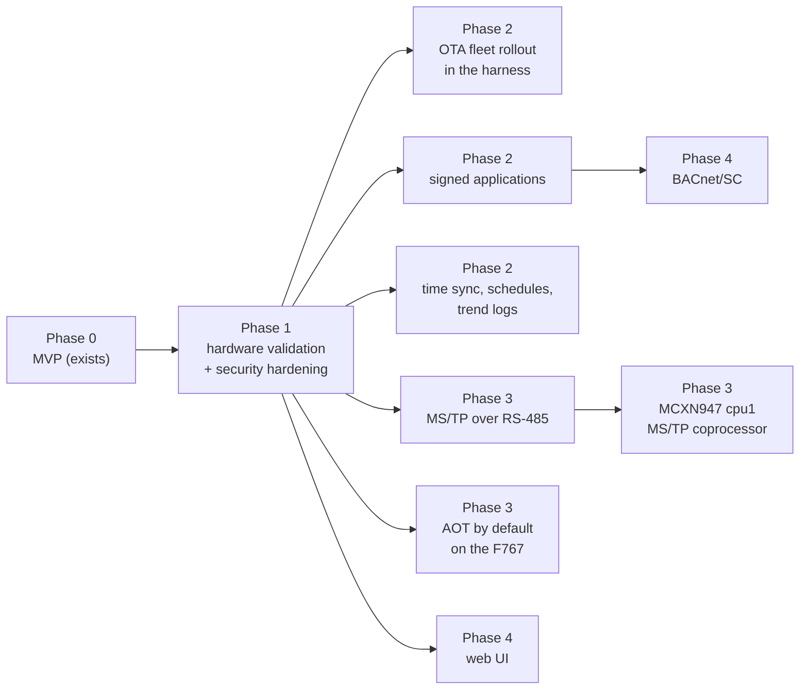
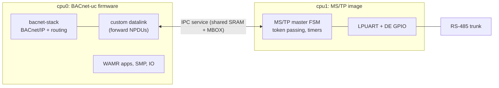

# Roadmap

This is the plan beyond the current state. Phase 0 lists what exists in the
repository; everything in later phases is **Planned** and subject to the open
questions listed with each item. There are no dates: the order reflects
dependencies and risk, not a schedule.

## Phase 0: MVP (exists)

| Area | Content | Reference |
|------|---------|-----------|
| Firmware | Zephyr v4.4.2 application for `nucleo_f767zi`, `frdm_mcxn947/mcxn947/cpu0`, `native_sim/native/64`; BACnet/IP device (B-ASC profile) with AI/AO/AV/BI/BO/BV/MSI/MSO/MSV objects; COV server and client; static bindings; foreign device registration | [architecture.md](architecture.md), [bacnet.md](bacnet.md) |
| IO | devicetree IO catalog (`uc,io-channels`), `io.json` binding to BACnet objects, scaling, debouncing, forcing | [io.md](io.md) |
| Storage and logs | LittleFS at `/lfs`, JSON configuration documents, rotating file log, optional syslog | [storage-and-logging.md](storage-and-logging.md) |
| Management | MCUmgr/SMP over UDP and the console UART; custom groups `uc_app`, `uc_io`, `uc_node`; MCUboot image updates with sysbuild | [management-protocol.md](management-protocol.md) |
| Applications | WAMR 2.4.5 fast interpreter, host ABI 1.0, permissions, watchdog, kv store; SDK (`uc-cc`, `uc-aot`, host stub, WAMR runner); examples `blinky`, `thermostat`, `alarm`, `uc-link` | [wasm-runtime.md](wasm-runtime.md), [`wasm/README.md`](../wasm/README.md) |
| Harness | MCP server (36 tools, resources, prompts) and CLI; system manifests with validate/plan/apply/test; `native_sim` simulation in network namespaces, on the host or with docker compose | [harness-mcp.md](harness-mcp.md), [distributed-apps.md](distributed-apps.md), [simulation.md](simulation.md) |

State at the time of writing: the `native_sim/native/64` firmware builds and
runs, the harness test suite passes (544 tests) and the end-to-end system
tests of `harness/examples/systems/sim-demo.yaml` pass on `native_sim` (two
nodes, three tests). The `nucleo_f767zi` and `frdm_mcxn947/mcxn947/cpu0`
builds compile but **fail to link in the default configuration** (RAM
overflow of 29 564 and 60 648 bytes; workaround and details in
[getting-started.md](getting-started.md#verification-notes)). **Not yet
done**: running the system on the two boards (performance figures in
[bacnet.md](bacnet.md#8-performance-figures) and measured memory usage in
[architecture.md](architecture.md#6-memory-budgets) are open).

## Phase 1: hardware validation and security hardening

Rationale: everything later builds on nodes that are known to work on the
real boards and that can be deployed outside a lab network.

| Item | Content | Rationale |
|------|---------|-----------|
| Board RAM budget | make both board targets link in the default configuration (WAMR pool placement in DTCM/SRAMX via the `uc,app-pool` chosen node, or smaller defaults) | prerequisite for everything else on hardware |
| Hardware bring-up | run `sim-demo`-equivalent manifests on NUCLEO-F767ZI and FRDM-MCXN947 (SPI NOR on the F767, FlexSPI NOR on the MCXN947); record RAM/flash usage, loop timing, COV latency, app tick budgets | the simulation does not cover timing, drivers, flash or broadcasts ([simulation.md](simulation.md#7-limitations-compared-with-hardware)) |
| Hardware CI | self-hosted runner with both boards on a bench network; nightly `firmware update` + `system apply` + `system test` | regressions in drivers and timing |
| SMP over DTLS | credentials provisioned over the console, `smp_udp_open()` with `CONFIG_MCUMGR_TRANSPORT_UDP_DTLS`, DTLS client in the harness | SMP is unauthenticated today ([security.md](security.md#41-smp-over-udp)) |
| Production configuration | `overlay-production.conf`: SMP shell group off, log level `inf`, FS access hook restricting paths; site MCUboot key; downgrade prevention with versioned images | remove development defaults |
| BACnet service policy | DCC and ReinitializeDevice passwords from `device.json` (schema change); CreateObject/DeleteObject removed or restricted to non-owned objects | verified exposure on `native_sim` ([security.md](security.md#21-current-exposure-default-build)) |
| Robustness | hardware watchdog (IWDG on the F767, WWDT0 on the MCXN947) fed by the BACnet thread; configurable Relinquish_Default per `io.json` point; persistence of output priority arrays; `uc-link` rewrite after `reload io` | degraded-mode behaviour ([distributed-apps.md](distributed-apps.md#9-failure-modes-and-degraded-operation)) |
| Application ACL | per-object write permission (`bacnet.local` currently allows writing any local object) | least privilege for apps |
| Harness | audit log of tool calls, rate limits for write tools, per-node protection flag, `nodes` filter for plan/apply, WAMR pool budgeting in `validate_system`, test step kinds `app` and `node` for failure tests | [harness-mcp.md](harness-mcp.md#7-safety-model) |

Open questions:

- Where do DTLS PSKs live on the F767, which has no secure storage? Zephyr
  settings in internal flash (readable over SWD unless the debug port is
  locked) is the pragmatic choice; the MCXN947 could use its TrustZone
  (firmware currently runs secure-only).
- Should the production overlay disable the console shell entirely (it is the
  recovery path when the network configuration is wrong)?

## Phase 2

### 2.1 OTA via MCUboot in the harness

Today: `update_firmware` uploads a signed image to one node, test-boots it,
waits for the node and confirms it; tested against the harness's in-process
fake node, not yet on a board.

Plan:

| Step | Content |
|------|---------|
| manifest | optional firmware version per node (`nodes[].firmware: {version, build}` or a system-wide default), schema change |
| planner | `update_firmware` action in a new phase 0 (before device configuration), ordered node by node |
| rollout | canary node first; next node only when the previous one confirmed and `system_status` is healthy; stop on the first failure |
| versions | image version from `CONFIG_UC_FW_VERSION` passed to imgtool, so that MCUboot downgrade prevention can be enabled |
| transports | OTA over the serial transport for sites without UDP management (slow: 115200 baud) |

Open questions: how long to wait before confirming (a node that boots but
misbehaves after minutes)? Is an automatic confirm acceptable for plant
controllers, or should confirmation be an operator step?

### 2.2 Signed applications

Design in [security.md](security.md#51-planned-signed-application-manifests)
and [wasm-runtime.md](wasm-runtime.md#10-versioning-and-signing): a signature
over module hash, name and permissions, verified with PSA Crypto at install
and start; keys that limit which permissions they can grant; signing in CI.

Rationale: SMP authentication (Phase 1) controls *who* installs; signing
controls *what* runs, independently of the transport, and survives a
compromised harness host.

Open question: one key per site or per vendor of apps; key rotation without
reflashing (keys in `/lfs` protected by the FS access hook vs. compiled in).

### 2.3 Time, schedules and trend logs

| Item | Content |
|------|---------|
| Time source | wall clock from SNTP or BACnet TimeSynchronization/UTCTimeSynchronization (the bacnet-stack handlers exist; the basic server registers them only with `BACNET_TIME_MASTER`), kept in the RTC of each board |
| Schedule and Calendar objects | bacnet-stack objects (`CONFIG_BACNET_BASIC_OBJECT_SCHEDULE`, `..._CALENDAR`); weekly schedules written by the BMS or the harness; their Present_Value drives objects through the priority array |
| Trend Log objects | `CONFIG_BACNET_BASIC_OBJECT_TRENDLOG` plus the ReadRange service (not registered by the basic server today); log buffers in RAM with periodic persistence to `/lfs/data` |
| Harness | `schedules` and `trends` sections in the manifest (schema change); tools to read trend buffers |

Rationale: schedules and trends are standard expectations of a B-ASC/B-AAC
class controller and let a node keep operating sensibly without a BMS.

Open questions: flash wear from trend persistence (log writes already
dominate wear, [storage-and-logging.md](storage-and-logging.md#6-wear-and-power-loss));
whether trends should be exposed to WebAssembly apps (a host function for
time-of-day is needed in any case: `UC_API_VERSION` minor 1).

## Phase 3

### 3.1 BACnet MS/TP over RS-485

| Item | Content |
|------|---------|
| Hardware | RS-485 transceiver on the Arduino UART of both boards, DE/RE on a GPIO ([hardware.md](hardware.md#5-rs-485-add-on-for-bacnet-mstp-planned)) |
| Datalink | bacnet-stack's portable MS/TP state machines (`mstp.c`, `dlmstp.c`) with a Zephyr port layer (UART interrupt/DMA driver, DE control, bit-time timers); the Zephyr glue has `CONFIG_BACDL_MSTP` but no RS-485 port code |
| Configuration | `device.json` `mstp` section: MAC address, baud rate, `max_master`, `max_info_frames` (schema change) |
| Topology | first the node as an MS/TP master device; then the node as a BACnet/IP ↔ MS/TP router (`CONFIG_BAC_ROUTING`) so that MS/TP devices become reachable from the BACnet/IP side |
| Harness | manifests with MS/TP nodes reachable only through a router node; links across the router |

Rationale: MS/TP is the dominant field bus for BACnet devices; a router node
connects existing field devices to BACnet-uc applications.

Open questions: can software DE switching meet the turnaround requirement at
76 800 and 115 200 bit/s while the BACnet/IP stack and applications run on
the same core? (This decides whether 3.2 is needed.) Router versus a node
that is only an MS/TP device?

### 3.2 FRDM-MCXN947 second core (cpu1) for MS/TP

The MCXN947 has a second Cortex-M33 core that the firmware does not use.
Zephyr v4.4.2 has the board target `frdm_mcxn947/mcxn947/cpu1` and IPC
samples (`samples/subsys/ipc/ipc_service`, `samples/drivers/mbox`) for this
SoC.

| Aspect | Plan |
|--------|------|
| Split | cpu1 runs only the MS/TP state machine and the UART; cpu0 sees MS/TP as a datalink port that exchanges NPDUs over IPC |
| Build | sysbuild with two images (cpu0 firmware, cpu1 MS/TP image) and MCUboot for both |
| Benefit | MS/TP timing isolated from BACnet/IP traffic, WebAssembly execution and flash operations on cpu0 |

Open questions: RAM split between the cores (cpu0 has 320 KiB by default),
updating two images consistently, debugging, and whether measurements from
3.1 show that a single core is sufficient (then 3.2 is dropped).

### 3.3 AOT by default on the NUCLEO-F767ZI

AOT-compiled modules run native Thumb-2 code instead of the interpreter. The
F767's Cortex-M7 has a double-precision FPU, and the application ABI passes
every value as `double`, so AOT code on the F767 uses hardware double
arithmetic directly; the MCXN947's FPU is single precision only.

Prerequisites ([wasm-runtime.md](wasm-runtime.md#21-aot-and-the-mpu)):

1. an executable RAM region with an MPU entry (ideally W^X: writable while
   loading, executable afterwards),
2. an allocator for that region registered with `set_exec_mem_alloc_func()`,
3. removal of WAMR 2.4.5's `disable_mpu_rasr_xn()` call, which corrupts MPU
   regions on ARMv7-M (upstream fix or local patch),
4. watchdog-compatible AOT code (`uc-aot` compiles with
   `--enable-multi-thread` for terminate checks),
5. the harness builds `.aot` per board automatically (`aot: true` already
   exists in manifests) and falls back to `.wasm` for firmware without AOT.

Open questions: executable, writable RAM weakens the sandbox argument (a bug
in the AOT loader becomes code execution) — acceptable only together with
signed applications (2.2)? Measured speed-up and code size versus the
interpreter's translated module on the F767.

## Phase 4

### 4.1 BACnet Secure Connect

| Item | Content |
|------|---------|
| Role | BACnet/SC node (hub connector to a primary and failover hub); hub function later, if at all |
| Stack | bacnet-stack ships the BACnet/SC datalink (`datalink/bsc`, `CONFIG_BACDL_BSC` in the Zephyr glue); it needs a WebSocket implementation of `websocket.h` (bacnet-stack's ports use libwebsockets on Linux). On Zephyr: a port to the Zephyr WebSocket client (`CONFIG_WEBSOCKET_CLIENT`) over TLS sockets |
| Network | TCP (disabled today, `CONFIG_NET_TCP=n`), TLS 1.3 with mbedTLS/PSA |
| Credentials | device certificate and key plus the site CA, provisioned like the DTLS credentials of Phase 1 |
| Coexistence | BACnet/IP and BACnet/SC on one node needs routing between the two networks (`CONFIG_BAC_ROUTING`) |

Rationale: the only standard way to authenticate and encrypt BACnet traffic.

Open questions: RAM for TCP, TLS 1.3 and certificate handling next to the
WAMR pool on the MCXN947 (320 KiB for cpu0); certificate lifecycle
(enrolment, renewal) without a management server.

### 4.2 Web UI

| Option | Content | Assessment |
|--------|---------|------------|
| A: in the harness | a local web page served by the harness host using the same functions as the MCP tools: inventory, node status, objects, logs, manifest plan/diff, test results | preferred: no new attack surface on the nodes, no TCP/HTTP stack on the MCU |
| B: on the node | a minimal read-only status page from Zephyr's HTTP server | needs TCP and an HTTP server on the MCU, authentication, RAM and flash; only if nodes must be inspected without a harness |

Open question: is a read-only view sufficient, or should the UI edit
manifests (then it must share the plan/apply safety model of the MCP server)?

## Items without a phase

| Item | Note |
|------|------|
| BACnet/IPv6 | `CONFIG_BACDL_BIP6` exists in the Zephyr glue; low priority |
| Manifest overlays | one base manifest plus per-target overlays (simulation vs. hardware) instead of two files |
| Heartbeat and staleness in stock apps | `uc-link` option to relinquish or write a fail-safe value when a source is stale |
| Rust application SDK | a crate with the `bacnet_uc` bindings (a sketch is in [wasm-runtime.md](wasm-runtime.md#82-rust-sketch-checked)) |
| Further boards | any Zephyr board with Ethernet and ≥ 256 KiB RAM; steps in [harness-mcp.md](harness-mcp.md#91-a-new-board) and [io.md](io.md#6-adding-a-board) |
