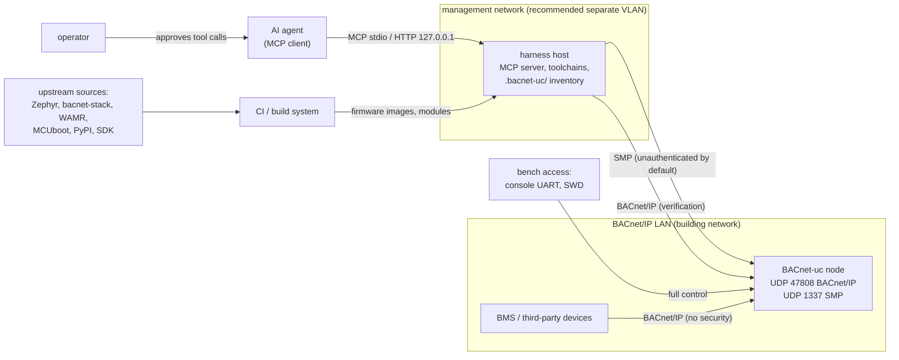

# Security

This document states what a BACnet-uc node and the development harness
protect against today, what they do not, and which controls are recommended
or planned. It distinguishes three states for every control:

| Marker | Meaning |
|--------|---------|
| **Implemented** | present in this repository's firmware or harness and active in the default build |
| **Available** | supported by Zephyr, MCUboot or bacnet-stack and selectable by configuration, but not configured or not wired up by BACnet-uc |
| **Planned** | not implemented; described as the intended design |

The default build is a **development configuration**: the management
interface is unauthenticated and the MCUboot signing key is the public
development key. Do not connect a default-build node to a network that
untrusted parties can reach.

## 1. Assets and trust boundaries

| Asset | Why it matters |
|-------|----------------|
| Plant outputs (digital/analog outputs, their BACnet objects) | physical effect: heating, fans, valves |
| Control logic (WebAssembly apps, links, parameters) | wrong logic = wrong plant behaviour |
| Node configuration (`/lfs/cfg/*.json`) | identity, addressing, IO mapping |
| Firmware image | full control of the node |
| Credentials: the BACnet DCC/ReinitializeDevice password (`device.json` `bacnet.password`); planned: DTLS PSKs/keys, app signing keys | authority over nodes |
| Availability of the node and of the BACnet network | supervision, alarms |
| Logs | diagnosis; may reveal topology |

Trust boundaries: (1) the BACnet/IP network, (2) the SMP management
interface, (3) the WebAssembly sandbox inside the node, (4) the MCP boundary
between agent and harness, (5) the build inputs.

## 2. Threat model

| ID | Actor | Capability assumed | Goal |
|----|-------|--------------------|------|
| T1 | network attacker on the BACnet/IP LAN | send and receive UDP on the building subnet, spoof source addresses | manipulate outputs, disrupt supervision, reboot or silence nodes |
| T2 | rogue management client | reach UDP 1337 of a node (same network or routed), or the console UART | install code, change configuration, read files, replace firmware |
| T3 | malicious or buggy WebAssembly application | arbitrary module code installed through SMP | escape the sandbox, starve other functions, corrupt state |
| T4 | supply chain | modify an upstream dependency, a toolchain, a prebuilt module or a signing key | persistent compromise of all nodes |
| T5 | misled or compromised agent | issue any MCP tool call the client allows; read attacker-controlled data (object names, logs, app output) | destructive calls, prompt injection through node data |
| T6 | physical attacker | console UART, SWD, external flash | extract data, reflash |

### 2.1 Current exposure (default build)

| Threat | Attack | Result today |
|--------|--------|--------------|
| T1 | WriteProperty to an output at priority 1 | accepted: BACnet/IP has no authentication |
| T1 | ReinitializeDevice (cold/warm start) | refused with Error security/password-failure unless the request carries `device.json` `bacnet.password`; without a configured password every request is refused (`CONFIG_UC_BACNET_REQUIRE_PASSWORD=y`, default). With the right password the node reboots after `CONFIG_BACNET_REINIT_REBOOT_DELAY` (3 s). The password is sent in clear text (BACnet/IP), so an attacker who can sniff the subnet can learn it. Verified on `native_sim`: no password, a wrong one and `filister` get password-failure; the configured one gets SimpleACK |
| T1 | DeviceCommunicationControl | same password and the same refusal without one; the bacnet-stack default DCC password `filister` no longer works. A build with `CONFIG_UC_BACNET_REQUIRE_PASSWORD=n` accepts DCC and ReinitializeDevice without a password as long as none is configured. DISABLE is rejected as deprecated (protocol revision ≥ 20) |
| T1 | CreateObject / DeleteObject | not supported in the default build: both services are unregistered, clients get Reject unrecognized-service. With `CONFIG_UC_BACNET_REMOTE_CREATE_DELETE=y` a client may create AI..MSV objects (owner `network`, counted against the 64-entry owner table: resources/no-space-for-object when full) and delete only those; system, IO and application objects answer object/object-deletion-not-permitted. Verified on `native_sim` with both builds |
| T1 | Register-Foreign-Device, broadcast flooding | the stack's BVLC layer is built with BBMD support and accepts up to 5 foreign-device registrations ([bacnet.md](bacnet.md#6-bacnetip-datalink)) |
| T2 | any SMP command over UDP 1337 | accepted: no authentication, no encryption. This includes file upload/download on `/lfs` (also reading `device.json` with the BACnet password in clear text), app install, IO force, `os reset`, and the **shell group** (remote shell commands, `CONFIG_MCUMGR_GRP_SHELL=y`) |
| T2 | firmware upload (sysbuild builds) | MCUboot verifies an ECDSA P-256 signature, but the default key is MCUboot's public development key (`root-ec-p256.pem`): anyone can sign an image that boots |
| T3 | out-of-bounds access, bad pointers | contained (section 5); WAMR 2.4.5's linear-memory allocation gap (bounds checks up to 4095 bytes beyond the allocated pool block) is closed by the firmware's WAMR glue |
| T3 | writing any local object | allowed with `bacnet.local` (no per-object ACL) |
| T3 | endless loop, or blocking on requests to unreachable devices so that a stop, remove or reinstall hangs | contained: the watchdog ends a callback after 2 s of execution time; a stop cancels the app's blocking host calls and completes in about 1 s, at most 2 × watchdog + about 1 s (section 5) |
| T3 | code that runs during instantiation (start function, `__wasm_call_ctors`, `__post_instantiate`, `_initialize`), outside the watchdog and the app context | refused at start with rc `VERIFY` |
| T3 | flooding or forging log lines through `uc_log` or `printf`/`puts`/`putchar` | contained: both become log lines tagged `uc_app: <app>:`, sanitised, cut to 120 characters, 20 per second per app (section 8) |
| T5 | `apply_system(dry_run=false)`, `bacnet_write`, `io_force` | executed if the MCP client allows the call; `flash_firmware`/`update_firmware` need `confirm=true`; `node_shell` is disabled unless enabled at server start |
| T6 | console UART | shell (`uc` commands, `kernel`, `fs`, `net`) and SMP over the shell transport, no login |

## 3. Network architecture (recommended)

The most effective control available today is network separation.

| Zone | Contains | Allowed traffic |
|------|----------|-----------------|
| BACnet VLAN | nodes' BACnet/IP interface, BMS, other BACnet devices, BBMDs | UDP 47808 within the VLAN; BBMD-to-BBMD only between listed BBMDs |
| management VLAN | harness host(s), syslog server | from the harness host to nodes: UDP 1337 (SMP), UDP 47808 (verification); from nodes: UDP 514 (syslog) |
| everything else | office, Internet | nothing to or from nodes |

A node has one Ethernet interface and one IPv4 address, in the BACnet VLAN.
The management VLAN reaches it through a router/firewall that forwards only
UDP 1337 (and UDP 47808 for verification) from the harness hosts; switch ACLs
inside the BACnet VLAN drop UDP 1337 from all other devices. A node never
needs outbound Internet access.

## 4. Management plane

### 4.1 SMP over UDP

| Control | Status | Notes |
|---------|--------|-------|
| Network ACL for UDP 1337 | recommended | section 3 |
| DTLS for the SMP UDP transport (`CONFIG_MCUMGR_TRANSPORT_UDP_DTLS`) | **Available** in Zephyr v4.4.2; **Planned** in BACnet-uc | the option selects mbedTLS, TLS credentials and DTLS sockets, and disables automatic transport start: the application must add its credentials under `CONFIG_MCUMGR_TRANSPORT_UDP_DTLS_TLS_TAG` and call `smp_udp_open()`. The firmware does neither yet, and the harness's SMP UDP transport has no DTLS client, so enabling the option today makes UDP management unavailable |
| Disable the shell group in production (`CONFIG_MCUMGR_GRP_SHELL=n`) | **Available** | removes remote shell execution. The harness keeps working: `read_logs` falls back from `fs ls` (shell) to probing log files with the FS group; only `node_shell` becomes unavailable |
| Restrict FS group paths (`CONFIG_MCUMGR_GRP_FS_FILE_ACCESS_HOOK` + an MCUmgr callback) | **Available**; not used | allow writes only to `/lfs/cfg/*.json` and `/lfs/apps/*`, reads of `/lfs/log/*` and `/lfs/cfg/*`; deny everything else (e.g. future key files) |
| Serial management (shell transport on the console UART) | **Implemented** | physical access required; see T6 |

Planned DTLS design:

1. **Credentials**: one PSK per node (TLS-PSK with AES-GCM cipher suites of
   mbedTLS) as the first step; X.509 device certificates later (shared with
   BACnet/SC, [roadmap.md](roadmap.md)).
2. **Provisioning**: over the console UART at commissioning (physical
   presence), a `uc cred set` shell command writing the key to Zephyr settings
   (not to a file readable through the FS group); never logged.
3. **Firmware**: at boot, add the credential with `tls_credential_add()` and
   call `smp_udp_open()`; refuse to start UDP management without a credential
   (serial management stays available for recovery).
4. **Harness**: a DTLS client for `smp/transport.py` (candidate:
   `python-mbedtls`, not evaluated); PSKs referenced from the inventory by
   name and read from the environment or an OS secret store, never stored in
   `inventory.yaml` or manifests.

### 4.2 Harness host

| Control | Status |
|---------|--------|
| MCP over stdio (no network listener) by default; HTTP binds `127.0.0.1` by default | **Implemented** |
| The HTTP endpoint has no authentication; do not bind it to other addresses | recommendation |
| Run the harness as an unprivileged user; root only for `sim_start(mode="netns")` (or use `mode="compose"`) | recommendation |
| Inventory contains no secrets | **Implemented**; must stay true when DTLS arrives |
| Manifests contain the BACnet password (`nodes[].bacnet.password`, rendered into `device.json`) in clear text; `get_config` returns it to the agent | fact; use a site-specific password, keep manifests with passwords out of public repositories (the examples use placeholders shared through `{{ nodes.<n>.bacnet.password }}`) |

## 5. Applications (WebAssembly)

| Control | Status | Detail |
|---------|--------|--------|
| Sandbox: linear memory with bounds checks, no access to firmware memory or peripherals except through host functions | **Implemented** | WAMR fast interpreter. Every linear memory is allocated with the size WAMR bounds-checks (rounded up to 4 KiB, `modules/wasm-micro-runtime/wamr_linear_memory.c`; WAMR 2.4.5 itself allocates the unrounded size). AOT is off by default (`CONFIG_WAMR_AOT=n`), so no native code from modules runs; see the AOT row below |
| AOT and the MPU | **Available** (build option) | with `CONFIG_WAMR_AOT=y` the firmware refuses AOT files unless the WAMR pool is executable, which it checks in the MPU registers; WAMR's own MPU code (which corrupts the MPU setup) is not built. On the boards the pool becomes executable only with `CONFIG_WAMR_AOT_MPU_EXEC=y`, which clears XN of the whole MPU region: on the F767 all SRAM including DTCM (like an `XIP=n` image), on the MCXN947 only SRAMX. Executable, writable RAM means a WAMR loader bug or a malicious AOT file can run native code with full privileges: enable it only with trusted modules ([wasm-runtime.md](wasm-runtime.md#21-aot-and-the-mpu)) |
| Import whitelist | **Implemented** | only `bacnet_uc` host functions and the libc-builtin subset link; unknown imports fail the load |
| Pointer validation in every host function | **Implemented** | the full range `[ptr, ptr+len)` must lie in linear memory, offset 0 rejected; failures return `UC_ERR_INVALID` instead of trapping |
| Permissions per app (`bacnet.local`, `bacnet.remote`, `io`, `kv`) checked per host call | **Implemented** | `UC_ERR_PERM` otherwise |
| Object ownership | **Implemented** | an app deletes only its own objects; its objects disappear when it stops |
| Watchdog per callback | **Implemented** | `CONFIG_UC_APP_WATCHDOG_MS` (2 s) of execution time; `wasm_runtime_terminate()`. Time blocked in remote requests and kv access does not count, except while the app is being stopped. On `native_sim` (simulated time does not advance in a busy loop) an instruction budget per callback, `CONFIG_WAMR_INSTRUCTION_LIMIT`, instead; it does not cover AOT code |
| Stop cancels blocking host calls | **Implemented** | a stop (also `remove`, reinstall, `reload apps`) abandons a remote request in flight within about 50 ms (`UC_ERR_TIMEOUT`); later blocking calls of the stopping callback fail at once (`uc_remote_*`: `UC_ERR_TIMEOUT`, `uc_kv_*`: `UC_ERR_IO`) and count against the watchdog; a callback that keeps calling them is terminated after 100 calls (this also covers `native_sim`, where host calls do not consume the instruction budget). A stop completes in about 1 s, at most 2 × watchdog + about 1 s; an app blocked in, or looping on, blocking host calls can no longer make it fail with rc `BUSY` ([wasm-runtime.md](wasm-runtime.md#31-lifecycle)) |
| No module code at instantiation | **Implemented** | a module with a start function or an exported `__wasm_call_ctors`, `__post_instantiate` or `_initialize` is refused at start (rc `VERIFY`, `last_error` "... not supported (runs at instantiation)"): WAMR would run that code inside `wasm_runtime_instantiate()`, beyond the watchdog, the instruction budget and the app's context (`modules/wasm-micro-runtime/wamr_zephyr_module.c`). `uc-cc` and `uc-wasm-info` report such modules as errors |
| Resource quotas | **Implemented** | WAMR pool per board, `heap_kb`, `stack_kb`, module ≤ 256 KiB, 16 queued events, 20 log lines/s (`uc_log` and `printf` output together), 16 COV subscriptions and 8 client slots shared per node, kv values ≤ 256 bytes |
| kv store confinement | **Implemented** | keys `[A-Za-z0-9_.-]{1,31}` except `.` and `..`, stored under `/lfs/data/<app>/` |
| API version check | **Implemented** | the host refuses a module whose `UC_API_VERSION` major differs |
| Integrity (`sha256` in the app manifest, checked at install and at every start) | **Implemented** | protects against corrupted transfers, **not** against a malicious uploader |
| Per-object write ACL (`bacnet.local` currently allows writing any writable local property) | **Planned** | |
| Signed applications | **Planned** | below |

Known limits: an app with `bacnet.local` can command any local output; the
WAMR pool is shared, so one large app can prevent another from starting; an
app may use up to 2 s of CPU per callback, starving only lower-priority
threads (shell, logging). Details: [wasm-runtime.md](wasm-runtime.md#7-sandboxing).

### 5.1 Planned: signed application manifests

Signing binds the module, its name and the permissions it may receive, so
that an SMP client cannot grant itself more than the signer allowed.

| Element | Design |
|---------|--------|
| Signed statement | `{name, sha256(module), perms, api_major, not_before?}` in canonical CBOR |
| Signature | ECDSA P-256 (the algorithm MCUboot already uses), detached file `/lfs/apps/<file>.sig` |
| Keys | trusted public keys compiled into the firmware (or provisioned like DTLS credentials); each key carries the set of permissions it may grant |
| Verification | PSA Crypto at `uc_app install` and at every start; `CONFIG_UC_APP_REQUIRE_SIGNATURE=y` rejects unsigned modules with rc `VERIFY` |
| Signing | in CI with the private key in the CI secret store; the harness uploads the `.sig` next to the module in `deploy_app`/`apply_system`; the agent never holds the key |

See also [wasm-runtime.md](wasm-runtime.md#10-versioning-and-signing).

## 6. Firmware integrity

| Control | Status | Detail |
|---------|--------|--------|
| Signed images with MCUboot (`west build --sysbuild`) | **Implemented** (sysbuild builds) | `SB_CONFIG_BOOT_SIGNATURE_TYPE_ECDSA_P256=y` in `firmware/sysbuild.conf` |
| Production signing key | **Required action** | the default `SB_CONFIG_BOOT_SIGNATURE_KEY_FILE` is MCUboot's public `root-ec-p256.pem`. Generate a key (`imgtool keygen -t ecdsa-p256`), keep it offline or in the CI secret store, and set `SB_CONFIG_BOOT_SIGNATURE_KEY_FILE` |
| Test boot and revert | **Implemented** | `update_firmware` marks the new image for a test boot and confirms it only when the node answers; MCUboot reverts otherwise |
| Downgrade prevention | **Available** | `CONFIG_MCUBOOT_DOWNGRADE_PREVENTION` (software, version numbers) or `CONFIG_MCUBOOT_HW_DOWNGRADE_PREVENTION` (security counter) in the MCUboot image configuration; requires increasing image versions at signing (not set today) |
| Plain builds (no sysbuild) | – | no bootloader, no signature check; flashed over SWD only |
| Debug port lock (STM32 readout protection option bytes; MCXN947 debug authentication / lifecycle) | recommendation | not configured by the repository; prevents T6 from reading or reflashing through SWD |
| Encrypted images (`SB_CONFIG_BOOT_ENCRYPTION`) | **Available** | confidentiality of the image in transit and in the secondary slot; not needed while the image holds no secrets |

## 7. BACnet

BACnet/IP (ASHRAE 135 Annex J) has no authentication, integrity protection or
encryption. Every device on the network segment can read and command every
writable property of every device.

| Control | Status | Detail |
|---------|--------|--------|
| Network segmentation (BACnet VLAN, ACLs on UDP 47808) | recommendation | section 3 |
| BBMD hygiene: Broadcast Distribution Tables only with known BBMDs, foreign-device registrations only from known hosts, no BACnet/IP port forwarding from other networks | recommendation | the node's own BBMD support (5 FDT entries) should be firewalled from outside the BACnet VLAN |
| DCC and ReinitializeDevice password | **Implemented** | `device.json` `bacnet.password` (1..20 printable ASCII), applied at start and on `reload device`; refused without a password unless `CONFIG_UC_BACNET_REQUIRE_PASSWORD=n` |
| CreateObject/DeleteObject | **Implemented** | off by default (`CONFIG_UC_BACNET_REMOTE_CREATE_DELETE=n`); with the option only `network` objects can be deleted |
| Priority discipline: operator at 8, applications at 10..14 | convention | [bacnet.md](bacnet.md#34-priority-array-use-convention) |
| BACnet Secure Connect (TLS 1.3 over WebSockets, device certificates) | **Planned** | bacnet-stack contains the BACnet/SC datalink; see [roadmap.md](roadmap.md) |

## 8. Logs

| Rule | Status |
|------|--------|
| No secrets in logs: the BACnet password is never logged or printed (`uc cfg show device` prints `password: configured` / `none`); the planned DTLS and signing code must not log key material, PSK identities are logged at most as a fingerprint | **Implemented**; rule for new code |
| Logs are readable by every SMP client (`/lfs/log/log.NNNN` through the FS group) and sent in clear text with the syslog option (`overlay-syslog.conf`, UDP 514) | fact; keep syslog on the management VLAN |
| Application output is application-controlled text. `uc_log` and the libc-builtin `printf`/`vprintf`/`puts`/`putchar` both end up as log lines of source `uc_app`, prefixed with the app name (`uc_app: <app>: ...`; `printf` at info level, collected per line, an unfinished line logged when the callback returns). Control characters are replaced by blanks, lines are cut to 120 characters, 20 lines/s per app for both together (the excess is dropped and counted); an app cannot write untagged text to the console or the log | **Implemented** limits; treat content as untrusted |
| Log level is configurable at run time (`device.json` `log.level`); `dbg` reveals request details | **Implemented**; use `inf` in production |

## 9. Harness and AI agent

The MCP boundary is where an agent's mistakes or manipulated inputs turn into
actions on the plant.

| Control | Status |
|---------|--------|
| MCP tool annotations on all 36 tools (`readOnlyHint`, `destructiveHint`, `idempotentHint`, `openWorldHint`) so that clients can gate destructive calls | **Implemented** |
| `apply_system` dry run by default; `plan_system` read-only | **Implemented** |
| `flash_firmware` / `update_firmware` require `confirm=true` | **Implemented** |
| `node_shell` disabled unless `BACNET_UC_ALLOW_SHELL=1` / `--allow-shell` | **Implemented** |
| Validation before any upload (schemas, IO catalog, ABI) | **Implemented** |
| Least privilege in the MCP client: allow read-only tools, prompt for the rest, deny flashing/OTA | recommendation; example rules in [harness-mcp.md](harness-mcp.md#7-safety-model) |
| Treat node data as untrusted input: object names, descriptions, log lines, app `last_error` and BACnet strings are controlled by whoever can write them (T1, T3) and are returned to the agent verbatim | recommendation for agent prompts and clients; the harness does not sanitise |
| Audit log of tool calls | **Planned** ([harness-mcp.md](harness-mcp.md#7-safety-model)) |
| Rate limits for write tools | **Planned** |
| Per-node protection flag requiring confirmation for destructive tools | **Planned** |

## 10. Open issues

| Issue | Where | Proposed fix |
|-------|-------|--------------|
| The BACnet password is stored in clear text in `/lfs/cfg/device.json`, which every SMP client can download | firmware | restrict the FS group with an access hook (section 4.1) and add SMP authentication (DTLS); or store only a hash (bacnet-stack compares clear text, so this needs a wrapper) |
| `CONFIG_WAMR_AOT_MPU_EXEC` makes the whole SRAM region executable on the F767 | `modules/wasm-micro-runtime` | a dedicated executable region for the pool (W^X), see [roadmap.md](roadmap.md#33-aot-by-default-on-the-nucleo-f767zi) |
| SMP shell group enabled in the default configuration | `firmware/prj.conf` | production overlay (`overlay-production.conf`, **Planned**) with `CONFIG_MCUMGR_GRP_SHELL=n` |
| MCUboot development key | `firmware/sysbuild.conf` | document and enforce a site key (CI fails when the default key is used for a release build) |
| No DTLS | firmware + harness | section 4.1 |

## 11. Supply chain

| Input | Current pinning | Recommendation |
|-------|-----------------|----------------|
| Zephyr | tag `v4.4.2` in [`west.yml`](../west.yml) | pin the commit SHA for release builds |
| bacnet-stack-zephyr, bacnet-stack | commit SHAs | keep; review diffs when bumping |
| WAMR | tag `WAMR-2.4.5` | pin the commit SHA |
| Zephyr modules (hal_stm32, hal_nxp, mbedtls, mcuboot, littlefs, ...) | revisions from Zephyr's `west.yml` at the pinned Zephyr revision | – |
| Zephyr SDK | release download | verify the published checksums |
| Python packages of the harness | lower bounds in `harness/pyproject.toml`, no lock file | lock with hashes for CI (`pip-compile --generate-hashes` or equivalent) |
| clang / wasm-ld, wamrc | distribution packages / release binary | record versions in CI logs; build modules only in CI for releases |
| Application modules | built from source by the harness, SHA-256 recorded in `apps.json` | signed modules (section 5.1) |
| SBOM | – | Zephyr's `west spdx` produces SPDX documents for a build directory (`west spdx --init` before the build) |

bacnet-stack licensing (GPL-2.0-or-later WITH GCC-exception-2.0 for the core
files, MIT and others for examples) is summarised in the top-level
[README](../README.md#license).

## 12. Production checklist

| # | Action | Addresses |
|---|--------|-----------|
| 1 | Separate BACnet and management traffic; ACLs for UDP 1337 and 47808 | T1, T2 |
| 2 | Build with sysbuild and a site signing key; enable downgrade prevention with versioned images | T2, T4 |
| 3 | Disable the SMP shell group; consider the FS access hook | T2 |
| 4 | Lock the debug port | T6 |
| 5 | Set a site-specific `bacnet.password` on every node (without one DCC and ReinitializeDevice are refused); keep `CONFIG_UC_BACNET_REMOTE_CREATE_DELETE=n` | T1 |
| 6 | Run the MCP server without `--allow-shell`; allow only read-only tools without prompting | T5 |
| 7 | Log level `inf`; syslog only on the management network | information exposure |
| 8 | Keep manifests and app sources in git with review; build modules in CI | T4, T5 |
| 9 | Once available: DTLS for SMP, signed applications, BACnet/SC; leave AOT off (or `CONFIG_WAMR_AOT_MPU_EXEC=n`) unless all modules are trusted | T1, T2, T3 |
