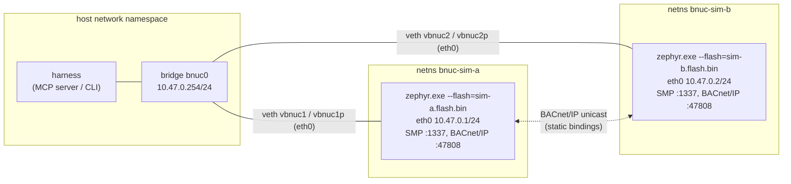
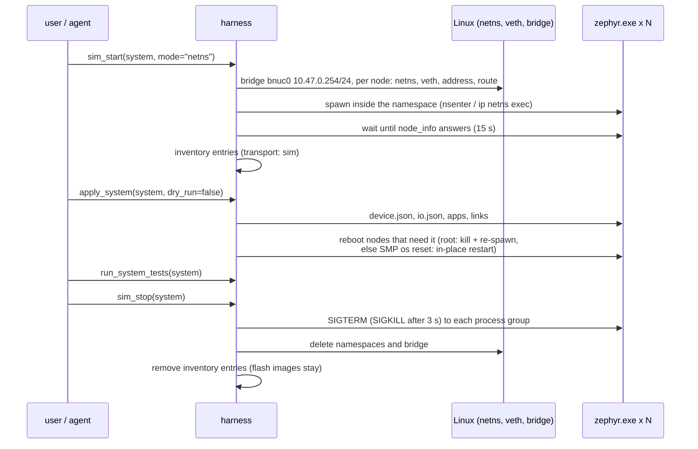

# Simulation

The firmware builds for `native_sim/native/64`: a 64-bit Linux executable
(`build/zephyr/zephyr.exe`) that runs the same application code as the
boards (BACnet stack, LittleFS, SMP groups, WAMR, IO scan) on the POSIX
architecture. The harness starts one or many of these processes and connects
them over real IP networks, so system manifests, apps, links and acceptance
tests run without hardware.

This document describes the `native_sim` target, the three simulation modes
of [`harness/src/bacnet_uc_harness/sim.py`](../harness/src/bacnet_uc_harness/sim.py),
running manifest tests against a simulated system, the differences from real
hardware, and a CI recipe. Tool reference: [harness-mcp.md](harness-mcp.md);
manifests: [distributed-apps.md](distributed-apps.md).

## 1. The native_sim target

| Aspect | Implementation | Files |
|--------|----------------|-------|
| Executable | `zephyr.exe`, x86-64 Linux, glibc | `west build -b native_sim/native/64 BACNet-uc/firmware` |
| Time | runs slowed down to real time (`CONFIG_NATIVE_SIM_SLOWDOWN_TO_REAL_TIME=y`); Zephyr threads are host threads of which only one runs at a time | Zephyr default |
| Networking | Native Simulator Offloaded Sockets (NSOS): every Zephyr socket is a host socket of the process's network namespace. SMP listens on UDP 1337, BACnet/IP on `device.json` `bacnet.udp_port` (47808) | [`firmware/boards/native_sim_native_64.conf`](../firmware/boards/native_sim_native_64.conf) |
| Interface address | NSOS has no IPv4 configuration; `uc_net` assigns `network.ipv4`/`netmask` from `device.json` when `dhcp` is false, otherwise `127.0.0.1/255.0.0.0`. The address must exist in the namespace, or `bind()` fails | `firmware/src/net/uc_net.c` |
| Broadcasts | NSOS does not forward `SO_BROADCAST`: the node's broadcast address is its own address. Who-Is/I-Am between simulated nodes does not work; nodes bind each other through **static bindings** | `uc_bn_node.c`, [bacnet.md](bacnet.md#6-bacnetip-datalink) |
| Storage | LittleFS on the flash simulator: 2 MiB flash, 4 KiB erase blocks, `/lfs` in a 1580 KiB partition, backed by a file (`flash.bin` in the working directory by default) | [`firmware/boards/native_sim_native_64.overlay`](../firmware/boards/native_sim_native_64.overlay) |
| IO | eight simulated channels (below); no GPIO/ADC/PWM hardware | [`firmware/boards/io/native_sim_native_64.dtsi`](../firmware/boards/io/native_sim_native_64.dtsi) |
| Console | shell UART on a pseudo-terminal (`uart connected to pseudotty: /dev/pts/N` at start), interrupt-driven so that SMP frames over the pty (harness `serial` transport, smpmgr/mcumgr serial) arrive complete; log output on stdout | `CONFIG_UART_NATIVE_PTY`, `CONFIG_UART_INTERRUPT_DRIVEN`, `CONFIG_SHELL_BACKEND_SERIAL_API_INTERRUPT_DRIVEN` |
| WAMR | build target `X86_64`, pool 256 KiB (`CONFIG_UC_APP_POOL_SIZE=262144`), kernel heap 128 KiB; instruction budget per callback instead of the watchdog (`CONFIG_WAMR_INSTRUCTION_LIMIT`, see section 7) | `native_sim_native_64.conf`, `modules/wasm-micro-runtime/Kconfig` |
| Entropy | test entropy source (`CONFIG_TEST_RANDOM_GENERATOR`); not suitable for key generation | `native_sim_native_64.conf` |
| Reboot | `CONFIG_NATIVE_SIM_REBOOT=y`: `sys_reboot()` (SMP `os reset`, shell `kernel reboot`, BACnet ReinitializeDevice) **restarts the process in place** with the same command line (`native_sim_reboot: Restarting process.`), same PID, flash file kept. An exit hook of `uc_net` closes the inherited host sockets first (a Zephyr 4.4 NSOS `dup()` without close-on-exec would otherwise keep UDP 1337 bound: `bind err 98`). With `--flash_erase` on the command line the restart erases the flash again. The harness reboots simulated nodes with the simulation manager (kill and re-spawn) when it may (root for `netns`), otherwise over SMP | `native_sim_native_64.conf`, `uc_net.c`, `sim.py` |

Useful command line options of `zephyr.exe`:

| Option | Effect |
|--------|--------|
| `--flash=<file>` | flash image file (one per node) |
| `--flash_erase` | start with an erased flash (the firmware formats `/lfs`); applies again at every in-place reboot |
| `--flash_rm` | delete the flash file on exit |
| `--flash_in_ram` | keep the flash content in RAM only (nothing persists) |
| `--seed=<n>` | seed of the test entropy source (the harness gives every node a distinct seed) |
| `--stop_at=<s>` | stop after `s` seconds of simulated time |

### 1.1 Simulated IO channels

| Channel | Kind | Initial value | `uc_io force` | `uc_io release` |
|---------|------|---------------|---------------|-----------------|
| `di0`, `di1` | di | 0 | sets the simulated value (and the forced value) | the simulated value keeps the forced value |
| `do0`, `do1` | do | 0 | the read value is the forced value | the commanded value is visible again |
| `ai0` | ai | 2000 mV | as `di` | as `di` |
| `ai1` | ai | 0 mV | as `di` | as `di` |
| `ao0`, `ao1` | ao | 0 % | as `do` | as `do` |

Inputs are the way to inject stimuli (`io_force`, test step `force`); outputs
follow their BACnet object and are read back with `io_read`. Semantics are the
same as on hardware ([io.md](io.md#5-forcing)); only the persistence of a
forced input value after release is specific to simulated channels.

## 2. Single node on the host network

For interactive work with one node:

```sh
cd <workspace>                     # west workspace top (contains BACNet-uc/, zephyr/)
west build -b native_sim/native/64 BACNet-uc/firmware -d build-sim
mkdir -p /tmp/node1 && cd /tmp/node1
<workspace>/build-sim/zephyr/zephyr.exe --flash=node1.flash.bin &

bacnet-uc node add sim1 --udp 127.0.0.1 --bacnet 127.0.0.1:47808
bacnet-uc node info sim1
bacnet-uc io force sim1 ai0 2150
```

SMP listens on UDP port 1337 of the host; without a `network` section in
`device.json` the node uses `127.0.0.1` as its BACnet/IP address (port
47808). Only one such node can run per network
namespace (the SMP port is fixed at build time,
`CONFIG_MCUMGR_TRANSPORT_UDP_PORT`). The harness equivalent is
`sim_start(mode="host")` / `bacnet-uc sim up MANIFEST --mode host`, which
accepts a manifest with exactly one `transport: sim` node.

Several nodes on one host without namespaces would need distinct SMP ports
(a firmware build per node) and distinct BACnet ports with static bindings to
`127.0.0.1:<port>`; the harness does not support this layout. Use `netns`.

## 3. Multi-node: network namespaces (`netns`, default)



| Item | Value |
|------|-------|
| Namespace per node | `bnuc-<node>` |
| Link | veth pair `vbnuc<n>` (host side, enslaved to `bnuc0`) / `vbnuc<n>p` renamed to `eth0` inside the namespace; default route via `10.47.0.254` |
| Node address | `transport.ipv4` of the manifest node, else `10.47.0.<n>` in manifest order (`.254` is the host) |
| Harness address | `10.47.0.254` on `bnuc0` |
| Backend | `ip` command (iproute2) when installed, else `pyroute2` (`pip install 'harness[sim]'`); processes enter the namespace with `ip netns exec`, `nsenter --net=/var/run/netns/<ns>`, or `setns()` from pyroute2 |
| Privileges | root, or CAP_NET_ADMIN + CAP_SYS_ADMIN (checked before anything is created) |
| Working directory | `<home>/.bacnet-uc/sim/<system>/`: `<node>.flash.bin`, `<node>.log` (console output), `sim-state.json` |
| Process | `zephyr.exe --flash=<workdir>/<node>.flash.bin --seed=<0x5EED0000 + n>`, own session, stdin closed |
| Failure handling | a network setup error tears down what was created; a node that exits within 0.5 s of its start stops the whole simulation and returns its log tail |

Because each process has its own namespace, every node uses the standard
ports (1337, 47808): the simulated system is addressed exactly like a
hardware system on one subnet.

The harness renders for each simulated node
`network: {dhcp: false, ipv4: 10.47.0.<n>, netmask: 255.255.255.0}` (so NSOS
binds BACnet/IP to the namespace address) and static bindings to every peer
(so nodes find each other without broadcasts). A freshly started node runs
with firmware defaults (device 260001, `127.0.0.1`); the first
`apply_system` writes the documents and restarts the processes so that the
new identity and address take effect.

Lifecycle:



`sim_stop` keeps the flash images: the next `sim_start` resumes with the
applied configuration and apps (`erase_flash=true` / `--erase` starts clean).
The state file allows a different harness process to stop the simulation.

## 4. Multi-node: docker compose (`compose`)

For hosts where the harness cannot run as root. `sim_start(mode="compose")`
writes `<workdir>/docker-compose.yml` and runs `docker compose up -d`:

```yaml
name: bacnet-uc-sim-demo
services:
  sim-a:
    image: ubuntu:24.04
    command: [/opt/bacnet-uc/zephyr.exe, --flash=/data/sim-a.flash.bin, --seed=1592590337]
    working_dir: /data
    init: true
    volumes:
      - <build>/zephyr/zephyr.exe:/opt/bacnet-uc/zephyr.exe:ro
      - <workdir>:/data
    networks:
      bacnet_uc: {ipv4_address: 10.47.0.1}
  sim-b: ...            # same, 10.47.0.2
networks:
  bacnet_uc:
    driver: bridge
    driver_opts: {com.docker.network.bridge.name: bnuc0}
    ipam:
      config: [{subnet: 10.47.0.0/24, gateway: 10.47.0.254}]
```

(Generated by `SimManager` for `harness/examples/systems/sim-demo.yaml`; paths
shortened.)

| Item | Behaviour |
|------|-----------|
| Addressing | identical to `netns`: nodes `10.47.0.<n>`, the host reaches them through the bridge gateway `10.47.0.254` |
| Image | `ubuntu:24.04` by default; any image whose glibc runs the 64-bit `zephyr.exe` |
| Restart (reboot) | `docker compose restart <node>` |
| Stop | `docker compose down` |
| Console output | `docker compose -f <workdir>/docker-compose.yml logs <node>` (not written to `<node>.log`) |
| Requirements | docker with the compose plugin, permission to use the docker socket |

## 5. Running a simulated system

Using the example [`harness/examples/systems/sim-demo.yaml`](../harness/examples/systems/sim-demo.yaml)
(two nodes: `sim-a` with a temperature input and a switch, `sim-b` with a
valve and a lamp, the thermostat app and two links):

```sh
# once: firmware for the simulator (into .bacnet-uc/build/fw-native_sim_native_64)
bacnet-uc firmware build native_sim/native/64

SUDO="sudo -E env PATH=$PATH"     # netns: sim up/down and apply (restarts nodes) need root
$SUDO bacnet-uc sim up harness/examples/systems/sim-demo.yaml --erase
bacnet-uc system plan  harness/examples/systems/sim-demo.yaml
$SUDO bacnet-uc system apply harness/examples/systems/sim-demo.yaml --no-dry-run
bacnet-uc system status harness/examples/systems/sim-demo.yaml
bacnet-uc system test  harness/examples/systems/sim-demo.yaml
$SUDO bacnet-uc sim down sim-demo
```

`system apply` restarts the simulated nodes whose identity or address
changed (kill and re-spawn inside the namespace), so it needs the same
privileges as `sim up`; `plan`, `status` and `test` only talk to the nodes
over the bridge and run unprivileged. An MCP server that shall run the whole
flow must itself run as root (or use `mode="compose"`).

MCP equivalent: `build_firmware(board="native_sim/native/64")`,
`sim_start(system=..., erase_flash=true)`, `plan_system`,
`apply_system(dry_run=false)`, `run_system_tests`, `sim_stop`.
`sim_start(apply_config=true)` combines start and apply.

Observed with `sim-demo.yaml` on the `native_sim/native/64` build of the
current repository state (the README quick start, run as root inside private
network and mount namespaces):

| Step | Result |
|------|--------|
| `sim up --erase` | both nodes reachable at `10.47.0.1`, `10.47.0.2` (pyroute2 backend) |
| `system plan` | 6 actions: `push_config device` ×2, `push_config io` ×2, `deploy_app thermostat`, `deploy_app link`; 2 reboot notes (device 260001 → 2001/2002, IPv4 127.0.0.1 → 10.47.0.x) |
| `system apply --no-dry-run` | 6 × ok, both nodes restarted |
| `system status` | `in_sync: true`, `thermostat` and `link` running |
| `system test` | `switch-drives-lamp` 488 ms, `temperature-is-mirrored` 483 ms, `thermostat-heats-when-cold` 917 ms: 3 passed |
| `sim down` | both stopped, no errors |

Inspecting a simulated node: all node tools work as on hardware
(`read_logs`, `list_objects`, `app_status`, ...). The console output of each
process is in `<workdir>/<node>.log`; `sim_status` shows the last lines.

## 6. Testing apps against a simulated system

| Question | Approach |
|----------|----------|
| Does my app logic work? | unit tests with the host stub (`make -C wasm test`); no node needed |
| Does it run under the firmware's WAMR configuration? | `make -C wasm validate` (host WAMR runner) or deploy to a single host-mode node |
| Does the distributed behaviour work? | manifest with `transport: sim` nodes, `tests:` section, `sim up` + `apply` + `test` |
| Does it survive restarts? | `sim_start` again without `--erase` (flash kept); `bacnet-uc app restart NODE APP` |

The same manifest `apps`, `links` and `tests` can then be pointed at hardware
by changing `board` and `transport` of each node (and adding `network` for
static addresses).

## 7. Limitations compared with hardware

| Area | Simulation | Hardware | Consequence |
|------|------------|----------|-------------|
| Timing | host threads, one Zephyr thread at a time, real-time slowdown; simulated time advances only while the simulated CPU idles; scheduling jitter depends on host load | deterministic RTOS scheduling | latency figures from simulation are not representative; timeouts are rarely hit because the host CPU is much faster. The application watchdog cannot fire during a busy loop: an instruction budget (`CONFIG_WAMR_INSTRUCTION_LIMIT`, 100 000 000 per callback) stops interpreted code instead (`last_error` "instruction limit exceeded"); an AOT busy loop hangs the node |
| WebAssembly execution | x86-64 host, fast interpreter | Cortex-M7 216 MHz / Cortex-M33 150 MHz | an app that fits its tick budget in simulation may not on the MCU; measure on hardware |
| Memory | WAMR pool 256 KiB, heap 128 KiB, host `malloc` | 112 KiB (F767) / 96 KiB (MCXN947) pool, 64 KiB heap, 64 KiB `malloc` arena | an app mix that starts in simulation can fail with pool exhaustion on the boards; `validate_system` warns from the board's pool size |
| IO | simulated values, no noise, no ADC conversion time, no PWM frequency, no contact bounce | real signals | scaling and logic are tested, electrical behaviour is not |
| Network stack | host sockets (NSOS): Zephyr's IP stack, Ethernet driver and DHCP client are not exercised | Zephyr native IP stack, Ethernet MAC/PHY | network buffer exhaustion, link loss and DHCP behaviour need hardware tests |
| Broadcasts | not delivered (NSOS) | directed subnet broadcast | Who-Is discovery, I-Am, broadcast-based BBMD behaviour are untested in simulation; static bindings are mandatory |
| Flash | file-backed simulator, no erase/program time, no power loss | SPI NOR (F767), FlexSPI NOR (MCXN947) | wear, write timing and power-loss recovery need hardware |
| Boot and update | no MCUboot, no image slots | MCUboot with swap | `update_firmware` is not applicable; reboot = in-place process restart |
| AOT | x86-64 AOT files run with a `CONFIG_WAMR_AOT=y` build (pool made executable with `mprotect()`) | Thumb targets; the pool must be made executable (`CONFIG_WAMR_AOT_MPU_EXEC`) | AOT modules are board-specific, AOT is off in the default firmware; Thumb AOT has not run on a board |
| Entropy | test generator | hardware RNG | do not use simulated nodes for key material |

## 8. CI recipe

The complete command sequence of section 5 runs headless. The repository's
workflow ([`.github/workflows/ci.yml`](../.github/workflows/ci.yml), job
`e2e`) runs the harness end-to-end tests, which include the whole
`sim-demo` flow of section 5, against the `native_sim` firmware built by the
`firmware` job, as root inside private network and mount namespaces
(`harness/tests/e2e/run-isolated.sh`); see
[harness-mcp.md](harness-mcp.md#8-ci-usage). A job of your own needs Python
3.12, west, the Zephyr SDK host tools, clang with `wasm-ld`
(`apt-get install clang lld`), the harness (`pip install -e
'BACNet-uc/harness[dev,sim]'`) and `sudo` for the `netns` mode (GitHub-hosted
Ubuntu runners provide passwordless sudo and iproute2).

Practical points:

| Point | Recommendation |
|-------|----------------|
| Artifacts | upload `<home>/.bacnet-uc/sim/<system>/*.log` (console output of every node) on failure |
| Isolation | one system name per job; the bridge name `bnuc0` and the subnet `10.47.0.0/24` are fixed, so two `netns` simulations cannot run in the same network namespace. Parallel jobs on one machine: run each in its own network (and mount) namespace, as `run-isolated.sh` does (`unshare --net --mount` with a private `/run/netns`), or use separate runners |
| Cleanup | run `sim down` in an `always()` step; namespaces and the bridge otherwise stay until the runner is recycled (not needed inside `run-isolated.sh`: the namespaces vanish with it) |
| Flaky timing | derive `within_ms` from [distributed-apps.md](distributed-apps.md#8-timing-and-latency-budget) with margin; shared runners add jitter |
| Speed | cache the `native_sim` build directory keyed by the west manifest revisions and the `firmware/` content; a pristine build compiles the whole Zephyr, bacnet-stack and WAMR tree |
