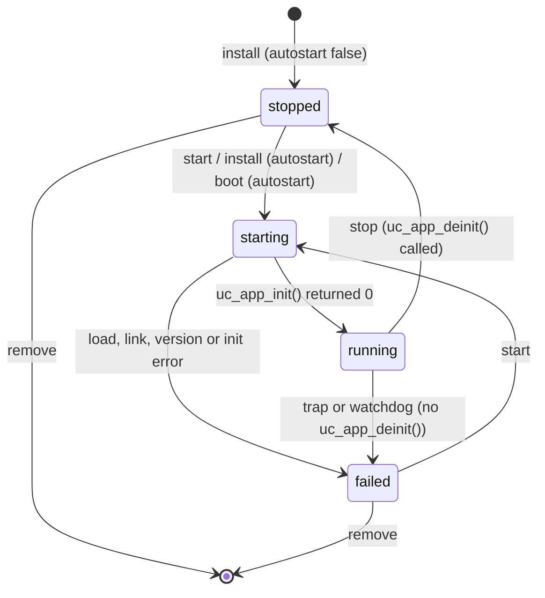
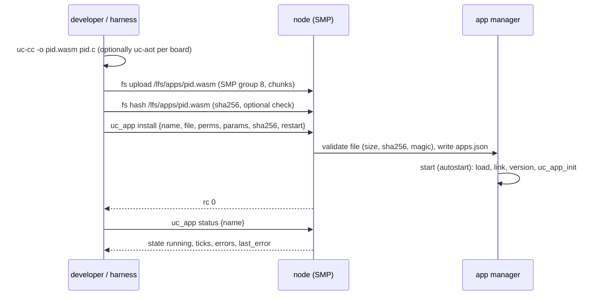

# WebAssembly application runtime

Control logic on a BACnet-uc node runs as WebAssembly modules executed by the
WebAssembly Micro Runtime (WAMR) 2.4.5. This document describes the runtime
as built into the firmware, the application model, the host ABI, memory,
sandboxing, toolchains and deployment.

| Normative source | File |
|------------------|------|
| Guest ABI (imports, exports, constants, error codes) | [`wasm/sdk/include/bacnet_uc.h`](../wasm/sdk/include/bacnet_uc.h) |
| Management commands (`uc_app` group) | [management-protocol.md](management-protocol.md#group-64-uc_app---webassembly-applications) |
| `apps.json` | [`schemas/apps.schema.json`](../schemas/apps.schema.json) |
| SDK, compiler wrapper, examples, test tools | [`wasm/README.md`](../wasm/README.md) |

Implementation: [`firmware/src/apps/uc_app_mgr.c`](../firmware/src/apps/uc_app_mgr.c)
(runtime, slots, threads, watchdog) and
[`uc_app_host_api.c`](../firmware/src/apps/uc_app_host_api.c) (host functions).

## 1. Why WebAssembly on a microcontroller

| Property | What it gives a BACnet controller |
|----------|-----------------------------------|
| Portable binary | the same `.wasm` runs on the Cortex-M7, the Cortex-M33 and `native_sim`; applications are tested on the host and deployed unchanged |
| Memory safety by construction | a module addresses only its own linear memory (bounds-checked); it cannot corrupt the firmware, the BACnet stack or another application |
| Capability-based host API | the module sees only the functions of import module `bacnet_uc`, gated by per-application permissions |
| Update without reflashing | a module is a file in `/lfs/apps`; installing, replacing or removing it takes seconds over SMP and needs no reboot |
| Language choice | C (SDK), Rust, AssemblyScript, TinyGo, anything that targets `wasm32` |
| Small artefacts | the example applications are 3.5..7.5 KiB |

Costs and limits: interpretation is slower than native code (acceptable for
control loops with periods of 10 ms and more); the fast interpreter keeps a
translated copy of the code in RAM; there is no preemption inside a module
other than the watchdog; floating point on the MCXN947's single-precision
FPU is emulated for `double`.

Alternatives considered:

| Alternative | Not chosen because |
|-------------|--------------------|
| Zephyr LLEXT (native loadable extensions) | native code has full access to memory and peripherals; no isolation between applications and firmware |
| MicroPython / Lua | one language, larger RAM footprint per application, garbage-collector pauses |
| IEC 61131-3 runtime | domain-appropriate, but a much larger engineering tool chain; may be layered on top later (a 61131 compiler emitting WebAssembly) |

## 2. WAMR configuration

The WAMR Zephyr glue lives in this repository
([`modules/wasm-micro-runtime/`](../modules/wasm-micro-runtime/)) because
WAMR's `zephyr/module.yml` refers to external glue.

| Feature | Setting | Kconfig / CMake |
|---------|---------|-----------------|
| Interpreter | fast interpreter (pre-translated internal bytecode) | `CONFIG_WAMR_FAST_INTERP=y` |
| AOT loader | off by default (section 2.1) | `CONFIG_WAMR_AOT` |
| JIT, Fast JIT | off | |
| C library for modules | libc-builtin (subset, `wasm/sdk/include/uc_libc.h`); no WASI | `WAMR_BUILD_LIBC_BUILTIN=1`, `WAMR_BUILD_LIBC_WASI=0` |
| Bulk memory, reference types | on | `CONFIG_WAMR_BULK_MEMORY=y`, `CONFIG_WAMR_REF_TYPES=y` |
| Thread manager | on, only for interruptible execution (the watchdog); WebAssembly threads are not available | `CONFIG_WAMR_THREAD_MGR=y`, `WASM_ENABLE_HEAP_AUX_STACK_ALLOCATION=1` |
| SIMD, shared memory, multi-module, GC, exception handling, memory64, tail calls | off | |
| Memory allocation | one static pool, `Alloc_With_Pool` | `CONFIG_UC_APP_POOL_SIZE` |
| Build target | `THUMBV7EM_VFP` (F767), `THUMBV8M.MAIN_VFP` (MCXN947), `X86_64` (`native_sim`) | `CONFIG_WAMR_BUILD_TARGET` (derived from CPU and `CONFIG_FP_HARDABI`) |
| Runtime log | on | `CONFIG_WAMR_LOG` |

The pool is a static array in `.noinit` of the main RAM. A devicetree chosen
node `uc,app-pool` pointing at a `zephyr,memory-region` places it elsewhere
(for example the MCXN947's 96 KiB SRAMX); none of the board overlays sets it
at the time of writing.

### 2.1 AOT and the MPU

An AOT module (`.aot`, produced by `wamrc`) contains native machine code that
WAMR copies into RAM and executes. On a Cortex-M this requires an MPU region
that allows instruction fetches from that RAM. WAMR 2.4.5's Zephyr platform
layer (`core/shared/platform/zephyr/zephyr_platform.c`) handles this as
follows:

| Step | WAMR 2.4.5 behaviour | Consequence |
|------|----------------------|-------------|
| `bh_platform_init()` with AOT and `CONFIG_ARM_MPU` | calls `disable_mpu_rasr_xn()`: for MPU regions 0..7, if `RASR.XN` is set, executes `MPU->RASR \|= ~MPU_RASR_XN_Msk` | on ARMv7-M (Cortex-M7) this sets every RASR bit **except** XN (size, TEX/C/B, AP, subregion disables, enable) of each XN region instead of clearing XN: the regions are corrupted and XN stays set. Upstream bug; the intended statement is `MPU->RASR &= ~MPU_RASR_XN_Msk` |
| same, on ARMv8-M (Cortex-M33) | `MPU_RASR_XN_Msk` does not exist in the ARMv8-M CMSIS headers (XN is in `RBAR`), so the loop body compiles to nothing | SRAM stays execute-never |
| `os_mmap()` for code sections | `BH_MALLOC()` from the pool unless the embedder registered `set_exec_mem_alloc_func()` | code lands in the ordinary pool |
| `os_mprotect()` | returns 0 without doing anything | no W^X handling |
| cache maintenance | `os_dcache_flush()` cleans the D-cache on the Cortex-M7; `os_icache_flush()` calls `sys_cache_instr_flush_range()` | correct for code copied into RAM |

Zephyr's default MPU configuration marks SRAM execute-never whenever the
image executes in place from flash (`CONFIG_XIP=y`, the case on both boards:
`REGION_RAM_ATTR` in `arm_mpu_v7m.h` and `arm_mpu_v8.h`). AOT code in the pool
therefore faults on instruction fetch on both boards. The firmware ships with
`CONFIG_WAMR_AOT=n`; `uc_node info` reports `"aot": false` and `uc_app
install` rejects AOT files with rc `UNSUPPORTED`.

**Planned** steps to enable AOT on a board:

1. Reserve an execution region: e.g. part of the MCXN947's SRAMX (code-bus
   RAM) or a 32..64 KiB block of the F767's SRAM, as a `zephyr,memory-region`.
2. Give it an MPU region with execute permission: a board-specific fixed
   region (`CONFIG_CPU_HAS_CUSTOM_FIXED_SOC_MPU_REGIONS` style `mpu_regions`
   table) or a run-time region; ideally writable while a module is loaded and
   read-only/executable afterwards (W^X).
3. Register an allocator for that region with `set_exec_mem_alloc_func()`
   before `wasm_runtime_full_init()`.
4. Remove the `disable_mpu_rasr_xn()` call (patch or upstream fix) so that the
   other MPU regions stay intact.
5. Compile modules with `wasm/sdk/uc-aot` (`--bounds-checks=1`,
   `--enable-multi-thread` for watchdog checks, indirect mode on Cortex-M; see
   [`wasm/README.md`](../wasm/README.md#uc-aot)). The AOT target must match
   `CONFIG_WAMR_BUILD_TARGET` without the `_VFP` suffix (reported as
   `wasm.aot_target` by `uc_node info`).

Executable, writable RAM weakens the isolation argument of section 7: a bug
in WAMR's AOT loader could turn into code execution. The interpreter needs no
executable RAM.

## 3. Application model

An application is an installed `apps.json` entry that binds a name to a
module file, permissions, parameters and resource limits. Up to
`CONFIG_UC_APPS_MAX` (4) applications are installed; each occupies a slot
with its own thread (priority 10, 8 KiB native stack), event queue (16
events), watchdog and module instance.

### 3.1 Lifecycle



Start sequence in the application's thread:

1. Wait until the BACnet node is ready (`uc_bn_ready()`): applications never
   run before the stack and the datalink are up.
2. If the entry has `sha256`, hash the file and compare (`VERIFY` on
   mismatch).
3. Read the module into a pool buffer (WAMR references it until unload); check
   the magic (`\0asm`, or `\0aot` with AOT support).
4. `wasm_runtime_load()`; every function import must be resolved (`bacnet_uc`
   host functions or libc-builtin in `env`), otherwise "unresolved import
   module.name".
5. `wasm_runtime_instantiate()` with `stack_kb` and `heap_kb`; create the
   execution environment.
6. Look up the exports and check their signatures; `uc_app_api_version` is
   mandatory.
7. Call `uc_app_api_version()`; the major version must equal the host's
   `UC_API_VERSION_MAJOR`.
8. Call `uc_app_init()`; non-zero aborts the start (`failed`, "uc_app_init
   returned N").

Running: the first `uc_app_tick(now_ms)` comes one `period_ms` after the
start, then at a fixed rate (missed ticks are skipped after an overrun).
Between ticks the thread waits for events and delivers them in arrival order
(`uc_app_on_cov`, `uc_app_on_write`); a due tick is delivered before queued
events. `uc_set_tick_period(0)` or `period_ms: 0` gives an event-only
application.

Stop: the manager sets a stop flag; after the running callback returns,
`uc_app_deinit()` is called (under the watchdog), then the slot is cleaned
up. Failure (trap, watchdog, failed start) skips `uc_app_deinit()`.

Cleanup in both cases: cancel COV subscriptions, delete the objects the
application owns, drop queued events, destroy exec env, instance, module and
the module image. A failed application stays failed until it is started
again; there is no automatic restart.

### 3.2 Exports

| Export | Signature (C) | WebAssembly type | Required | Called |
|--------|---------------|------------------|----------|--------|
| `uc_app_api_version` | `uint32_t (void)` | `() -> i32` | yes (`UC_APP_DECLARE()`) | once, before `uc_app_init` |
| `uc_app_init` | `int32_t (void)` | `() -> i32` | no | once; 0 = run |
| `uc_app_tick` | `void (uint64_t now_ms)` | `(i64) -> ()` | no | every tick period; `now_ms` = uptime |
| `uc_app_on_cov` | `void (int32_t sub_id, uint32_t device, uint32_t type, uint32_t instance, uint32_t prop, double value)` | `(i32 i32 i32 i32 i32 f64) -> ()` | no | per notification of a live subscription |
| `uc_app_on_write` | `void (uint32_t type, uint32_t instance, uint32_t prop, uint32_t priority, double value)` | `(i32 i32 i32 i32 f64) -> ()` | no | after another writer wrote a numeric value to a property of an object the application owns (not for NULL/relinquish or string writes) |
| `uc_app_deinit` | `void (void)` | `() -> ()` | no | on a regular stop |

An export with a different signature fails the start ("export X: wrong
signature").

## 4. Host ABI reference

Import module `"bacnet_uc"`. Pointers are offsets into the application's
linear memory; the WAMR signature strings use `i` for i32 (also pointers),
`I` for i64 and `F` for f64. All functions returning `int32_t` return ≥ 0 on
success or a negative `UC_ERR_*` code. Every error return is counted in the
application's `errors` statistic.

### 4.1 Error codes

| Code | Value | Typical cause |
|------|------:|---------------|
| `UC_OK` | 0 | |
| `UC_ERR_INVALID` | -1 | bad pointer or length, value out of range, malformed key, unsupported object type, buffer too small |
| `UC_ERR_NOT_FOUND` | -2 | unknown object/property, parameter, channel, key or subscription |
| `UC_ERR_PERM` | -3 | permission missing in `perms`; write access denied by the object; write to an input channel |
| `UC_ERR_TIMEOUT` | -4 | no confirmation within `timeout_ms` |
| `UC_ERR_BUSY` | -5 | client slots or executor queue exhausted, retry |
| `UC_ERR_NO_MEM` | -6 | table full (objects, subscriptions), allocation failed |
| `UC_ERR_BACNET` | -7 | the remote device answered with Error, Reject or Abort |
| `UC_ERR_UNSUPPORTED` | -8 | feature not built into this firmware |
| `UC_ERR_IO` | -9 | file system or hardware error |
| `UC_ERR_TYPE` | -10 | property datatype not numeric, parameter not a number |
| `UC_ERR_EXISTS` | -11 | object exists and is owned by someone else |
| `UC_ERR_NO_ROUTE` | -12 | remote device could not be bound |

### 4.2 Functions

| Function | WAMR sig | Permission | Returns | Errors and notes |
|----------|----------|------------|---------|------------------|
| `void uc_log(int32_t level, const char *msg, uint32_t len)` | `(iii)` | - | - | Logs `"<app>: <msg>"` at level 1 ERR, 2 WRN, 3 INF, ≥4 DBG. Truncated to 120 characters, trailing CR/LF removed, control characters replaced by blanks. Rate limit 20 lines per second per application; excess lines are dropped and counted ("N log lines dropped"). Invalid pointer: counted as error, nothing logged |
| `uint64_t uc_uptime_ms(void)` | `()I` | - | ms since boot | |
| `int32_t uc_set_tick_period(uint32_t period_ms)` | `(i)i` | - | `UC_OK` | 0 disables ticks; otherwise 10..3 600 000 ms, else `INVALID`. Takes effect for the next tick (the period restarts) |
| `int32_t uc_param_get(const char *key, uint32_t key_len, char *buf, uint32_t buf_len)` | `(iiii)i` | - | value length without NUL | `NOT_FOUND`; `INVALID` for a bad key (1..23 chars of `[A-Za-z0-9_.-]`), a bad buffer or `buf_len` < length. NUL-terminated only if it fits |
| `int32_t uc_param_get_number(const char *key, uint32_t key_len, double *out)` | `(iii)i` | - | `UC_OK` | `strtod` of the value: `TYPE` if not a number; `NOT_FOUND`, `INVALID` |
| `int32_t uc_obj_create(uint32_t type, uint32_t instance, const char *name, uint32_t name_len)` | `(iiii)i` | `bacnet.local` | `UC_OK` (also if already owned by this app) | types AI, AO, AV, BI, BO, BV, MSI, MSO, MSV else `INVALID`; name ≤ 63 bytes (empty: stack default name); `EXISTS` if owned by IO or another app; `NO_MEM` owner table full; `BUSY` |
| `int32_t uc_obj_delete(uint32_t type, uint32_t instance)` | `(ii)i` | `bacnet.local` | `UC_OK` | only objects owned by this app (`NOT_FOUND` / `PERM` otherwise) |
| `int32_t uc_prop_read(uint32_t type, uint32_t instance, uint32_t prop, int32_t array_index, double *out)` | `(iiiii)i` | `bacnet.local` | `UC_OK` | any local object incl. Device; `array_index` -1 = whole property; `NOT_FOUND`, `TYPE` for non-numeric datatypes |
| `int32_t uc_prop_write(uint32_t type, uint32_t instance, uint32_t prop, int32_t array_index, double value, uint32_t priority)` | `(iiiiFi)i` | `bacnet.local` | `UC_OK` | WriteProperty semantics: priority 0 = none (16 for commandable properties), 1..16; value converted to the property's datatype (`TYPE` if not numeric); `PERM` write access denied (e.g. input not Out_Of_Service); `INVALID` value out of range |
| `int32_t uc_prop_write_null(uint32_t type, uint32_t instance, uint32_t prop, uint32_t priority)` | `(iiii)i` | `bacnet.local` | `UC_OK` | relinquish the priority slot of a commandable property (AO, BO, BV, MSO); `TYPE` on AV/MSV, which have no priority array |
| `int32_t uc_prop_write_string(uint32_t type, uint32_t instance, uint32_t prop, const char *str, uint32_t len)` | `(iiiii)i` | `bacnet.local` | `UC_OK` | CharacterString properties (Object_Name, Description); length ≤ 63 |
| `int32_t uc_remote_read(uint32_t device, uint32_t type, uint32_t instance, uint32_t prop, int32_t array_index, double *out, uint32_t timeout_ms)` | `(iiiiiii)i` | `bacnet.remote` (`bacnet.local` for the own device) | `UC_OK` | blocks up to `timeout_ms` (0 = 5000, max 600 000); `NO_ROUTE`, `TIMEOUT`, `BACNET`, `BUSY`, `TYPE`. The own device instance or `UC_DEVICE_LOCAL` is served locally |
| `int32_t uc_remote_write(uint32_t device, uint32_t type, uint32_t instance, uint32_t prop, int32_t array_index, double value, uint32_t priority, uint32_t timeout_ms)` | `(iiiiiFii)i` | `bacnet.remote` (`bacnet.local` for the own device) | `UC_OK` | as above; the value is encoded as REAL for analog, ENUMERATED for binary PV, UNSIGNED for multi-state PV (known property datatypes of the stack) |
| `int32_t uc_remote_write_null(uint32_t device, uint32_t type, uint32_t instance, uint32_t prop, uint32_t priority, uint32_t timeout_ms)` | `(iiiiii)i` | `bacnet.remote` | `UC_OK` | WriteProperty NULL at `priority` |
| `int32_t uc_cov_subscribe(uint32_t device, uint32_t type, uint32_t instance, uint32_t lifetime_s)` | `(iiii)i` | `bacnet.local` for local, `bacnet.remote` for remote | subscription id ≥ 0 | Present_Value only; current value delivered once, then changes ([bacnet.md](bacnet.md#52-client-for-applications)); `NO_MEM` when the application's or the node's table (16) is full |
| `int32_t uc_cov_unsubscribe(int32_t sub_id)` | `(i)i` | - | `UC_OK` | only this instance's subscriptions (`NOT_FOUND` otherwise); no event of that subscription is delivered afterwards |
| `int32_t uc_io_find(const char *name, uint32_t len)` | `(ii)i` | `io` | channel id ≥ 0 | `NOT_FOUND` |
| `int32_t uc_io_read(int32_t channel, double *out)` | `(ii)i` | `io` | `UC_OK` | di/do 0/1, ai mV, ao %; forced value while forced; `NOT_FOUND`, `IO` |
| `int32_t uc_io_write(int32_t channel, double value)` | `(iF)i` | `io` | `UC_OK` | outputs only (`PERM` for inputs); do: non-zero = 1; ao clamped to 0..100 |
| `int32_t uc_kv_get(const char *key, uint32_t key_len, void *buf, uint32_t buf_len)` | `(iiii)i` | `kv` | stored length (may exceed `buf_len`; `min(len, buf_len)` bytes copied) | key 1..31 chars of `[A-Za-z0-9_.-]`; `NOT_FOUND`, `IO` (storage not ready or read error). `buf_len` 0 queries the length |
| `int32_t uc_kv_set(const char *key, uint32_t key_len, const void *val, uint32_t val_len)` | `(iiii)i` | `kv` | `UC_OK` | ≤ `CONFIG_UC_APP_KV_VALUE_MAX` (256) bytes else `INVALID`; written atomically (`<key>~` then rename) to `/lfs/data/<app>/<key>`; `IO` |

Value conversions (`bacnet_uc.h`): REAL/DOUBLE ↔ value; UNSIGNED, SIGNED,
ENUMERATED ↔ value (truncated toward zero on write); BOOLEAN ↔ 0.0/1.0;
binary Present_Value ↔ 0.0 inactive / 1.0 active. Other datatypes give
`UC_ERR_TYPE`.

Blocking: remote requests and kv file access block the calling application
thread only. The watchdog is paused while they block. Local object access
goes through the BACnet executor and takes at most one BACnet loop.

### 4.3 C library (libc-builtin)

Modules may import the libc-builtin functions listed in
[`uc_libc.h`](../wasm/sdk/include/uc_libc.h) from module `env` (`printf`
family, string functions, `malloc` family on the app heap, `strtol`,
character classes). `printf` output goes to the console, not to the log; use
`uc_log`. Any other import makes the load fail.

## 5. Memory model

```
linear memory (per instance, from the WAMR pool)
0              stack_size            __data_end  __heap_base            + heap_kb * 1024
|<- C (aux) stack, grows down -|- data/bss -|             |<- app heap (malloc) ->|
```

| Memory | Size | Where | Configured by |
|--------|------|-------|---------------|
| C (auxiliary) stack | ≥ 4 KiB, page-aligned by uc-cc | linear memory, below the data (`--stack-first`): an overflow traps below address 0 instead of overwriting data | link time (`uc-cc --stack-size`) |
| data, bss | module dependent | linear memory | compiler |
| app heap | `heap_kb` KiB (default 8, 0 if unused) | appended to the linear memory by WAMR | `apps.json` `heap_kb` |
| WAMR execution stack (interpreter frames, operand stack) | `stack_kb` KiB (default 4) | pool | `apps.json` `stack_kb` |
| native thread stack | 8 KiB | RAM, per slot | `CONFIG_UC_APP_THREAD_STACK_SIZE` |
| module image, translated module, instance | module dependent | pool | |

Linear memory shrinking: a module declares one 64 KiB page, exports
`__heap_base` and `__data_end` and does not use `memory.grow`; WAMR then
truncates the memory at `__heap_base` and appends the app heap, so a small
application needs 8..16 KiB of linear memory instead of 64 KiB. WAMR 2.4.5
bounds-checks up to the next multiple of 4 KiB but allocates only the exact
size; uc-cc therefore page-aligns `__heap_base` and `heap_kb` should be a
multiple of 4 ([`wasm/README.md`](../wasm/README.md#linear-memory)).

Pool consumption per application (figures measured with the host WAMR runner
on x86-64, stack 4 KiB, heap 8 KiB; WAMR's structures are somewhat smaller on
the 32-bit targets):

| Module | image | translated module | instance | exec env | linear memory | total |
|--------|------:|------:|------:|------:|------:|------:|
| blinky | 3 470 | 12 144 | 2 400 | 4 720 | 16 384 | ~39 KiB |
| thermostat | 7 505 | 23 504 | 3 296 | 4 720 | 16 384 | ~54 KiB |
| alarm | 6 323 | 20 672 | 3 088 | 4 728 | 16 384 | ~50 KiB |
| uc-link | 5 392 | 19 024 | 2 920 | 4 720 | 16 384 | ~47 KiB |

With `heap_kb: 0` (none of the examples allocates) the linear memory shrinks
to 8 KiB per application. Measured on `native_sim`: blinky and thermostat, both
with `heap_kb: 0`, use 76 504 bytes of the pool together. The 128 KiB pool of the F767 then holds three of
the examples, the 96 KiB pool of the MCXN947 two. `uc_node info` reports
`wasm.pool_total` and `wasm.pool_free` of the running node.

## 6. Scheduling and timing

| Aspect | Behaviour |
|--------|-----------|
| Threads | one per slot, priority 10, preemptible; applications of equal priority are time-sliced (20 ms) |
| Relation to BACnet | the BACnet thread (5), network threads and SMP (3) preempt applications; an application cannot delay BACnet responses or the IO scan |
| Tick jitter | a tick runs when its thread is scheduled after the timer expired; with idle higher-priority threads this is within a scheduler tick |
| Event latency | a COV notification or write is delivered after the running callback returns |
| Watchdog | each callback may execute for `CONFIG_UC_APP_WATCHDOG_MS` (2000 ms); time blocked in remote requests or kv access does not count |

## 7. Sandboxing

| Mechanism | Protects against |
|-----------|------------------|
| Linear memory with software bounds checks | reading or writing firmware memory, other applications, peripherals |
| Pointer validation in every host function: the whole range `[ptr, ptr+len)` (all 8 bytes of a `double *`) must lie in the linear memory; offset 0 is rejected; data is copied with `memcpy` (no alignment assumptions) | host memory corruption through crafted pointers; bad pointers return `UC_ERR_INVALID` instead of trapping |
| Import whitelist | only `bacnet_uc` and libc-builtin functions link; unknown imports fail the load |
| Permissions (`perms`) | `bacnet.local`: local objects (create, delete own, read, write, local COV); `bacnet.remote`: requests to other devices; `io`: raw channel access; `kv`: persistent storage. Without any permission an application can only log, read the uptime, change its tick period and read its parameters |
| Object ownership | an application deletes only its own objects; its objects disappear when it stops |
| Watchdog | endless loops: `wasm_runtime_terminate()` stops the instance at the next branch or call (interpreter; AOT only with `--enable-multi-thread`) |
| Resource limits | pool sized per board, `heap_kb`, `stack_kb`, 16 queued events, 20 log lines/s, 16 COV subscriptions, 8 client slots (shared), kv values ≤ 256 bytes, module ≤ `CONFIG_UC_APP_MAX_FILE_SIZE` (256 KiB) |
| Thread per application | a trap or a blocking call affects one application only |
| Integrity | optional `sha256` in the manifest, checked at install and at every start |

Known limits of the isolation:

- `bacnet.local` allows writing **any** writable local property, including
  IO outputs and other applications' objects. A per-object write ACL is
  **Planned**.
- The pool is shared: an application with a large memory can prevent another
  from starting (load time only; the instance size is fixed after start).
- CPU: an application may use up to 2 s of CPU per callback repeatedly;
  it starves only threads of lower priority (shell, logging).
- Integrity is not authenticity: whoever can use SMP can install code.
  Signed applications are **Planned** (section 10); SMP access control is
  described in [security.md](security.md).

## 8. Toolchains

### 8.1 C (supported)

`wasm/sdk/uc-cc` wraps clang (≥ 16, `wasm32` target and `wasm-ld`) with the
flags and the post-link ABI check described in
[`wasm/README.md`](../wasm/README.md#uc-cc):

```sh
wasm/sdk/uc-cc -o hello.wasm hello.c
wasm/sdk/uc-wasm-info hello.wasm        # imports, permissions, memory
```

```c
#include <bacnet_uc.h>

UC_APP_DECLARE()

UC_EXPORT(uc_app_init) int32_t uc_app_init(void)
{
	return uc_obj_create_str(UC_OBJ_ANALOG_VALUE, 100, "uptime-s");
}

UC_EXPORT(uc_app_tick) void uc_app_tick(uint64_t now_ms)
{
	(void)uc_pv_write(UC_OBJ_ANALOG_VALUE, 100, (double)(now_ms / 1000u), UC_PRIORITY_NONE);
}
```

Host-side unit tests compile the same source natively against the host stub
(`wasm/sdk/host-stub`); `make -C wasm test`.

### 8.2 Rust (sketch, checked)

Target `wasm32v1-none` (Rust ≥ 1.84, `no_std`) generates WebAssembly 1.0
code without the reference-types and multivalue defaults of
`wasm32-unknown-unknown`. The following crate was built with Rust 1.94,
passes `uc-wasm-info` and runs in the host WAMR runner
(`uc-wamr-runner --perms bacnet.local --heap 0`):

`.cargo/config.toml`:

```toml
[build]
target = "wasm32v1-none"

[target.wasm32v1-none]
rustflags = [
  "-C", "link-arg=--export=__heap_base",
  "-C", "link-arg=--export=__data_end",
  "-C", "link-arg=--stack-first",
  # 8192 - 32: puts __heap_base on a 4 KiB boundary for this crate's 26 bytes
  # of data; check with uc-wasm-info and adjust
  "-C", "link-arg=-zstack-size=8160",
  "-C", "link-arg=--initial-memory=65536",
  "-C", "link-arg=--max-memory=65536",
  "-C", "target-feature=+sign-ext,+nontrapping-fptoint,+bulk-memory",
]
```

`Cargo.toml`: `crate-type = ["cdylib"]`, release profile with
`opt-level = "z"`, `lto = true`, `panic = "abort"`.

`src/lib.rs`:

```rust
#![no_std]

#[panic_handler]
fn panic(_: &core::panic::PanicInfo) -> ! {
    core::arch::wasm32::unreachable()
}

#[link(wasm_import_module = "bacnet_uc")]
extern "C" {
    fn uc_log(level: i32, msg: *const u8, len: u32);
    fn uc_obj_create(obj_type: u32, instance: u32, name: *const u8, name_len: u32) -> i32;
    fn uc_prop_write(obj_type: u32, instance: u32, prop: u32, index: i32, value: f64,
                     priority: u32) -> i32;
}

#[no_mangle]
pub extern "C" fn uc_app_api_version() -> u32 {
    1 << 16 // UC_API_VERSION 1.0
}

#[no_mangle]
pub extern "C" fn uc_app_init() -> i32 {
    let msg = b"hello from Rust";
    let name = b"rust-uptime";
    unsafe {
        uc_log(3, msg.as_ptr(), msg.len() as u32);
        uc_obj_create(2, 100, name.as_ptr(), name.len() as u32)
    }
}

#[no_mangle]
pub extern "C" fn uc_app_tick(now_ms: u64) {
    unsafe {
        uc_prop_write(2, 100, 85, -1, (now_ms / 1000) as f64, 0);
    }
}
```

Result: 772-byte module, linear memory 8 KiB with `heap_kb: 0`. A crate
that needs an allocator provides a `#[global_allocator]` over a static
buffer (the WAMR app heap is only reachable through libc-builtin `malloc`).
Bindings for the whole ABI can be generated from `bacnet_uc.h` with
`bindgen`; that is **Planned** as an SDK crate.

### 8.3 AssemblyScript and TinyGo (notes, not verified)

| Toolchain | Imports / exports | Points to watch |
|-----------|-------------------|-----------------|
| AssemblyScript | `@external("bacnet_uc", "uc_log") declare function uc_log(level: i32, msg: usize, len: u32): void;` exported functions with `export function uc_app_init(): i32` | the default runtime imports `env.abort` with a signature that differs from libc-builtin: build with `--use abort=` or a custom abort; strings are UTF-16, convert with `String.UTF8.encode()`; use `--runtime stub` or `minimal` and check that no `memory.grow` is emitted (otherwise the memory is not shrunk: `--initialMemory 1 --maximumMemory 1`) |
| TinyGo | `//go:wasmimport bacnet_uc uc_log` and `//export uc_app_init` | target `wasm-unknown` (no WASI), `-scheduler=none`, `-gc=leaking` or `conservative` with a fixed heap; module sizes are larger (tens of KiB); check the result with `uc-wasm-info` |

## 9. Deployment



| Operation | Commands |
|-----------|----------|
| first install | upload module, `uc_app install` |
| update code | upload the new module (same or new file name), `uc_app install` with the same name and `"restart": true` (rc `STATE` without it while running) |
| change parameters | `uc_app install` with the new `params` and `"restart": true` (no upload) |
| stop / start | `uc_app stop`, `uc_app start` |
| remove | `uc_app remove {"name": ..., "delete_file": true}` (also deletes `/lfs/data/<name>`) |
| bulk / declarative | upload `/lfs/cfg/apps.json` and the modules, then `uc_node reload apps` (stops removed or changed apps, starts autostart apps) |

The harness performs these steps with change detection by SHA-256, see
[harness-mcp.md](harness-mcp.md). Over the shell: `uc app list|start|stop|remove`.

## 10. Versioning and signing

`UC_API_VERSION` = major << 16 | minor (currently 1.0). `uc_node info`
reports the host's version as `api` (65536 for 1.0).

| Change | Version |
|--------|---------|
| new host function, new constant, new optional export | minor + 1. An application that uses a new function fails to start on an older host with "unresolved import bacnet_uc.<name>" |
| changed signature or semantics of an existing function, removed function | major + 1. The host refuses applications with a different major ("API x.y not supported") |

**Planned: signed applications.** Today the manifest `sha256` protects
against corrupted transfers only. The plan:

1. A detached signature file `/lfs/apps/<file>.sig` (ECDSA P-256 over the
   SHA-256 of the module, the application name and the requested
   permissions), produced by the harness or a CI signing step.
2. Trusted public keys provisioned in the firmware image or in `/lfs/cfg/keys/`
   (the latter itself protected by SMP access control).
3. Verification with PSA Crypto at install and at every start; a policy
   option (`CONFIG_UC_APP_REQUIRE_SIGNATURE`) rejects unsigned modules with
   rc `VERIFY`.
4. Permissions granted only if the signing key is allowed to grant them.
