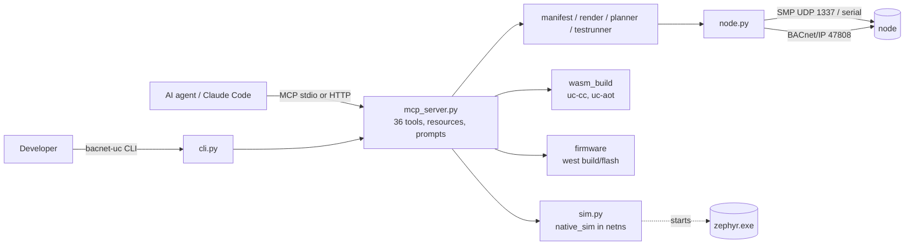
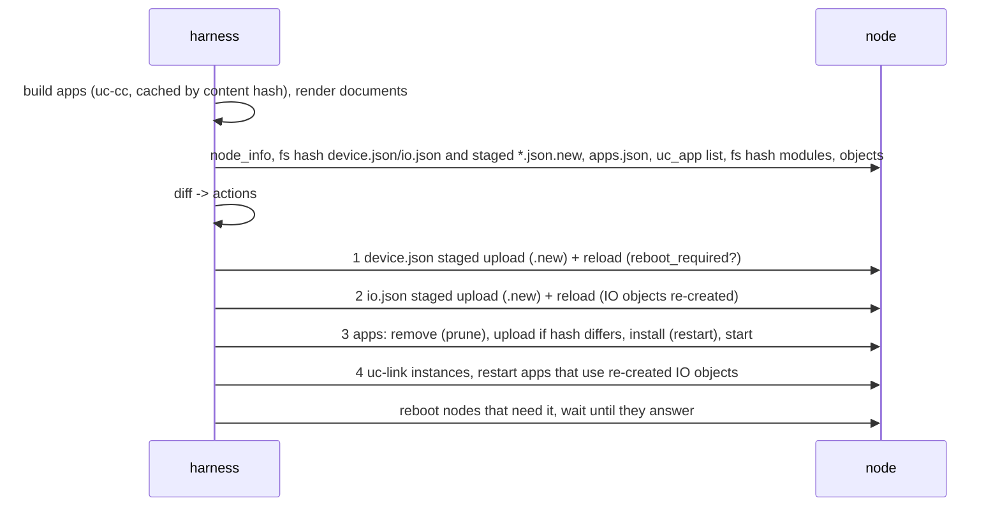

# BACnet-uc development harness

Python package `bacnet_uc_harness`: an MCP server, a command line interface
and a library that let a person or an AI agent operate BACnet-uc nodes
(NUCLEO-F767ZI, FRDM-MCXN947, native_sim): configure IO channels, read and
write BACnet properties, build and deploy WebAssembly applications, read
logs, build/flash/update firmware, run simulated nodes, and build
distributed BACnet applications from a declarative system manifest.



| Module | Responsibility |
|--------|----------------|
| `paths.py` | repository root (`BACNET_UC_ROOT`, else search for `west.yml` + `schemas/`), state directory `<home>/.bacnet-uc` |
| `manifest.py` | system manifests: YAML/JSON loading, placeholders, schema validation, semantic checks |
| `render.py` | per-node `device.json` / `io.json` / `apps.json`, static bindings, uc-link parameters |
| `wasm_build.py` | C to WebAssembly (`wasm/sdk/uc-cc` or clang), WebAssembly binary reader, ABI check, AOT (`uc-aot`/wamrc), SDK summary |
| `firmware.py` | `west build` / `west flash` wrappers, image inspection, MCUboot image hash |
| `node.py` | one node: SMP + BACnet/IP operations, hash-based uploads, staged configuration documents, logs |
| `inventory.py` | `<home>/.bacnet-uc/inventory.yaml` |
| `planner.py` | build artifacts, fetch live state, diff, apply in a safe order, restart apps that use re-created IO objects |
| `budget.py` | WAMR pool budget per node (`CONFIG_UC_APP_POOL_SIZE` of the board, `uc-wasm-info` memory predictions) |
| `testrunner.py` | manifest acceptance tests |
| `sim.py` | native_sim nodes: host, network namespaces, docker compose |
| `mcp_server.py` | MCP server (tools, resources, prompts) |
| `cli.py` | `bacnet-uc` command line |
| `smp/`, `bacnet/`, `testing/` | SMP client, BACnet/IP client (incl. DeviceCommunicationControl, ReinitializeDevice), in-process fake node that mirrors the firmware (see their docstrings) |

## Installation

Python 3.11 or newer. Inside the west workspace (`west.yml` at the
repository root) with the Zephyr virtual environment:

```sh
python3.12 -m venv /opt/zvenv                 # or reuse the Zephyr venv
/opt/zvenv/bin/pip install -e 'BACNet-uc/harness[dev]'
/opt/zvenv/bin/pip install 'BACNet-uc/harness[serial,sim]'   # optional extras
```

| Extra | Adds | Needed for |
|-------|------|------------|
| `serial` | pyserial | SMP over the console UART (`transport: serial`) |
| `sim` | pyroute2 | network-namespace simulation (and `tests/e2e/run-isolated.sh`) when the `ip` command is not installed |
| `dev` | pytest, pytest-asyncio, ruff | the test suite |

External tools:

| Tool | Used by |
|------|---------|
| clang >= 16 with the `wasm32` target and `wasm-ld` | `build_app`, `apply_system` (apps from source) |
| `wamrc` 2.4.5 (`/opt/wamrc/wamrc`, `$WAMRC` or `PATH`) | AOT compilation (`aot: true`, `build_app(aot_board=...)`) |
| west, Zephyr SDK (`ZEPHYR_SDK_INSTALL_DIR`) | `build_firmware`, `flash_firmware` |
| `ip` (iproute2) or pyroute2, root | `sim_start(mode="netns")` |
| docker with compose | `sim_start(mode="compose")` |

The package is used from the repository checkout: it reads `schemas/`,
`docs/`, `wasm/sdk/` and `firmware/boards/io/`. Set `BACNET_UC_ROOT` when the
current directory is outside the repository.

## Configuration: the inventory

Nodes are addressed by name. Names come from the inventory
`<home>/.bacnet-uc/inventory.yaml` (`<home>` = `BACNET_UC_HOME` or the current
directory), or from the system manifest loaded in the same session.

```yaml
nodes:
  sensor:
    transport: udp              # udp | serial | sim
    host: 192.168.10.51         # SMP (UDP 1337) address
    port: 1337
    bacnet_address: 192.168.10.51:47808
    board: nucleo_f767zi
  bench:
    transport: serial
    device: /dev/ttyACM0
    baud: 115200
    board: frdm_mcxn947/mcxn947/cpu0
```

Add entries with the `add_node` tool or the CLI:

```sh
bacnet-uc node add sensor --udp 192.168.10.51            # probes node_info, records the board
bacnet-uc node add bench --serial /dev/ttyACM0:115200 --no-probe
bacnet-uc node list
```

`sim_start` adds the simulated nodes (`transport: sim`) and `sim_stop`
removes them again.

| Environment variable | Meaning |
|----------------------|---------|
| `BACNET_UC_ROOT` | repository root (default: found from the package or the current directory) |
| `BACNET_UC_HOME` | directory holding `.bacnet-uc/` (inventory, build cache, simulations) |
| `BACNET_UC_ALLOW_SHELL=1` | enables the `node_shell` tool |
| `ZEPHYR_SDK_INSTALL_DIR` | passed on to west |
| `UC_CLANG`, `WAMRC` | clang and wamrc executables for the WebAssembly SDK |

## Running the MCP server

```sh
bacnet-uc-mcp                        # stdio (default)
bacnet-uc-mcp --http --port 8000     # streamable HTTP at http://127.0.0.1:8000/mcp
bacnet-uc mcp --http                 # same through the CLI
```

Built with the official MCP Python SDK: `mcp.server.mcpserver.MCPServer`
(mcp >= 2); with mcp 1.x the module falls back to `FastMCP`.

### Claude Code

Project scope (writes `.mcp.json` in the current directory):

```sh
claude mcp add bacnet-uc --scope project \
  --env BACNET_UC_HOME="$PWD" -- /opt/zvenv/bin/bacnet-uc-mcp
```

or `.mcp.json` by hand:

```json
{
  "mcpServers": {
    "bacnet-uc": {
      "type": "stdio",
      "command": "/opt/zvenv/bin/bacnet-uc-mcp",
      "args": [],
      "env": {
        "BACNET_UC_HOME": "${PWD}",
        "ZEPHYR_SDK_INSTALL_DIR": "/opt/zsdk/zephyr-sdk-1.0.1"
      }
    }
  }
}
```

A server started separately with `--http`:
`claude mcp add --transport http bacnet-uc http://127.0.0.1:8000/mcp`.

`sim_start(mode="netns")` needs root; run the server as root in a container
or use `mode="compose"`.

## Tool catalogue

`ro` = readOnlyHint, `destr.` = destructiveHint, `idem.` = idempotentHint
(MCP tool annotations). A `?` marks optional arguments. Errors are returned
as MCP tool errors whose text is a JSON object: `error` (exception type),
`message`, and depending on the error `issues` (manifest/schema problems with
JSON-pointer paths), `group`/`rc`/`rc_name` (SMP), `kind`/`error_class`/
`error_code` (BACnet), `errors`/`output` (compiler).

| Tool | Arguments | Hints | Purpose |
|------|-----------|-------|---------|
| `list_nodes` | | ro | inventory, loaded systems, running simulations |
| `add_node` | name, transport?, host?, port?, device?, baud?, bacnet_address?, board?, replace?, probe? | idem. | add an inventory entry, probe `node_info` |
| `remove_node` | name | destr. | remove an inventory entry |
| `discover_devices` | broadcast?, low?, high?, timeout_s?, target? | ro | Who-Is / I-Am |
| `node_info` | node | ro | firmware, board, API, device, network, FS, apps, WASM runtime |
| `get_config` | node, doc | ro | read `/lfs/cfg/<doc>.json` (includes `bacnet.password` in clear text) |
| `set_config` | node, doc, content, reload?, force? | destr. | schema-validated staged upload (`<doc>.json.new`) + reload; restarts IO-dependent apps after `io` |
| `reload_config` | node, doc? | idem. | `uc_node reload` (activates a staged document); restarts IO-dependent apps after `io`/`all`, also when one document of `all` fails (the error carries `reboot_required`) |
| `io_catalog` | node | ro | IO channels (name, kind, hw, pin, forced, bound object) |
| `configure_io` | node, points, mode?, dry_run? | destr. | merge/replace `io.json` points, validated against schema and catalog; restarts IO-dependent apps |
| `io_read` | node, channel? | ro | raw channel values |
| `io_write` | node, channel, value | destr. | drive an output channel |
| `io_force` | node, channel, value | destr. | force a channel (test stimulus) |
| `io_release` | node, channel | destr. | release a forced channel |
| `bacnet_read` | node, object, property?, index?, via? | ro | ReadProperty (BACnet/IP, SMP fallback) |
| `bacnet_write` | node, object, value, property?, priority?, index?, via? | destr. | WriteProperty with read-back; `null` relinquishes (output objects; value objects ignore it) |
| `list_objects` | node | ro | objects with owner and present value |
| `sdk_info` | | ro | host API from `bacnet_uc.h`, exports, error codes, flags, examples |
| `build_app` | name, source_path?, source?, aot_board?, opt?, defines?, output_dir? | idem. | C to `.wasm` (+ `.aot`), ABI check |
| `deploy_app` | node, name, module_path, autostart?, period_ms?, heap_kb?, stack_kb?, perms?, params?, force? | destr. | upload if changed, install, start (a manifest too large for one SMP request goes through `apps.json`) |
| `app_control` | node, name, action, delete_file? | destr. | start / stop / restart / remove |
| `list_apps` | node | ro | apps with state and counters |
| `app_status` | node, name | ro | one app |
| `read_logs` | node, lines?, grep? | ro | `/lfs/log/log.NNNN` tail |
| `node_shell` | node, command | destr. | Zephyr shell (only with `BACNET_UC_ALLOW_SHELL=1`) |
| `build_firmware` | board, pristine?, sysbuild?, snippets?, extra_conf?, cmake_args?, build_dir? | idem. | `west build` |
| `flash_firmware` | build_dir, runner?, confirm? | destr. | `west flash`, only with `confirm=true` |
| `update_firmware` | node, build_dir, confirm?, make_permanent?, timeout_s? | destr. | SMP image upload, test boot, confirm; only with `confirm=true` |
| `validate_system` | system, live_catalogs? | ro | manifest validation report, rendered document hashes, WAMR pool budget per node |
| `plan_system` | system, prune? | ro | actions needed to reach the manifest's state |
| `apply_system` | system, dry_run?, prune?, reboot? | destr. | execute the plan (dry run by default) |
| `run_system_tests` | system, tests?, stop_on_failure? | destr. | manifest acceptance tests |
| `system_status` | system | ro | reachability, firmware, apps, pending actions per node |
| `sim_start` | system, firmware_exe?, mode?, erase_flash?, apply_config? | destr. | start simulated nodes |
| `sim_stop` | system | destr. | stop them, remove the network |
| `sim_status` | system? | ro | processes, addresses, console log tails |

Every node tool takes the per-node lock of the server, so concurrent calls
on the same node are serialised (a file upload is never interleaved with
another request).

### Resources

| URI | Content |
|-----|---------|
| `bacnet-uc://docs/{name}` | `docs/<name>` (`management-protocol`), and `wasm-sdk`, `uc-link`, `harness` (README files) |
| `bacnet-uc://schemas/{name}` | `device`, `io`, `apps`, `system` schemas; `example-device`, `example-io`, `example-apps` |
| `bacnet-uc://sdk/bacnet_uc.h` | the WebAssembly guest ABI header |
| `bacnet-uc://nodes/{name}/info` | live `node_info` of a node |

### Prompts

| Prompt | Arguments | Guides the agent through |
|--------|-----------|--------------------------|
| `design_distributed_app` | goal | inventory, contracts, manifest, validate, plan, apply, test |
| `commission_node` | node | identity, IO mapping, point checkout, log review |
| `debug_app` | node, app | status, logs, permissions, parameters, objects, remote bindings |

## Command line

`bacnet-uc [--json] [--home DIR] <group> <command>`; the commands call the
same implementations as the MCP tools.

| Group | Commands |
|-------|----------|
| `node` | `list`, `add NAME --udp H[:P] \| --serial DEV[:BAUD] \| --sim H`, `remove`, `info`, `objects`, `logs [-n N] [--grep RE]`, `shell NAME CMD...`, `discover` |
| `io` | `catalog`, `read NODE [CH]`, `write`/`force NODE CH VALUE`, `release NODE CH`, `configure NODE FILE [--replace] [--dry-run]` |
| `prop` | `read NODE OBJ [PROP] [--via]`, `write NODE OBJ VALUE [--property] [--priority]` |
| `app` | `build NAME SRC [--aot BOARD] [-O z]`, `deploy NODE NAME MODULE [--param K=V] [--perm P]`, `list`, `status`, `start`, `stop`, `restart`, `remove [--keep-file]` |
| `config` | `get NODE DOC`, `set NODE DOC FILE`, `reload NODE [DOC]` |
| `system` | `validate`, `render [-o DIR] [--node N]`, `plan [--prune]`, `apply [--no-dry-run] [--prune] [--no-reboot]`, `test [NAMES...]`, `status` |
| `sim` | `up MANIFEST [--exe] [--mode netns\|host\|compose] [--erase] [--apply]`, `down`, `status` |
| `firmware` | `build BOARD [--pristine] [--sysbuild] [-S SNIPPET] [-- CMAKE_ARGS]`, `flash DIR [--runner] --yes`, `info DIR`, `update NODE DIR --yes` |
| `sdk`, `mcp` | SDK summary; run the MCP server |

Exit status: 0 success, 1 failure (error, invalid manifest, failed apply or
test), 2 usage error.

## System manifests

A manifest (`schemas/system.schema.json`, `apiVersion: bacnet-uc/v1`,
`kind: System`) describes the desired state of a distributed application:

| Section | Content |
|---------|---------|
| `nodes` | name, board, management `transport` (`udp`, `serial`, `sim`), optional `bacnet_address`, `device` identity, `network`, `bacnet` options, `io` points |
| `apps` | WebAssembly apps per node: `source` (C, built with the SDK) or `wasm`, `aot`, `autostart`, `period_ms`, `heap_kb`, `stack_kb`, `perms`, `params` |
| `links` | copy a point's present value to a writable object (`from`/`to` as `<node>/<type>:<instance>`, `mode` cov/poll, `period_ms`, `priority`, `scale`, `offset`) |
| `tests` | named step lists: `force`, `release`, `write`, `wait`, `expect` |

Examples: [`examples/systems/hvac-demo.yaml`](examples/systems/hvac-demo.yaml)
(three boards: sensor, actuator, supervisor with thermostat) and
[`examples/systems/sim-demo.yaml`](examples/systems/sim-demo.yaml) (two
native_sim nodes). Both set `bacnet.password`: the firmware refuses
DeviceCommunicationControl and ReinitializeDevice while no password is
configured (`CONFIG_UC_BACNET_REQUIRE_PASSWORD=y`); the rendered
`device.json` passes it through (a placeholder such as
`"{{ nodes.sensor.bacnet.password }}"` shares one password between nodes).

Write priorities follow the firmware's bacnet-stack: analog-, binary- and
multi-state-**output** objects are commandable (16-slot priority array,
Relinquish_Default, priority 6 reserved for minimum on/off and rejected);
the **value** objects (analog-, binary-, multi-state-value) have no priority
array: a write sets Present_Value whatever the priority (analog-value
rejects 6), the last write wins and a relinquish (`null`) changes nothing.
Links to value objects therefore use priority 0, links to outputs a
priority (uc-link relinquishes it when it stops), and a test restores a
value object by writing the old value, not `null`.

### Loading and validation

1. YAML (with YAML 1.2 booleans: `on`/`off`/`yes`/`no` stay strings) or JSON.
2. Placeholders `{{ dotted.path }}` are resolved against the manifest.
   `nodes.<name>` selects the node with that name, a number a list index. A
   string that is exactly one placeholder takes the referenced value's type
   (`"{{ nodes.sensor.device.instance }}"` becomes the integer 1001), else the
   value is inserted as text. Unknown paths and cycles are errors.
3. JSON schema validation (the `$ref`s into `device.schema.json` and
   `io.schema.json` are resolved through a `referencing` registry, formats
   such as `ipv4` are checked).
4. Semantic checks:

| Check | Severity |
|-------|----------|
| unique node names, device instances, app names per node, test names | error |
| apps, links, tests reference existing nodes; object references parse; test step kinds | error |
| link destination writable (AO, AV, BO, BV, MSO, MSV); no self-link; no two links to one output object at one priority; no two links to one value object (no priority array); link priority 6 on an output object | error |
| test `write` at priority 6 on an output object or analog-value | error |
| BACnet object collisions per node between IO points and objects the stock apps create (`thermostat` setpoint AV, `alarm` BV/AV, `blinky` value object, uc-link value destinations) | error |
| `source`/`wasm` files exist (relative to the manifest) | error |
| app parameters: keys 1..23 of `[A-Za-z0-9_.-]`, values <= 95 characters, <= 16 per app; <= 8 apps per node | error |
| IO channels against an explicit catalog (`validate_system(live_catalogs=true)` uses the nodes' `io_catalog`) | error |
| IO channels and channel kind vs. object type against the board catalog in `firmware/boards/io/<board>.dtsi` | warning |
| more than 4 apps on a node (`CONFIG_UC_APPS_MAX` default), link destination created by an app, link destination/source that nothing on the node provides, `bacnet_address` port differing from `bacnet.udp_port` | warning |
| link priority on a value object (ignored), test `write` with a priority or `null` on a value object | warning |
| WAMR pool budget of a node above 90 % of its `CONFIG_UC_APP_POOL_SIZE` (only `validate_system`, see below) | warning |

`validate_system` (and `bacnet-uc system validate`) also builds the apps
(cached) and estimates the WAMR pool each node needs (`wamr_pool` in the
report, `budget.py`): per app the linear memory predicted by
`wasm/sdk/uc-wasm-info` (shrunk to `__heap_base`, plus `heap_kb`, rounded to
4 KiB), `stack_kb`, the module (5.3 x code bytes for the fast interpreter;
1.5 x file size + 17 KiB for AOT) and 6 KiB of runtime structures, against
the board's `CONFIG_UC_APP_POOL_SIZE` from `firmware/boards/<board>.conf`
(else `prj.conf`, else the Kconfig default): 112 KiB on the NUCLEO-F767ZI,
96 KiB on the FRDM-MCXN947, 256 KiB on native_sim. The factors are fitted to
the stock examples measured on native_sim (64-bit, within 3 %; interpreted:
thermostat 54920 B, alarm 50376 B, blinky 38776 B, uc-link with heap 0
39496 B); the Cortex-M boards need a little less. Above 90 % the report
warns; above 100 % apps will fail with rc `NO_MEM`.

All findings are reported together with JSON-pointer paths
(`/nodes/1/io/0/channel`).

### Rendering

`bacnet-uc system render MANIFEST -o out/` writes what the planner uploads.

- `device.json`: `device`, `network`, `bacnet` of the node. `bacnet.static_bindings`
  lists the other nodes (entries in the manifest first, then peers the node
  talks to through links or `*_device` app parameters, then the rest; at most
  16). A peer's address is its `bacnet_address`, else its static
  `network.ipv4`, else its UDP transport host, else its simulation address.
  Simulated nodes in namespaces get `network: {dhcp: false, ipv4: 10.47.0.<n>,
  netmask: 255.255.255.0}`.
- `io.json`: the node's points.
- `apps.json`: the node's apps with `file: /lfs/apps/<name>.wasm` (`.aot`),
  parameters as `[{key, value}]` with string values, and `perms` defaulting to
  what the app needs (stock apps from their parameters, other apps from the
  host functions their module imports).
- Links to a node become uc-link instances (`link`, or `link-1`, `link-2`, ...
  for more than 8 links) with `count` and `l<i>` = `"<src_device> <src_type>
  <src_instance> <dst_type> <dst_instance> <mode> <period_ms> <priority>
  <scale> <offset>"` ([uc-link README](../wasm/examples/uc-link/README.md)),
  permissions `bacnet.local` + `bacnet.remote`, `period_ms` = the smallest
  link period, `heap_kb` 0 (uc-link does not allocate; a WAMR app heap must be
  a multiple of 4 KiB anyway) and `stack_kb` 4.

Documents are serialised as compact JSON plus a newline; the planner compares
their SHA-256 with the node's `fs hash`.

### Plan and apply



Configuration documents are staged ([management protocol](../docs/management-protocol.md#staged-documents-jsonnew)):
`Node.push_config` uploads `/lfs/cfg/<doc>.json.new` and sends
`uc_node reload`; the node validates the staged file and renames it over the
active document in one LittleFS commit, or deletes it and keeps its running
configuration (rc `INVALID`, reported as "rejected by the node"). The
harness then checks the active document's SHA-256 (an error means firmware
without staged documents). An interrupted upload never replaces a working
document. The node's parser checks more than the JSON schemas (duplicate
objects, table limits); an `io.json` point it cannot bind (unknown channel,
wrong kind, channel or object taken) is skipped with a logged error while
the other points are bound.

| Action | When |
|--------|------|
| `clear_staged device/io/apps` | a staged `<doc>.json.new` is on the node that differs from the rendered document (any staged `apps.json.new`) and no `push_config` replaces it: the next reload or boot would activate it |
| `push_config device/io` | file missing or SHA-256 differs |
| `reload io` | `io.json` current but IO objects missing |
| `deploy_app` | not installed, module hash differs (upload), or manifest fields differ (install only) |
| `start_app` | installed and current, `autostart`, but not running |
| `remove_app` | installed but not in the manifest, only with `prune` |
| `restart_app` | the app reads or writes an IO object of a node whose `io.json` is pushed or reloaded (stock apps and uc-link instances, from their parameters; on any node), is running and not (re)deployed or started anyway |
| note `reboot_required` | device instance, BACnet port or static IPv4 differs from what the node runs |

Why `restart_app`: an `io.json` reload deletes and re-creates every IO object
of the node, so outputs fall back to Relinquish_Default and subscriptions to
the old objects end. uc-link writes a destination only when its source
changes, so a link-driven output would sit at Relinquish_Default until then:
verified on native_sim for a poll link (`tests/e2e`); a COV link whose source
is an IO object of the same node recovered by itself (the re-created source
sent a new notification); with a remote source nothing triggers a new write
until its value changes (its object was not re-created). The MCP tools
`configure_io`, `set_config(doc="io")` and `reload_config` restart the
affected apps of that node the same way (`restarted_apps`).

After a failed action the remaining actions of that node are skipped; other
nodes continue. Reboots use `os reset`; simulated nodes are restarted by the
simulation manager when it may (root for `netns`), else also over SMP (the
native_sim firmware is built with `CONFIG_NATIVE_SIM_REBOOT=y` and restarts
its process in place: same pid, namespace and flash image).

### Tests

```yaml
tests:
  - name: switch-drives-lamp
    steps:
      - force: {node: sim-a, channel: di0, value: 1}
      - expect: {point: sim-b/binary-output:1, op: eq, value: 1, within_ms: 5000}
      - write: {point: sim-b/binary-output:1, value: 1, priority: 8}
      - wait: 500
      - write: {point: sim-b/binary-output:1, value: null, priority: 8}
      - release: {node: sim-a, channel: di0}
```

`expect` reads the point (BACnet/IP, SMP `prop_read` as fallback) every
200 ms until the comparison holds or `within_ms` passed. Binary values compare
as numbers (`active`/`true` = 1); `eq`/`ne` allow a relative error of 1e-6
(REAL is single precision); `approx` uses `tolerance` (default 0.01).
Channels a test forced are released when it ends.

## Workflows

### Commission a node

```text
add_node(name="sensor", host="192.168.10.51")
node_info("sensor"); io_catalog("sensor")
set_config("sensor", "device", {"schema": 1, "device": {"instance": 1001, "name": "uc-sensor"}})
configure_io("sensor", [{"channel": "ai0", "type": "analog-input", "instance": 1,
                         "units": "degrees-celsius", "scale": 0.1}])
io_force("sensor", "ai0", 215); bacnet_read("sensor", "analog-input:1")   # 21.5
io_release("sensor", "ai0")
```

### Write and deploy an app

```text
sdk_info()                                    # host API, permissions, examples
build_app(name="hello", source="#include <bacnet_uc.h> ...")
deploy_app(node="sensor", name="hello", module_path=".bacnet-uc/apps/hello.wasm",
           params={"instance": 5})
app_status("sensor", "hello"); read_logs("sensor", grep="hello")
```

### Simulated distributed application

```sh
bacnet-uc firmware build native_sim/native/64          # .bacnet-uc/build/fw-native_sim_native_64
sudo bacnet-uc sim up harness/examples/systems/sim-demo.yaml
sudo bacnet-uc system apply harness/examples/systems/sim-demo.yaml --no-dry-run
bacnet-uc system test harness/examples/systems/sim-demo.yaml
sudo bacnet-uc sim down harness/examples/systems/sim-demo.yaml
```

The `netns` mode needs root for `sim up`/`sim down`; `system apply` restarts
the nodes in their namespaces after the first `device.json` (new instance
and address), which needs root as well; without root it reboots them over
SMP instead. Run the commands from the same directory (the state lives in
`./.bacnet-uc`), or everything as root. `apply` reboots by default
(`--no-reboot` skips it); `sim up --apply` combines the first two steps.

Simulation modes:

| Mode | Network | Nodes | Requirements |
|------|---------|-------|--------------|
| `netns` (default) | namespace `bnuc-<node>` per node, veth pair on bridge `bnuc0`; node *n* = `10.47.0.<n>/24` (or `transport.ipv4`), host = `10.47.0.254` | any | root (CAP_NET_ADMIN + CAP_SYS_ADMIN); `ip` or pyroute2; `nsenter` or pyroute2 to enter the namespace |
| `host` | host network, `127.0.0.1` | one (SMP UDP port 1337 is fixed at build time) | none |
| `compose` | docker bridge network `10.47.0.0/24`, gateway `.254` | any | docker compose, an image whose glibc runs the 64-bit `zephyr.exe` (default `ubuntu:24.04`) |

Each node runs `zephyr.exe --flash=<workdir>/<node>.flash.bin --seed=<n>`
(workdir `<home>/.bacnet-uc/sim/<system>`), its console output goes to
`<node>.log`, and the state (pids, addresses) to `sim-state.json` so that a
different process can stop the simulation. native_sim networking is NSOS
(host sockets inside the namespace): broadcasts are not forwarded, so nodes
find each other through the rendered static bindings. The first `apply`
changes device instance and IPv4, which needs a reboot: the harness restarts
the process (kill and start; root in `netns` mode) or sends `os reset` (the
firmware's native_sim build has `CONFIG_NATIVE_SIM_REBOOT=y` and restarts in
place). The console of each node is also a pseudo terminal (`uart connected
to pseudotty: /dev/pts/N` in `<node>.log`), usable as `transport: serial`.

### Firmware

```text
build_firmware(board="nucleo_f767zi", sysbuild=true)    # MCUboot: signed image for OTA
flash_firmware(build_dir=".bacnet-uc/build/fw-nucleo_f767zi", confirm=true)
update_firmware(node="sensor", build_dir=".bacnet-uc/build/fw-nucleo_f767zi", confirm=true)
```

`update_firmware` uploads `zephyr.signed.bin` (image group), marks the image
the node reports in the secondary slot for a test boot, resets, waits for the
node and, when the new image runs, confirms it (`make_permanent`); otherwise
MCUboot reverts at the next reset. The result says whether the slot hash
equals the SHA-256 TLV of the local image.

## Library use

```python
import asyncio
from bacnet_uc_harness.manifest import load_system
from bacnet_uc_harness.node import Node
from bacnet_uc_harness.planner import apply, plan_system

async def main() -> None:
    system = load_system("harness/examples/systems/hvac-demo.yaml")
    nodes = {n.name: Node(n.name, f"udp:{n.transport.host}:1337",
                          f"{n.transport.host}:47808") for n in system.nodes}
    plan, renders, artifacts, live = await plan_system(system, nodes)
    print(plan.summary())
    report = await apply(plan, nodes, reboot=True)
    print(report.ok)

asyncio.run(main())
```

## Tests

```sh
cd harness && pip install -e '.[dev]' && python -m pytest -q
```

The unit tests run against `FakeNode` (`testing/fake_node.py`), an
in-process node that follows the integration firmware: two-stage document
validation and staged documents, IO points that cannot be bound are
skipped, paged lists cut at the 1016-byte response limit, whole-array
`prop_read` with rc `LIMIT`, the `prop_write` conversion checks, commandable
output objects vs. value objects without priority array,
`bacnet.password` for DeviceCommunicationControl/ReinitializeDevice and
reboot detection against the boot configuration.

| File | Covers |
|------|--------|
| `test_manifest.py` | example manifests, placeholders, YAML 1.2, schema errors, firmware limits the schemas cannot express (UTF-8 bytes, integers without fraction, netmask, parameter keys), semantic checks (link priority 6 and period), catalogs, collisions |
| `test_render.py` | rendered documents against the schemas, static bindings, uc-link parameters (README format), chunking, permissions |
| `test_planner.py` | diffs against fake live state, `restart_app` for apps using re-created IO objects, `clear_staged` of stale staged documents, apply order/failure/reboot with fake nodes, plan/apply/re-plan against `FakeNode`s, the build cache key (local headers) |
| `test_wasm_build.py` | WebAssembly reader on hand-assembled modules, ABI check, header parsing, builds with uc-cc and the clang fallback, AOT |
| `test_mcp_server.py` | tool catalogue and annotations, resources, prompts, tool calls end-to-end against `FakeNode` through the SDK's in-memory client |
| `test_cli.py` | CLI commands, exit codes, output against a `FakeNode` |
| `test_sim.py` | `ip` command generation, compose file, process lifecycle with a stand-in executable, failure roll-back without touching another simulation's network, host ports in use, stale pids, reboot fallback to SMP |
| `test_node.py` | staged `push_config` (activation check, rejection, no reload, stale staged documents removed, firmware without staging), `prop_read` LIMIT fallback, `restart_app`, IO-dependent app restarts, log reads with a fresh FS handle, serial targets with pyserial URLs |
| `test_budget.py` | pool sizes from the board configurations, per-app estimates against the native_sim measurements, budget warnings |
| `test_fake_node.py`, `test_smp_*.py`, `test_bacnet_*.py` | FakeNode fidelity, SMP client (uploads with lost responses, partial reloads) and serial framing, BACnet/IP codec and client |
| `e2e/` | marker `e2e`: the real native_sim firmware (below) |

### End-to-end tests

`tests/e2e` runs the harness against the real firmware. The tests are
skipped unless `BACNET_UC_FIRMWARE` names the `zephyr.exe` of a
`native_sim/native/64` build:

```sh
west build -b native_sim/native/64 BACNet-uc/firmware -d /tmp/build-native
cd BACNet-uc/harness
sudo PYTHON=$(command -v python) BACNET_UC_FIRMWARE=/tmp/build-native/zephyr/zephyr.exe \
    tests/e2e/run-isolated.sh               # = pytest -m e2e tests/e2e, isolated
```

| Test | Needs | Covers |
|------|-------|--------|
| `test_single_node.py` | UDP ports 1337/47808 free (host mode) | node info; staged `device.json` (activation, rejection of an invalid staged file, reboot in place); `io.json` incl. a skipped point; IO force -> BACnet object via `BacnetClient`; outputs via WriteProperty/relinquish; `prop_read` of arrays, `prop_write` errors; `bacnet.password` with DCC/ReinitializeDevice; SMP over the console pty (1152-byte frames, no pacing); thermostat + blinky built from `wasm/examples` and deployed (control loop, logs, value-object semantics, pool estimate within 10 %); an `io.json` reload leaves a poll link's output at Relinquish_Default until the link is restarted |
| `test_sim_demo.py` | root, `ip` or pyroute2, no bridge `bnuc0` | `examples/systems/sim-demo.yaml` through the CLI: `sim up`, `validate` (pool budget), `plan`, `apply` (with reboots), re-plan in sync, `system test` (3 tests), passwords via DCC, IO drift -> `push_config io` + `restart_app`, `status`, `sim down` |

`run-isolated.sh` (root) starts pytest in new network and mount namespaces
with a private `/run/netns`: the nodes, the bridge and the namespaces cannot
collide with other simulations on the machine and disappear with the run.
Without it, `pytest -m e2e tests/e2e` works too when the ports are free
(single node) and no other simulation uses `bnuc0` (sim-demo, root).


Tests that need clang or wamrc are skipped when those are missing.

## Limitations

- `get_config` returns `device.json` as stored, including `bacnet.password`
  (the node's shell prints only whether one is configured).
- `SerialTransport` sends full 1152-byte frames without pacing (the firmware
  buffers 16 console lines, `CONFIG_MCUMGR_TRANSPORT_SHELL_RX_BUF_COUNT`).
  For firmware with Zephyr's default of 2 buffers pass `mtu=256` and
  `line_delay=0.02`.
- Log files are read through the FS group, which keeps a download handle
  open between requests with the length of its first open; the harness
  closes that handle before every download (else a growing log file came
  back truncated).
- `read_logs` can miss the node's most recent message: on native_sim a
  message logged by an app sometimes reached `/lfs/log` only with the next
  log activity (seen in `tests/e2e`, 5 s without it).
- The WAMR pool estimate is calibrated on native_sim (64-bit); AOT factors
  come from x86-64 files, thumb AOT is not calibrated.
- `discover_devices` binds UDP 47808 (shared) to receive broadcast I-Ams; do
  not combine with a host-mode simulation on the same host.
- Simulated nodes outlive the process that started them (they run in their
  own session); stop them with `sim_stop` / `bacnet-uc sim down`, which uses
  `<workdir>/sim-state.json`.
- The `ip` command backend of the `netns` mode is covered by unit tests of the
  generated commands; the pyroute2 backend runs the two-node e2e test.
- AOT modules can only be deployed to firmware built with
  `CONFIG_WAMR_AOT=y` (off by default; on the boards also
  `CONFIG_WAMR_AOT_MPU_EXEC=y`, else `node_info` reports `wasm.aot: false`);
  their permissions cannot be derived from the module and default to
  `bacnet.local` + `bacnet.remote`.
