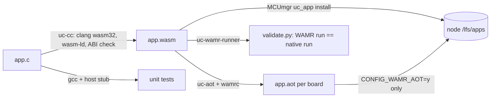

# BACnet-uc WebAssembly SDK and example applications

Applications for BACnet-uc nodes are WebAssembly modules run by WAMR 2.4.5
in the firmware (fast interpreter, optionally AOT). They talk to the node
only through the host functions of import module `bacnet_uc`
([`sdk/include/bacnet_uc.h`](sdk/include/bacnet_uc.h), API 1.0) and a small
C library subset provided by WAMR's libc-builtin. This directory holds the
toolchain wrapper, AOT wrapper, helper headers, four example applications,
a native host stub for unit tests and a host build of WAMR that runs the
modules with the firmware's runtime configuration.

| Path | Content |
|------|---------|
| `sdk/uc-cc` | compile C into a module and check it against the ABI |
| `sdk/uc-aot` | wamrc wrapper for the three boards, with a runtime symbol check |
| `sdk/uc-wasm-info` | module report: imports, permissions, features, memory (text or JSON) |
| `sdk/include/` | `bacnet_uc.h` (contract), `uc_libc.h`, `uc_util.h`, `uc_point.h` |
| `sdk/Makefile.inc`, `sdk/cmake/BacnetUcWasm.cmake` | build integration for application projects |
| `sdk/tools/` | Python modules behind the tools (`uc_abi.py`, `wasmfile.py`, `uc_check.py`, `aotfile.py`) |
| `sdk/host-stub/` | native implementation of all `bacnet_uc` imports plus test control API |
| `sdk/wamr-runner/` | WAMR host build, scenario runner, iwasm native library, `validate.py` |
| `sdk/tests/` | SDK tests: helper headers (C) and ABI consistency (Python) |
| `examples/<app>/` | `blinky`, `thermostat`, `uc-link`, `alarm` with their unit tests |
| `Makefile` | builds everything into `build/` (ignored by git) |

## Quick start

Requirements: clang >= 16 with the `wasm32` target and `wasm-ld` (Ubuntu
`clang-18` works), Python >= 3.11, gcc for the host tests, CMake for the
WAMR runner, `wamrc` 2.4.5 for AOT.

```sh
make -C wasm              # build/blinky.wasm thermostat.wasm alarm.wasm uc-link.wasm
make -C wasm test         # host-stub unit tests + SDK tests
make -C wasm aot          # build/aot/<board>/<app>.aot
make -C wasm validate     # builds the WAMR runner and iwasm under /tmp, runs all modules
make -C wasm check        # all of the above
```

A new application:

```sh
wasm/sdk/uc-cc -o hello.wasm hello.c
wasm/sdk/uc-wasm-info hello.wasm
wasm/sdk/uc-aot --board nucleo_f767zi -o hello.aot hello.wasm   # optional
```

```c
#include <bacnet_uc.h>
#include <uc_util.h>

UC_APP_DECLARE()

UC_EXPORT(uc_app_init) int32_t uc_app_init(void)
{
	uc_logf(UC_LOG_INF, "period %u", (unsigned int)uc_param_num("period_ms", 1000));
	return uc_obj_create_str(UC_OBJ_ANALOG_VALUE, 1, "hello");
}

UC_EXPORT(uc_app_tick) void uc_app_tick(uint64_t now_ms)
{
	(void)uc_pv_write(UC_OBJ_ANALOG_VALUE, 1, (double)(now_ms / 1000u), UC_PRIORITY_NONE);
}
```



## uc-cc

`uc-cc [options] -o app.wasm a.c [b.c ...]` compiles every source, links, and
checks the result (`sdk/tools/uc_check.py`). A module that fails the check is
deleted. `uc-cc --help` lists the options; `--print-flags` prints the clang
flags for other build systems; `--info report.json` writes the check report.

### Compiler flags

| Flag | Reason |
|------|--------|
| `--target=wasm32 -nostdlib` | no libc in the module; libc-builtin serves the functions in `uc_libc.h` |
| `-mcpu=mvp -msign-ext -mnontrapping-fptoint -mbulk-memory` | features the firmware's WAMR always has, plus bulk memory (`CONFIG_WAMR_BULK_MEMORY=y`): struct copies and `memset` become `memory.copy`/`memory.fill` instead of imports |
| no `reference-types` | C does not need it; with it clang 18 encodes `call_indirect` with a table index that a runtime built with `CONFIG_WAMR_REF_TYPES=n` rejects |
| no `mutable-globals`, SIMD, atomics, exceptions, tail calls, multivalue | not built into the firmware's WAMR (`WAMR_BUILD_SIMD=0`, no shared memory, ...) |
| `-Oz` (default, `-O` to change) | the fast interpreter keeps a translated copy of the code in the WAMR pool: `-Oz` modules need 6-12 % less pool than `-Os` (thermostat: 23504 B vs 26544 B) |
| `-Wall -Wextra` | |

### Link flags and undefined symbols

| Flag | Reason |
|------|--------|
| `--no-entry` | reactor module, the host calls the `uc_app_*` exports |
| (no `--allow-undefined`) | host functions carry `import_module("bacnet_uc")` attributes (`UC_IMPORT`), which wasm-ld accepts as imports |
| `--allow-undefined-file=<generated>` | exactly the libc-builtin functions of `uc_abi.LIBC_BUILTIN` may stay undefined (imported from `env`); any other undefined symbol (`sin`, `abort`, `__multi3`, ...) is a link error |
| `--export=__heap_base --export=__data_end` | lets WAMR shrink the linear memory (below) |
| `--stack-first -z stack-size=4096` | the C stack at the bottom of the memory: an overflow runs below address 0 and traps instead of overwriting data |
| `--initial-memory=65536 --max-memory=65536` | one declared page; WAMR shrinks it |
| `--strip-all --compress-relocations` (`-g` keeps debug info) | smaller module |

The post-link check rejects: imports outside `bacnet_uc`/`env`, unknown
host functions, import or export signatures that differ from the host's
(the firmware table in `uc_app_host_api.c` and WAMR's libc-builtin table are
cross-checked by `sdk/tests/test_abi.py`), a missing `uc_app_api_version`,
memory/table/global imports, instructions of features the runtime lacks,
and `memory.grow`/`memory.size` (they disable shrinking; `--allow-grow`
makes this a warning).

### Linear memory

WAMR truncates the linear memory at `__heap_base` when the module exports
`__heap_base` and `__data_end`, has a stack pointer global and contains no
`memory.grow`/`memory.size` (`wasm_loader.c`, `WASM_ENABLE_SHRUNK_MEMORY`),
then appends the app heap (`apps.json` `heap_kb`):

```
0            stack (>= 4 KiB)   data/bss   __heap_base          + heap_kb * 1024
|<-- C stack grows down --|-- globals --|<-- app heap (malloc, strdup) -->|
```

WAMR 2.4.5 rounds the memory size it bounds-checks up to
`os_getpagesize()` (4096 on Zephyr without MMU) but, without hardware bounds
checks, allocates only the unrounded size from its pool
(`wasm_allocate_linear_memory` in `core/iwasm/common/wasm_memory.c`: `map_size`
vs. `memory_data_size`). A module whose memory is not a multiple of 4 KiB can
therefore read and write up to 4095 bytes behind its allocation on the
target. `validate.py` demonstrates the rounding on the host with a probe
built with `--no-page-align` (12304 B allocated, writes accepted up to 16383).
uc-cc avoids it: it links twice and enlarges the stack so that `__heap_base`
is a multiple of 4096 (`--no-page-align` disables this). With `heap_kb` a
multiple of 4 (the default 8, or 0) allocation and bounds then agree; the
checker warns otherwise.

Measured with `uc-wamr-runner` (WAMR 2.4.5, stack 4 KiB, heap 8 KiB) and
confirmed with iwasm `-v=5` ("Shrink memory size to 8192", "page bytes:
16384, init pages: 1"):

| Module | .wasm | code | data | `__heap_base` | linear memory, heap 8 KiB | heap 0 | without shrinking |
|--------|------:|-----:|-----:|-----:|-----:|-----:|-----:|
| blinky | 3470 | 2421 | 532 | 8192 | 16384 | 8192 | 73728 |
| thermostat | 7505 | 5504 | 1200 | 8192 | 16384 | 8192 | 73728 |
| alarm | 6323 | 4577 | 1060 | 8192 | 16384 | 8192 | 73728 |
| uc-link | 5392 | 3993 | 756 | 8192 | 16384 | 8192 | 73728 |

None of the examples allocates from the app heap (libc-builtin formatting
does not use it), so `heap_kb: 0` is sufficient for them.

### C library subset (`uc_libc.h`)

| Group | Functions |
|-------|-----------|
| stdio | `printf vprintf snprintf vsnprintf puts putchar` |
| string | `memcpy memmove memset memcmp memchr strlen strcmp strncmp strncasecmp strcpy strncpy strchr strstr strspn strcspn strdup` |
| stdlib | `malloc calloc realloc free atoi strtol strtoul` |
| ctype | `isalnum isalpha isdigit isgraph isprint isspace isupper isxdigit tolower toupper` |
| no import | `uc_trap uc_fabs uc_sqrt uc_floor uc_ceil uc_trunc uc_rint uc_isnan uc_isfinite uc_fmin uc_fmax uc_clamp` (single instructions or plain C) |

Semantics that differ from ISO C are listed in the header: `printf` goes to
the console, not the log; `%ld` is 32 bit; floating point formatting uses
the firmware's `snprintf` (`CONFIG_CBPRINTF_FP_SUPPORT=y` in `prj.conf`);
invalid pointers trap; `strtol`'s `endptr` must not be NULL (WAMR passes
offset 0 as the start of the linear memory, not as NULL); there is no
`strtod`, `abort` or `exit` (their WAMR signatures differ from ISO C).

### Helpers

`uc_util.h` (header-only):

- `uc_logf(level, fmt, ...)`: formatted log line, truncated to 120 characters like the host.
- `uc_parse_u32`, `uc_parse_double`, `uc_str_to_u32`, `uc_str_to_double`, `uc_next_token`: strict parsers without libc; `uc_parse_double` is correctly rounded for up to 15 significant digits and a decimal exponent (relative to the digits) within ±22.
- `uc_param_u32/double/device/choice/text`: typed parameters with range checks; an invalid value logs a warning naming the key and falls back to the default.
- `uc_pv_read_dev`, `uc_pv_write_dev`, `uc_pv_relinquish_dev`: Present_Value access for `UC_DEVICE_LOCAL` or a remote device.
- `uc_obj_type_abbr`, `uc_device_str`, `uc_obj_is_binary`, `uc_obj_is_creatable`.

`uc_point.h` follows an input point: `uc_point_start` subscribes (COV,
lifetime 300 s), `uc_point_on_cov` takes notifications, `uc_point_tick`
polls when no value arrived for `poll_ms` (no subscription, lost
notifications, or a steady value that produces none) and retries a failed
subscription every 30 s, `uc_point_fresh` tells whether the value is recent.

### Build integration

`sdk/Makefile.inc` defines `UC_CC`, `UC_AOT`, `UC_WASM_INFO`, `UC_INCLUDE`
and a `%.wasm: %.c` rule. `sdk/cmake/BacnetUcWasm.cmake` provides
`bacnet_uc_wasm_app(NAME app SOURCES ... [AOT_BOARDS ...])`.

## uc-aot

`uc-aot --board <board> [-o out.aot] app.wasm`; `uc-aot --list [--json]`
prints the table. The firmware only loads AOT files with `CONFIG_WAMR_AOT=y`
(off by default; see the Kconfig help about the MPU).

| Board | wamrc target | `CONFIG_WAMR_BUILD_TARGET` |
|-------|--------------|----------------------------|
| `nucleo_f767zi` | `--target=thumbv7em --target-abi=eabihf --cpu=cortex-m7 --size-level=3 --enable-indirect-mode` | `THUMBV7EM_VFP` |
| `frdm_mcxn947/mcxn947/cpu0` | `--target=thumbv8m.main --target-abi=eabihf --cpu=cortex-m33 --size-level=3 --enable-indirect-mode` | `THUMBV8M.MAIN_VFP` |
| `native_sim/native/64` | `--target=x86_64 --cpu=x86-64 --size-level=1` | `X86_64` |

Common options: `--opt-level=2` (`-O`; smaller than 3 on both Cortex-M
targets), `--bounds-checks=1` (Zephyr has no hardware bounds checks),
`--disable-simd`, `--disable-ref-types`, `--enable-multi-thread` (emits the
suspend-flag checks that let the application watchdog stop an AOT callback
when `CONFIG_WAMR_THREAD_MGR=y`, the `prj.conf` default; `--no-thread-mgr`
omits them).

After compiling, uc-aot reads the runtime symbols the file references
(relocation and native symbol sections, `sdk/tools/aotfile.py`) and checks
them against WAMR's symbol map for the target (`aot_reloc_<arch>.c` and
`aot_reloc.h`). This found that in direct mode LLVM turns the `memset(p, 0,
n)` that wamrc emits for `memory.fill` into `__aeabi_memclr`, which WAMR
2.4.5's `aot_reloc_thumb.c` does not provide: such a file fails to load on
both Cortex-M boards. Indirect mode calls through the runtime's symbol table
(`memset` -> `aot_memset`) and passes the check; `--direct` selects direct
mode and is rejected by the check. Indirect mode does not load on x86-64
("relocation truncated to fit"), so native_sim uses direct mode with the
medium code model.

wamrc: the WAMR 2.4.5 release asset
`https://github.com/bytecodealliance/wasm-micro-runtime/releases/download/WAMR-2.4.5/wamrc-2.4.5-x86_64-ubuntu-22.04.tar.gz`
(one file, `wamrc`) unpacked to `/opt/wamrc`; also found through `--wamrc`,
`$WAMRC` or `PATH`.

| Module | nucleo_f767zi | frdm_mcxn947 | native_sim/native/64 |
|--------|------:|------:|------:|
| blinky | 7340 | 7968 | 11724 |
| thermostat | 14552 | 16504 | 23304 |
| alarm | 12788 | 13676 | 20228 |
| uc-link | 11604 | 12304 | 19316 |

The Cortex-M33 of the MCXN947 has a single-precision FPU only: double
arithmetic in its AOT code calls `__aeabi_dadd` etc. (present in the thumb
symbol map). x86-64 AOT files are executed by `validate.py`; the Cortex-M
files are only compiled and symbol-checked here.

## Examples

All examples declare `UC_APP_DECLARE()`, read their configuration from
`apps.json` `params` (all values are strings; invalid values are logged and
replaced by the default), keep their state in one structure that
`uc_app_init` resets, and create their own objects (deleted by the host when
the app stops). Devices are `local` or a device instance.

### blinky

Toggles a binary object, or a raw digital output channel, every `period_ms`.

| Param | Default | Meaning |
|-------|---------|---------|
| `type`, `instance` | 5, 1 | object (binary-value:1) |
| `name` | `blinky` | object name when the app creates it |
| `priority` | 0 | write priority 1..16, 0 = none |
| `period_ms` | 1000 | toggle period (10..3600000), set with `uc_set_tick_period` |
| `on`, `off` | 1, 0 | values written |
| `channel` | - | raw IO channel (`do0`) instead of an object |

A value type (AV, BV, MSV) is created if missing; other types (an IO-bound
`binary-output`) must exist, otherwise `uc_app_init` fails. On a regular stop
it relinquishes its priority or writes `off`. Permissions: `bacnet.local`, or
`io` in channel mode.

### thermostat

PI room temperature controller.

| Param | Default | Meaning |
|-------|---------|---------|
| `sensor_device`, `sensor_type`, `sensor_instance` | local, 0, 1 | temperature point (analog-input:1) |
| `setpoint` | 21.0 | initial setpoint |
| `sp_instance` | 1 | setpoint analog-value created by the app (`thermostat-setpoint`, units degrees-Celsius) |
| `sp_min`, `sp_max` | 5, 35 | accepted setpoint range (values outside are clamped, with a warning) |
| `out_device`, `out_type`, `out_instance`, `out_priority` | local, 1, 1, 0 | output (analog-output:1, 0..100 %) |
| `action` | `heat` | `heat`: e = SP - T, `cool`: e = T - SP |
| `kp`, `ti_s` | 20 %/K, 600 s | PI gains (`ti_s` 0: P only) |
| `out_min`, `out_max` | 0, 100 | output limits |
| `out_deadband`, `refresh_ms` | 0.5 %, 60000 | rewrite an analog output on this change, or when due |
| `pwm_ms` | 600000 | time-proportioning cycle for a binary output (`out_type` 3/4/5) |
| `poll_ms` | 10000 | poll the sensor after this long without a value |
| `stale_ms`, `fail_output` | 60000, `out_min` | fail-safe output when the sensor value is older |
| `status_s` | 60 | status log line period (0: off) |
| `timeout_ms` | 2000 | remote request timeout |

Every tick: poll the sensor if due, re-read the setpoint's effective
Present_Value (a relinquish raises no `uc_app_on_write`), compute
`P = kp * e`, integrate `I += kp * e * dt / ti_s` only when the output is not
saturated in the direction of `e` (conditional integration) and keep `I`
within the output limits, `u = clamp(P + I)`. A write to the setpoint raises
`uc_app_on_write`, which logs and applies it at once. With permission `kv`
the setpoint is persisted (`setpoint`, 8 bytes) and restored on start. On a
regular stop it relinquishes `out_priority`, or writes the fail-safe value.
Permissions: `bacnet.local`, `bacnet.remote` for remote points, `kv`
optional. The `apps.json` example in `schemas/examples/` uses this app.

### uc-link

Implements [`examples/uc-link/README.md`](examples/uc-link/README.md). Choices
where the specification leaves room:

- Fields are separated by blanks (spaces or tabs, any number); exactly ten
  fields. `src_device` 0..4194302 (4294967295 = `UC_DEVICE_LOCAL` is accepted
  too), types 0..1023, instances 0..4194302, `period_ms` 100..3600000 (a
  `cov` link may give 0: fallback period 1000 ms), priority 0..16,
  `scale`/`offset` finite decimal numbers. Anything else is malformed: logged
  with the offending field (`l2: malformed (priority) "..."`) and skipped.
- `count` missing or outside 1..8, or no usable link: `uc_app_init` returns
  `UC_ERR_INVALID` and the app enters the failed state.
- A destination of another type that does not exist is logged and skipped;
  an AV/BV/MSV that exists and belongs to someone else is used as is.
- A `cov` link whose `uc_cov_subscribe` fails is polled with its `period_ms`
  (system.schema.json: "Poll period, or COV fallback poll period") and the
  subscription retried every 30 s.
- The tick period is the smallest `period_ms` of all links (cov links
  included, since they may fall back to polling), at least 100 ms.
- Read and write errors are logged once per error episode.
- On a regular stop, destinations the app did not create and wrote with a
  priority are relinquished at that priority.

Local sources are read with `uc_prop_read` for `UC_DEVICE_LOCAL` and with
`uc_remote_read` otherwise, which the firmware serves locally without
network traffic when the device is the node's own instance.

### alarm

Limit alarm with hysteresis and delays, published as a binary-value, with a
persistent trip counter.

| Param | Default | Meaning |
|-------|---------|---------|
| `src_device`, `src_type`, `src_instance` | local, 0, 1 | monitored point |
| `direction` | `high` | `high`: alarm when value > threshold, cleared below threshold - hysteresis; `low`: mirrored |
| `threshold`, `hysteresis` | 30, 1 | |
| `delay_ms`, `clear_delay_ms` | 0, 0 | the condition must hold this long |
| `bv_instance`, `name` | 10, `alarm` | alarm binary-value |
| `count_instance` | - | analog-value with the trip counter; writing 0 resets it |
| `poll_ms`, `stale_ms` | 10000, 60000 | polling fallback, stale warning (the state is kept) |

The counter and the alarm state are stored with `uc_kv_set("state", ...)`
(12 bytes: `ALM1`, trips u32 little endian, active u8, 3 bytes padding) on
every change and restored in `uc_app_init`, so an alarm condition that
persists across a restart is not counted twice. Without permission `kv` the
counter lives in RAM. Permissions: `bacnet.local`, `bacnet.remote` for a
remote point, `kv`.

## Testing

### Host stub (`sdk/host-stub`)

`uc_stub.c` implements every host function of `bacnet_uc.h` natively
(`UC_IMPORT` is empty without `__wasm__`) with the firmware's argument
checks, permissions and return codes, and the scheduling of
`uc_app_mgr.c`: first tick one period after start, a due tick before queued
events, `uc_set_tick_period` restarting the period, events dropped when 16
are queued. Model:

| Area | Behaviour |
|------|-----------|
| objects | table with owner (IO or app), priority arrays for AO/BO/MSO/AV/BV/MSV, REAL precision for analog values, binary 0/1, multi-state >= 1; other numeric properties stored per object |
| writes | `uc_stub_client_write` writes like a BACnet client and queues `uc_app_on_write` for app-owned objects (not for relinquish, not for the app's own writes) |
| COV | initial notification right after subscribing; local objects notify on every Present_Value change; remote points notify on `uc_stub_remote_set(..., notify=true)`; `uc_stub_cov_notify` for arbitrary values |
| remote | scripted points and per-point errors; unknown device: `UC_ERR_NO_ROUTE`, unknown object: `UC_ERR_BACNET`; a timeout advances the clock by `timeout_ms` |
| other | parameters, key/value store (survives `uc_stub_stop`), IO channels, log capture with the host's 120-character truncation and 20 lines/s limit, fault injection per function (`uc_stub_fail`) |

Unit tests use `uc_test.h` and run with ASan/UBSan: `test_thermostat.c`
(16 tests: defaults, remote COV, poll fallback, lost notifications, stale
fail-safe, setpoint write/clamp/relinquish, kv persistence, anti-windup,
integral limit, cooling, time-proportioning, remote output and stop,
invalid parameters, REAL setpoint precision, setpoint object taken),
`test_uc_link.c` (14 tests:
README example, scale/offset/priority, poll-on-change, error logging, local
sources, malformed links and numbers, blanks, invalid count, missing link,
destinations, write errors, COV fallback, unsubscribe), `test_alarm.c` (10),
`test_blinky.c` (5) and `sdk/tests/test_util.c` (7).

### WAMR runner (`sdk/wamr-runner`)

`build.sh [--iwasm] [dir]` builds WAMR 2.4.5 for Linux with the firmware's
configuration (fast interpreter, libc-builtin, bulk memory, reference types,
thread manager with heap aux stack allocation, no WASI/SIMD/JIT, software
bounds checks, one memory pool) plus the AOT loader, and from it:

- `uc-wamr-runner app.wasm|app.aot [scenario options]`: loads the module the
  way `uc_app_mgr.c` does (imports linked, instance with stack/heap, export
  signatures, API version, `uc_app_init`), serves `bacnet_uc` from the host
  stub with the firmware's pointer checks and signature strings, and runs a
  timeline (`--at 5000:remote:1001:0:1=21`, `write`, `relinquish`, `local`,
  `silent`, `fail`, `restart` with a new instance). It reports the linear
  memory, WAMR's bounds and the pool used per stage; `--dump` prints the
  final state.
- `libuc_bacnet_stub.so` for `iwasm --native-lib` (parameters from
  `UC_PARAMS="k=v;k=v"`), and with `--iwasm` WAMR's own
  `product-mini/platforms/linux` iwasm with the same options.

`validate.py` (`make validate`) runs 10 scenarios. For each it requires that
the application starts (or fails as expected), that WAMR allocated exactly
the predicted linear memory and bounds-checks the same size, and that the
state dumps of the WebAssembly run, the x86-64 AOT run and a native build of
the same source (`build/host/scenario_<app>`) are identical, including every
log line. It then loads every module and AOT file in iwasm and runs the
bounds probe.

Pool figures from the runner are for a 64-bit host (WAMR's structures are
smaller on the 32-bit targets); on Zephyr the linear memory also comes from
the pool.

| Module | module (fast interp) | instance | exec env (4 KiB stack) | linear memory |
|--------|------:|------:|------:|------:|
| blinky | 12144 | 2400 | 4720 | 16384 |
| thermostat | 23504 | 3296 | 4720 | 16384 |
| alarm | 20672 | 3088 | 4728 | 16384 |
| uc-link | 19024 | 2920 | 4720 | 16384 |

The runner also accepts `--stack 2048`: uc-link ran its scenario with a
2 KiB WAMR stack and no app heap (linear memory 8192 B).
